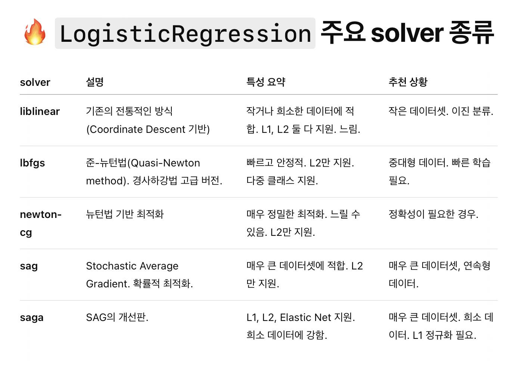

# 💳💲 Loan Prediction w/ Various ML Models 💵

## 공부할 내용
- SMOTE
- Logistic Regresssion
- KNN
- SVM
- Naive Bayes
- Decision Tree
- Random Forest
- Gradient Boosting

## Smote

- 클래스 불균형을 해결하는 기법

```py
X, y = SMOTE().fit_resample(X, y)
```

X -> 타겟변수를 제거한 df

y -> 타겟변수


SMOTE -> 클래스 50:50으로 맞춰줌

## Logistic Regresssion

- 분류 문제를 풀기위한 통계 모델
- 출력값은 0과 1사이의 확률

```py
LRclassifier = LogisticRegression(solver='saga', max_iter=500, random_state=1)
LRclassifier.fit(X_train, y_train)

y_pred = LRclassifier.predict(X_test)

print(classification_report(y_test, y_pred))
print(confusion_matrix(y_test, y_pred))

from sklearn.metrics import accuracy_score
LRAcc = accuracy_score(y_pred,y_test)
print('LR accuracy: {:.2f}%'.format(LRAcc*100))
```

### solver = SAGA
- solver는 로지스틱 회귀 모델을 학습할 때 최적화 방법을 선택하는 옵션
- saga란?
    - L1,L2, Elasic Net 정규화 다 가능
    - 대규모 데이터에도 잘 동작
    - sparse 데이터도 지원
    - 보동 빠름
    - softmax까지 지원

- L1, L2, Elastic Net란?

    모델을 단순하게 만들기 위해 추가하는 규제 방법

    - L1, 라쏘
        - 일부 가중치를 정확히 0으로 만들어버림
        - 결과적으로 모델이 희소해짐(sparse) -> 중요하지 않은 피쳐를 아예 제거하는 효과
        - 선택적인 변수만 남기고 싶을 때 유용
    
    - L2, 릿지
        - 가중치의 제곱합
        - 가중치를 줄이지만, 0은 아님 -> 조금씩 작게
        - 부드럽게 조정
        - 모든 피쳐를 조금씩 사용하고 싶을 때 유용
    
    - Elastic Net
        - L1 + L2 둘 다 합쳐 놓은 것
        - L1처럼 일부 변수는 제거하고 L2처럼 나머지는 부드럽게 줄임
        - 데이터 피쳐가 많거나 피쳐끼리 상관관계가 있을 때 아주 강력

- Softmax란?

    여러 개의 앖을 받아서 각각을 확률처럼 변환

### 다른 solver


### max_iter = 500
- max_iter란 최대 반복 횟수를 정하는 옵션
- 로지스틱 회귀는 손실 함수를 최소화하려고 가중치를 계속 바꿈, 이 과정이 반복
- 손실함수란?
    - 모델은 가중치를 랜덤으로 가지고 있음
    - 이 가중치를 조금씩 조정해서 예측이 잘 맞게 만드는게 중요
    - 손실함수는 예측값과 실제 사이에 오차를 수치로 표현한것

"모델을 학습할 때 최대 500번까지만 반복하고, 그 전에 수렴하면 일찍 끝내자."

### random_state = 1
- 랜덤 요소가 들어가는 과정에서 매번 같은 결과를 얻고 싶을 때 고정하는 숫자
- 숫자를 고정해주면 항상 똑같은 결과가 나와서 실험 재현 가능


