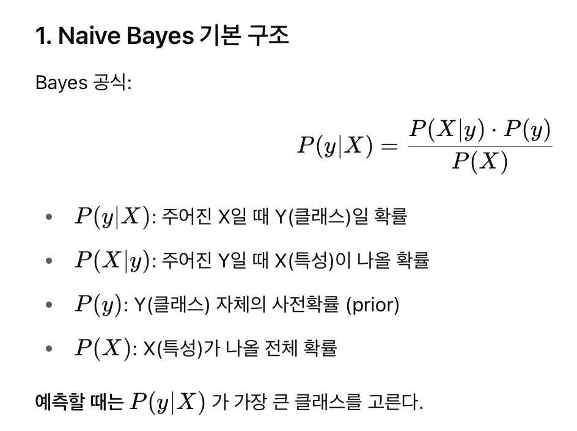
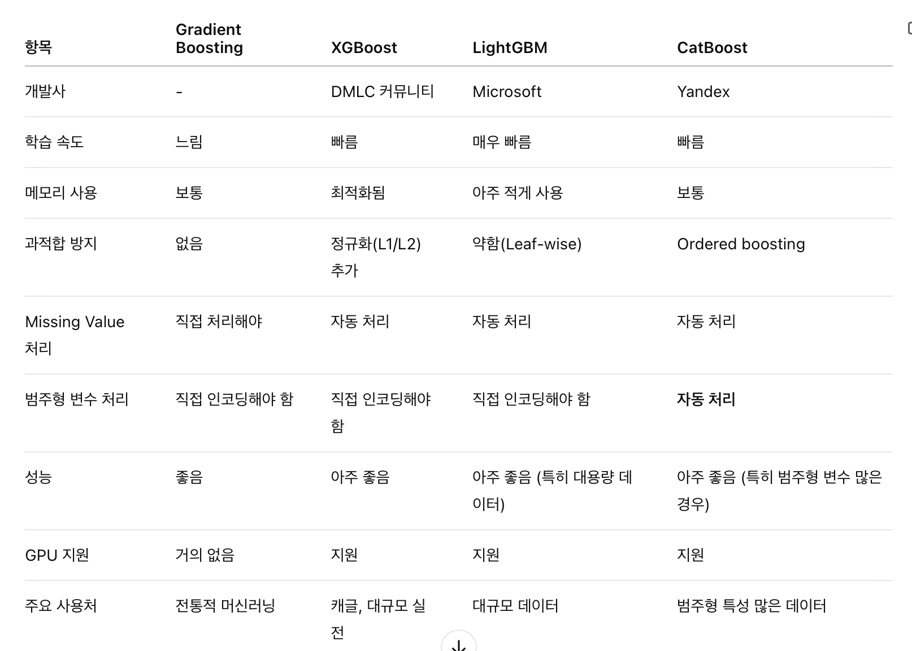
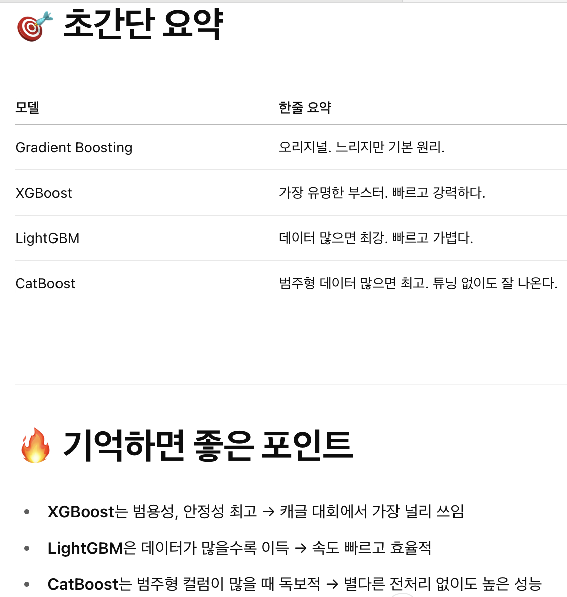

# 💳💲 Loan Prediction w/ Various ML Models 💵

## 공부할 내용
- SMOTE
- Logistic Regresssion
- KNN
- SVM
- Naive Bayes
- Decision Tree
- Random Forest
- Gradient Boosting

## Smote

- 클래스 불균형을 해결하는 기법

```py
X, y = SMOTE().fit_resample(X, y)
```

X -> 타겟변수를 제거한 df

y -> 타겟변수


SMOTE -> 클래스 50:50으로 맞춰줌

## Logistic Regresssion

- 분류 문제를 풀기위한 통계 모델
- 출력값은 0과 1사이의 확률

```py
LRclassifier = LogisticRegression(solver='saga', max_iter=500, random_state=1)
LRclassifier.fit(X_train, y_train)

y_pred = LRclassifier.predict(X_test)

print(classification_report(y_test, y_pred))
print(confusion_matrix(y_test, y_pred))

from sklearn.metrics import accuracy_score
LRAcc = accuracy_score(y_pred,y_test)
print('LR accuracy: {:.2f}%'.format(LRAcc*100))
```

### solver = SAGA
- solver는 로지스틱 회귀 모델을 학습할 때 최적화 방법을 선택하는 옵션
- saga란?
    - L1,L2, Elasic Net 정규화 다 가능
    - 대규모 데이터에도 잘 동작
    - sparse 데이터도 지원
    - 보동 빠름
    - softmax까지 지원

- L1, L2, Elastic Net란?

    모델을 단순하게 만들기 위해 추가하는 규제 방법

    - L1, 라쏘
        - 일부 가중치를 정확히 0으로 만들어버림
        - 결과적으로 모델이 희소해짐(sparse) -> 중요하지 않은 피쳐를 아예 제거하는 효과
        - 선택적인 변수만 남기고 싶을 때 유용
    
    - L2, 릿지
        - 가중치의 제곱합
        - 가중치를 줄이지만, 0은 아님 -> 조금씩 작게
        - 부드럽게 조정
        - 모든 피쳐를 조금씩 사용하고 싶을 때 유용
    
    - Elastic Net
        - L1 + L2 둘 다 합쳐 놓은 것
        - L1처럼 일부 변수는 제거하고 L2처럼 나머지는 부드럽게 줄임
        - 데이터 피쳐가 많거나 피쳐끼리 상관관계가 있을 때 아주 강력

- Softmax란?

    여러 개의 앖을 받아서 각각을 확률처럼 변환

### 다른 solver


### max_iter = 500
- max_iter란 최대 반복 횟수를 정하는 옵션
- 로지스틱 회귀는 손실 함수를 최소화하려고 가중치를 계속 바꿈, 이 과정이 반복
- 손실함수란?
    - 모델은 가중치를 랜덤으로 가지고 있음
    - 이 가중치를 조금씩 조정해서 예측이 잘 맞게 만드는게 중요
    - 손실함수는 예측값과 실제 사이에 오차를 수치로 표현한것

"모델을 학습할 때 최대 500번까지만 반복하고, 그 전에 수렴하면 일찍 끝내자."

### random_state = 1
- 랜덤 요소가 들어가는 과정에서 매번 같은 결과를 얻고 싶을 때 고정하는 숫자
- 숫자를 고정해주면 항상 똑같은 결과가 나와서 실험 재현 가능

## KNN

- 주변에 있는 데이터(K개)를 찾아서 다수결로 분류 or 평균을 내서 회쉬하는 방법

```py
scoreListknn = []
for i in range(1,21):
    KNclassifier = KNeighborsClassifier(n_neighbors = i)
    KNclassifier.fit(X_train, y_train)
    scoreListknn.append(KNclassifier.score(X_test, y_test))
    
plt.plot(range(1,21), scoreListknn)
plt.xticks(np.arange(1,21,1))
plt.xlabel("K value")
plt.ylabel("Score")
plt.show()
KNAcc = max(scoreListknn)
print("KNN best accuracy: {:.2f}%".format(KNAcc*100))
```

### scoreLisftKnn = []
k값에 따른 정확도를 저장할 리스트 생성

### for 문
k값을 1부터 20까지 바꿔가면서 그때그때 모델을 학습시키고, 테스트셋 정확도를 리스트에 저장

### 시각화
k별 정확도 시각화

## SVM

- 데이터를 분류할 때, 두 클래스를 가장 깔끔하게 구분하는 경계선을 찾는 알고리즘
- 클래스 간의 간격을 최대화 하는 선을 찾는 것
- 장점 : 강력한 이론, 고차원에 강함
- 단점 : 느림, 파라미터 튜닝 필요
- 선형 SVM : 데이터가 선형으로 구분 가능할때
- 커널 SVM : 선형으로 나눌 수 없을 때

```py
SVCclassifier = SVC(kernel='rbf', max_iter=500)
SVCclassifier.fit(X_train, y_train)

y_pred = SVCclassifier.predict(X_test)

print(classification_report(y_test, y_pred))
print(confusion_matrix(y_test, y_pred))

from sklearn.metrics import accuracy_score
SVCAcc = accuracy_score(y_pred,y_test)
print('SVC accuracy: {:.2f}%'.format(SVCAcc*100))
```

### SVCclassifier = SVC(kernel = 'rbf', max_iter = 500)
- SVC = svc 객체 생성
    - kernel : rbf를 사용한다는 뜻 -> 비선형 경계 학습 가능 (동그랗거나 꼬불한 거)
    - max_iter : 최적화를 최대 500번 반복

## Naive Bayes (Gaussian)
- 확률에 기반해서 분류하는 알고리즘
- 특성이 정규분포를 따른다고 가정
- Naive : 각 피쳐끼리 완전히 독립
- Gaussian : 각 특성이 정규분포를 따름



```py
NBclassifier2 = GaussianNB()
NBclassifier2.fit(X_train, y_train)

y_pred = NBclassifier2.predict(X_test)

print(classification_report(y_test, y_pred))
print(confusion_matrix(y_test, y_pred))

from sklearn.metrics import accuracy_score
NBAcc2 = accuracy_score(y_pred,y_test)
print('Gaussian Naive Bayes accuracy: {:.2f}%'.format(NBAcc2*100))
```

### fit
여기서 학습이란 각 클래스별로 각 피쳐의 형균과 분산을 계산

### y_pred
확률이 가장 높은 클래스 선택

## Decision Tree

```py
scoreListDT = []
for i in range(2,21):
    DTclassifier = DecisionTreeClassifier(max_leaf_nodes=i)
    DTclassifier.fit(X_train, y_train)
    scoreListDT.append(DTclassifier.score(X_test, y_test))
    
plt.plot(range(2,21), scoreListDT)
plt.xticks(np.arange(2,21,1))
plt.xlabel("Leaf")
plt.ylabel("Score")
plt.show()
DTAcc = max(scoreListDT)
print("Decision Tree Accuracy: {:.2f}%".format(DTAcc*100))
```

### for 문
리프의 개수를 2부터 20까지 반복하면서, 각 개수별 test셋 정확도 기록

리프란? : 결정이 최종적으로 내려지는 종착점

## Random Forest

```py
scoreListRF = []
for i in range(2,25):
    RFclassifier = RandomForestClassifier(n_estimators = 1000, random_state = 1, max_leaf_nodes=i)
    RFclassifier.fit(X_train, y_train)
    scoreListRF.append(RFclassifier.score(X_test, y_test))
    
plt.plot(range(2,25), scoreListRF)
plt.xticks(np.arange(2,25,1))
plt.xlabel("RF Value")
plt.ylabel("Score")
plt.show()
RFAcc = max(scoreListRF)
print("Random Forest Accuracy:  {:.2f}%".format(RFAcc*100))
```

### for문
- 최대 리프를 2부터 24개로 제한한 모델을 만들고 테스트셋 결과를 기록

### n_estimators = 1000
- 생성할 결정 트리의 개수 (1000개)

## Gradient Boosting
여러개의 약한 모델(얕은 결정트리)을 순차적으로 학습시키면서, 이전 모델이 못 맞춘 부분(오차)을 보완해 나감

"잘 못한 걸 계속 수정하면서 과제를 완성하는것"

1. 처음 시작 : 대충 전체를 보고 예측
2. 오차 계산
3. 오차를 줄이기 위한 다음 모델 학습
4. 예측 결과 갱신
5. 반복

### 파라미터

n_estimators : 몇 개의 트리를 순차적으로 만들까?

learning_rate : 각 트리의 기여도를 얼마나 줄까? (작으면 천천히, 작아햐 과적합 방지)

max_depth : 각 트리의 최대 깊이

sumsample : 각 트리 학습에 사용할 데이터 비율 (1이면 전체, 0.5면 무작위 절반 -> 앙상블 효과)

max_leaf_nodes : 하나의 트리 안에서 리프 노트 최대 수

```py
paramsGB={'n_estimators':[100,200,300,400,500],
      'max_depth':[1,2,3,4,5],
      'subsample':[0.5,1],
      'max_leaf_nodes':[2,5,10,20,30,40,50]}
```

```py
GB = RandomizedSearchCV(GradientBoostingClassifier(), paramsGB, cv=20)
GB.fit(X_train, y_train)
```

### RandomizedSearchCV
- GridSearchCV와 다르게 랜덤하게 일부 조합만 시도
- 후보 조합이 많을 때 사용

### CV = 20
- 교차검증(20)을 통해 가장 좋은 조합을 찾는것
- 데이터를 20등분해서, 20번 학습 + 평가

```py
GBclassifier = GradientBoostingClassifier(subsample=0.5, n_estimators=400, max_depth=4, max_leaf_nodes=10)
GBclassifier.fit(X_train, y_train)

y_pred = GBclassifier.predict(X_test)

print(classification_report(y_test, y_pred))
print(confusion_matrix(y_test, y_pred))

from sklearn.metrics import accuracy_score
GBAcc = accuracy_score(y_pred,y_test)
print('Gradient Boosting accuracy: {:.2f}%'.format(GBAcc*100))
```
앞에서 찾은 하이퍼파라미터로 모델 학습 및 성능 평가

### 각 부스트 계열 모델링 비교



"XGBoost는 강력하고, LightGBM은 빠르고, CatBoost는 똑똑하다."