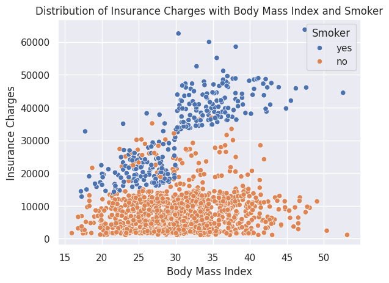
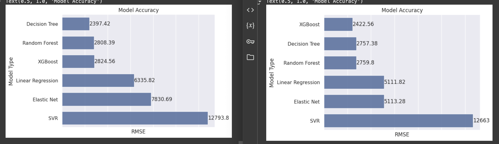
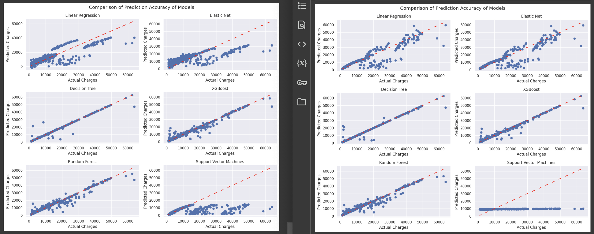

# Medical Insurance Cost - Prediction
## 궁금한것
- smoker : yes인 집단에는 유효하고, no인 집단에는 유효하지 않은 피쳐는 어떻게 처리해야하지?

### 상호작용항

흡연자는 BMI가 중요한 피쳐이지만, 비흡연자에게는 그렇지 않음

이런 경우 어떻게 모델을 만들어야 할까?

1. 트리기반 모델 사용
    - 회귀모델은 조건부 관계 해석 불가
    - 트리기반 모델은 해석 가능

2. 파생변수 생성 (Smoker * BMI)
    - Smoker = 0 , 1 일때, Smoker = 1인 경우만 유효한 피쳐를 생성가능
    - 다중공산성의 문제가 있기에 lasso, ridge, elsatic net 등 모델이 권고됨
    - 교차검증이 추천됨

## 개선
- 파생변수 사용
- 하이퍼파라미터 튜닝 (XGB, 랜덤포레스트, elastic net)
- region 1~4매핑 대신 원핫 인코딩사용
- 교차검증

## 비교

