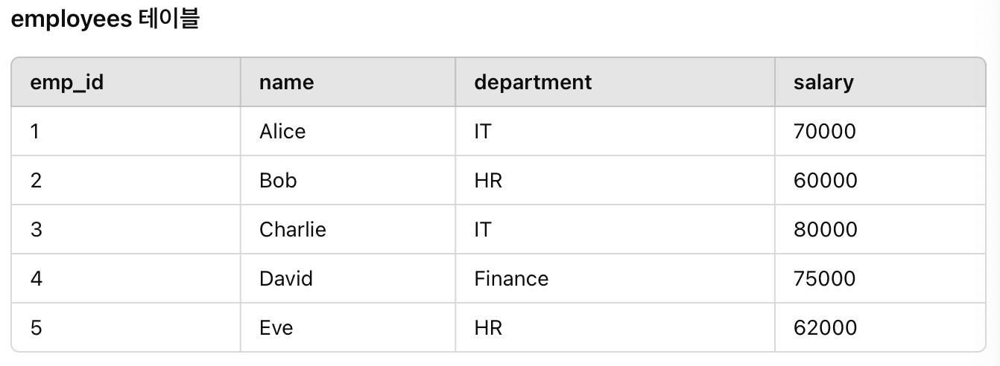
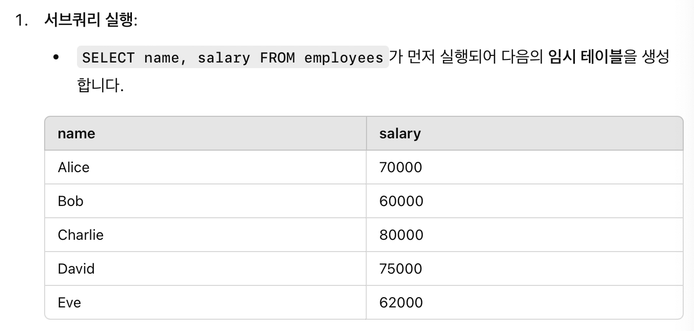
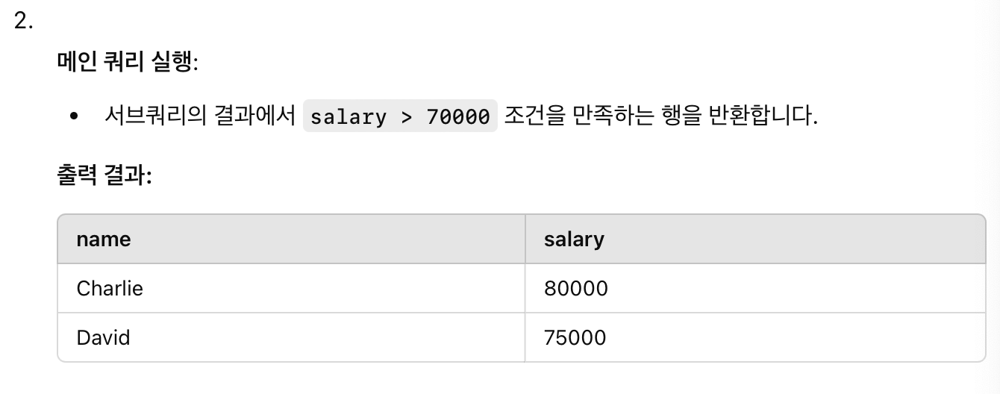
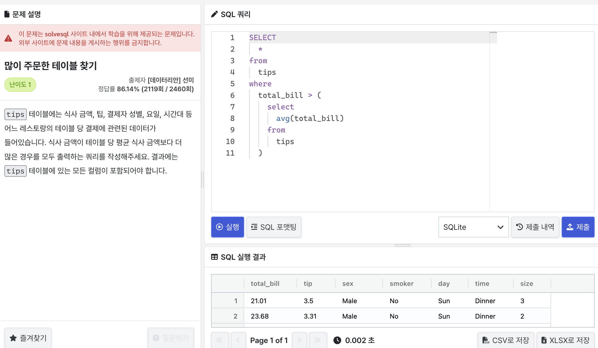
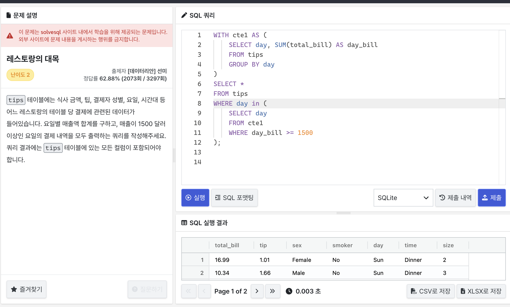
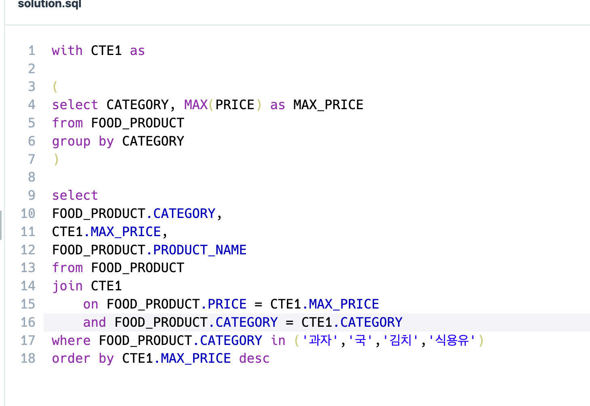

# SQL advanced week0
## 범위
15.2.15. Subqueries

15.2.15.2. Comparisons Using

15.2.15.3. Subquries with ANY, IN or SOME

15.2.15.4. Subqueries with ALL

15.2.15.6. Subqueries with EXIST or NOT EXISTS

15.2.15.10 Subquerey Errors

15.2.20 WITH, Common Table Expressions (CTE)

## 15.2.15.2. Subqueries
서브쿼리는 select 명령문 내의 명령문
```
SELECT * FROM t1 WHERE column1 = (SELECT column1 FROM t2);
```
여기서 select * from t1 where column1 은 외부쿼리,
select column1 from t2 는 서브쿼리 (하위 쿼리)

## 15.2.15.2. Comparisons Using
comparison_operator : = < > <= >= <> != <=>
```
where 'a' = (select column1 from t1)
```
```
select * from t1
    where column1 = (select MAX(column2) from t2);
```
```
SELECT * FROM t1 AS t
  WHERE 2 = (SELECT COUNT(*) FROM t1 WHERE t1.id = t.id);
```

## 15.2.15.3. Subquries with ANY, IN or SOME
Any?

- 무조건 비교 연산자가 따라옴
- 서브쿼리에서 반환된 값 중 하나라도 조건을 만족하면 TRUE

```
SELECT s1
FROM t1 
WHERE s1 > 
    ANY (
        SELECT s1
        FROM t2
);
```
t1.s1이 t2.s1 값 중 하나보다 크면 해당 행을 반환

ANY와 ALL의 차이점?
- ANY는 하나라고 크면 참, ALL은 모두보다 크면 참

IN?

- = ANY와 동일하게 사용됨
- 동일한 값을 찾을 때만 사용되며, '<' '>' 등과는 사용불가
```
SELECT s1
FROM t1
WHERE s1 = ANY (
    SELECT s1
    FROM t2);

SELECT s1
FROM t1
WHERE s1 IN (SELECT s1
    FROM t2);
```
이 둘은 동일

SOME?

- ANY와 동일하게 동작, 잘 사용안됨

## 15.2.15.4. Subqueries with ALL
ALL 연산자는 뒤에 모든 값에 대해 TRUE이면 TRUE반환
```
SELECT s1
FROM t1
WHERE s1 > ALL (
    SELECT s1
    FROM t2);
```
t1의 s1의 값이 t2의 s1의 모든 값과 비교했을때 크면 그 행 가져옴

<br/>
결측치가 있을수도 있다!

결측치와 비교하면 잘못된 결과가 나올 수도 있기에,
```
SELECT *
FROM t1
WHERE 1 > ALL (
    SELECT MAX(s1)
    FROM t2);
```
이런식으로 대체 가능, 아니면
```
SELECT *
FROM t1
WHERE 1 > ALL (
    SELECT MAX(s1)
    FROM t2
    WHERE s1 IS NOT NULL);
```
요렇게

'NOT IN'과 '<>'
```
SELECT s1 FROM t1 WHERE s1 <> ALL (SELECT s1 FROM t2);
SELECT s1 FROM t1 WHERE s1 NOT IN (SELECT s1 FROM t2);
```
이 두 문장은 동일

테이블 키워드란?
<br/>

- SQL에서 특정 테이블의 모든 행을 반환할 때 사용
- Select * From 테이블명 과 동일한 의미

## 15.2.15.6. Subqueries with EXIST or NOT EXISTS
EXIST란?

- 서브쿼리의 결과가 존재하는지 확인할 때 사용
- 서브쿼리에 행이 하나라도 있으면 TRUE, 없으면 FALSE

```
SELECT column1
FROM t1
WHERE EXISTS (SELECT * FROM t2);
```
(SELECT * FROM t2);가 존재하기에, 모든 값 반환

```
SELECT DISTINCT store_type
FROM stores
WHERE EXISTS (SELECT *
                FROM cities_stores
                WHERE 
                    cities_stores.store_type = stores.store_type);
```
cities_stores.store_type과 stores.store_type이 일치하는 행이 존재하면 TRUE,
없으면 FALSE
-> TRUE면 WHERE절 충족

```
SELECT DISTINCT store_type
FROM stores
WHERE NOT EXISTS (SELECT *
                  FROM cities_stores
                  WHERE
                    cities_stores.store_type = stores.store_type);
```
EXIST의 반대, 모두 존재하지 않으면 TRUE

## 15.2.15.10 Subquerey Errors
파생 테이블?

- 쿼리 절의 범위 내에서 테이블을 생성하는 표현식
```
SELECT ...
FROM (subquery) [AS] tbl_name ...
```

- GPT 예제
```
SELECT *
FROM (SELECT name, salary FROM employees) AS emp_sub
WHERE salary > 70000;
```




## 15.2.20 WITH , Common Table Expressions (CTE)
CTE는 단일 명령문의 범위 내에 존재하는 명명된 임시 결과 집합
나중에 해당 명령문 내에서 여러 번 참조될 수 있다

<br/>
CTE로 지정하려먼 WITH 쉼표로 구분된 하위 절이 하나 이상 있는 절을 사용
각 하위 절은 결과 집합을 생성하는 하위 쿼리를 제공하고 이름을 하위 쿼리와 연결

솔직히 무슨 말인지 모르겠다

```
WITH
  cte1 AS (SELECT a, b FROM table1),
  cte2 AS (SELECT c, d FROM table2)
SELECT b, d
FROM cte1
JOIN cte2
WHERE cte1.a = cte2.c;
```
- table1의 a, b를 cte1으로, table2의 c, d를 cte2로 함
- cte1.a와 cte2.c가 동일한 것들을 cte1에서 cte2와 조인함 (그럼 칼럼은 a,b,c,d로 됨)
- 그 중 b, d select

```
WITH cte (col1, col2) AS
(
  SELECT 1, 2
  UNION ALL
  SELECT 3, 4
)
SELECT col1, col2 FROM cte;
```
- col1과 col2를 가지는 cte테이블을 만듬
- (1,2) 와 (3,4)의 행을 만들어 유니온함
- cte에서 col1과 col2 열을 조회

```
WITH cte AS
(
  SELECT 1 AS col1, 2 AS col2
  UNION ALL
  SELECT 3, 4
)
SELECT col1, col2 FROM cte;
```
- 위와 동일

<br/>
- GPT 예제
```
WITH
    cte1 AS (
        SELECT column1, column2
        FROM table1
    ),
    cte2 AS (
        SELECT column3, column4
        FROM table2
    )
SELECT *
FROM cte1
JOIN cte2
ON cte1.column1 = cte2.column3;
```
- table1에서 coulumn1, 2를 뽑아 cte1 지정, 같은 원리로 cte2 지정
- cte1에 cte2 조인
- 조건은 (ON) cte1.column1 = cte2.column3;

- CTE는 자체 또는 다른 CTE 참조가능

# 문제
## 많이 주문한 테이블



## 레스토랑의 대목


아니 왜 in은 되는데 = any는 안됨???

## 식품분류별 가장 비싼 식품의 정보 조회하기 
