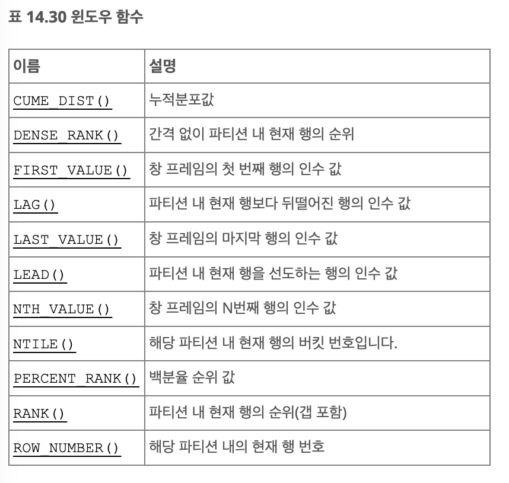
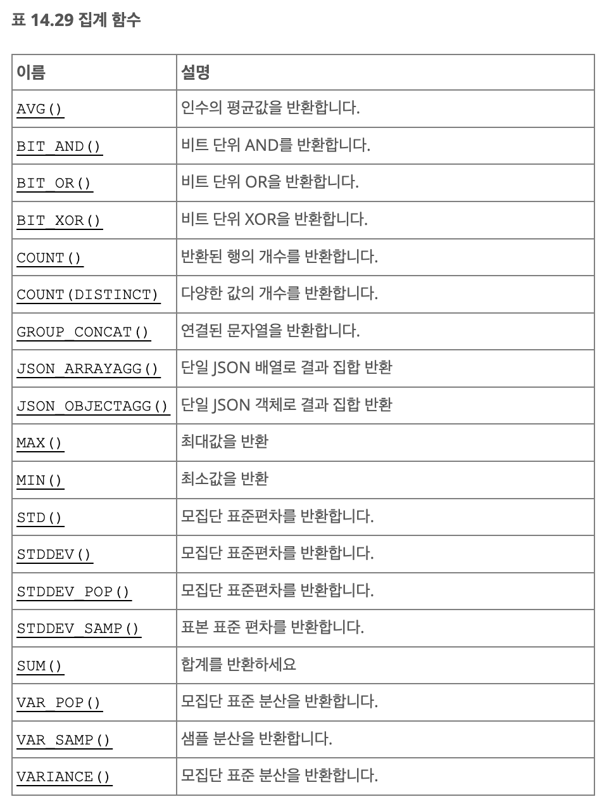
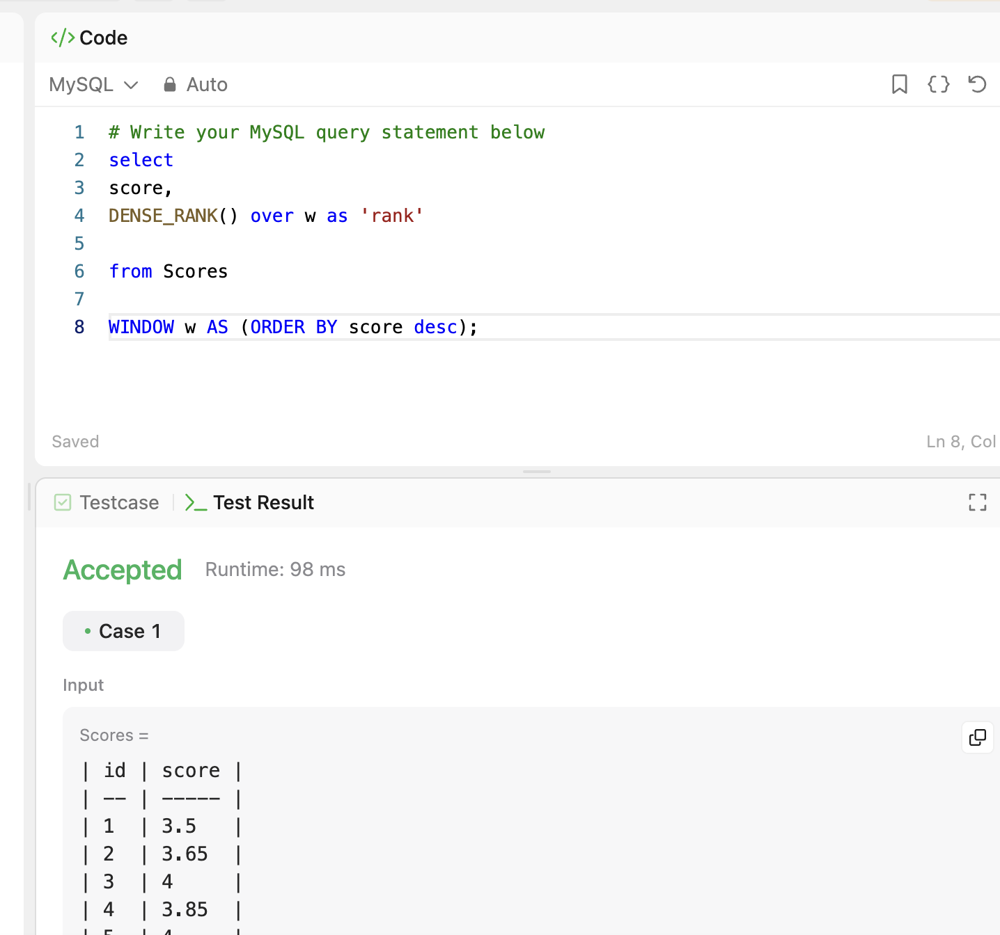
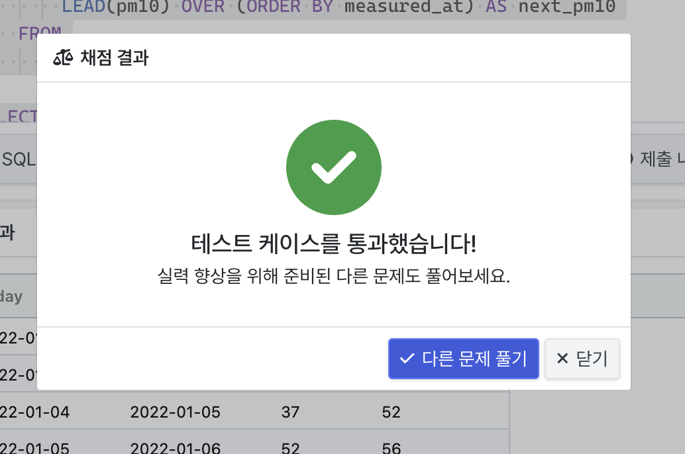

# SQL advanced week1
## 범위
14.20.2. Window Function Concepts and Syntax

14.20.1 Window Function Descriptions

14.20.4 Named Windows

14.19.1 Aggregate Function Descriptions


## 14.20.2. Window Function Concepts and Syntax

- Window 함수는 일련의 쿼리 행에 대해 집계와 같은 작업을 수행
- Window 함수는 각 쿼리 행에 대한 결과를 생성

```SQL
mysql> SELECT * FROM sales ORDER BY country, year, product;
+------+---------+------------+--------+
| year | country | product    | profit |
+------+---------+------------+--------+
| 2000 | Finland | Computer   |   1500 |
| 2000 | Finland | Phone      |    100 |
| 2001 | Finland | Phone      |     10 |
| 2000 | India   | Calculator |     75 |
| 2000 | India   | Calculator |     75 |
| 2000 | India   | Computer   |   1200 |
| 2000 | USA     | Calculator |     75 |
| 2000 | USA     | Computer   |   1500 |
| 2001 | USA     | Calculator |     50 |
| 2001 | USA     | Computer   |   1500 |
| 2001 | USA     | Computer   |   1200 |
| 2001 | USA     | TV         |    150 |
| 2001 | USA     | TV         |    100 |
+------+---------+------------+--------+
```

- Window 연산은 각 행에 대한 결과를 생성함

```SQL
mysql> SELECT
         year, country, product, profit,
         SUM(profit) OVER() AS total_profit,
         SUM(profit) OVER(PARTITION BY country) AS country_profit
       FROM sales
       ORDER BY country, year, product, profit;
+------+---------+------------+--------+--------------+----------------+
| year | country | product    | profit | total_profit | country_profit |
+------+---------+------------+--------+--------------+----------------+
| 2000 | Finland | Computer   |   1500 |         7535 |           1610 |
| 2000 | Finland | Phone      |    100 |         7535 |           1610 |
| 2001 | Finland | Phone      |     10 |         7535 |           1610 |
| 2000 | India   | Calculator |     75 |         7535 |           1350 |
| 2000 | India   | Calculator |     75 |         7535 |           1350 |
| 2000 | India   | Computer   |   1200 |         7535 |           1350 |
| 2000 | USA     | Calculator |     75 |         7535 |           4575 |
| 2000 | USA     | Computer   |   1500 |         7535 |           4575 |
| 2001 | USA     | Calculator |     50 |         7535 |           4575 |
| 2001 | USA     | Computer   |   1200 |         7535 |           4575 |
| 2001 | USA     | Computer   |   1500 |         7535 |           4575 |
| 2001 | USA     | TV         |    100 |         7535 |           4575 |
| 2001 | USA     | TV         |    150 |         7535 |           4575 |
+------+---------+------------+--------+--------------+----------------+
```
- SUM(profit) OVER() AS total_profit, : 전체 수익의 합계를 total_profit 칼럼에 생성
- SUM(profit) OVER(PARTITION BY country) AS country_profit : 국가별로 수익을 합계내어 country_profit 칼럼에 생성


OVER 절이란?
- 계산을 수행할 윈도우(행 집합)의 범위
- PARTITION BY, ORDER BY, ROWS 또는 RANGE 등 옵션 사용가능

```SQL
mysql> SELECT
         year, country, product, profit,
         ROW_NUMBER() OVER(PARTITION BY country) AS row_num1,
         ROW_NUMBER() OVER(PARTITION BY country ORDER BY year, product) AS row_num2
       FROM sales;
+------+---------+------------+--------+----------+----------+
| year | country | product    | profit | row_num1 | row_num2 |
+------+---------+------------+--------+----------+----------+
| 2000 | Finland | Computer   |   1500 |        2 |        1 |
| 2000 | Finland | Phone      |    100 |        1 |        2 |
| 2001 | Finland | Phone      |     10 |        3 |        3 |
| 2000 | India   | Calculator |     75 |        2 |        1 |
| 2000 | India   | Calculator |     75 |        3 |        2 |
| 2000 | India   | Computer   |   1200 |        1 |        3 |
| 2000 | USA     | Calculator |     75 |        5 |        1 |
| 2000 | USA     | Computer   |   1500 |        4 |        2 |
| 2001 | USA     | Calculator |     50 |        2 |        3 |
| 2001 | USA     | Computer   |   1500 |        3 |        4 |
| 2001 | USA     | Computer   |   1200 |        7 |        5 |
| 2001 | USA     | TV         |    150 |        1 |        6 |
| 2001 | USA     | TV         |    100 |        6 |        7 |
+------+---------+------------+--------+----------+----------+
```

-  ROW_NUMBER() OVER(PARTITION BY country) AS row_num1, : 국가별로 나누고 행 순서를 임의로 부여
- 연도와 제품명 기준으로 번호 부여


## 14.20.1 Window Function Descriptions



```SQL
mysql> SELECT
         val,
         ROW_NUMBER()   OVER w AS 'row_number',
         CUME_DIST()    OVER w AS 'cume_dist',
         PERCENT_RANK() OVER w AS 'percent_rank'
       FROM numbers
       WINDOW w AS (ORDER BY val);
+------+------------+--------------------+--------------+
| val  | row_number | cume_dist          | percent_rank |
+------+------------+--------------------+--------------+
|    1 |          1 | 0.2222222222222222 |            0 |
|    1 |          2 | 0.2222222222222222 |            0 |
|    2 |          3 | 0.3333333333333333 |         0.25 |
|    3 |          4 | 0.6666666666666666 |        0.375 |
|    3 |          5 | 0.6666666666666666 |        0.375 |
|    3 |          6 | 0.6666666666666666 |        0.375 |
|    4 |          7 | 0.8888888888888888 |         0.75 |
|    4 |          8 | 0.8888888888888888 |         0.75 |
|    5 |          9 |                  1 |            1 |
+------+------------+--------------------+--------------+
```

- OVER w AS ~ : 윈도우의 정의, w를 이용하여 윈도우 함수를 적용하는 것

- WINDOW w AS (ORDER BY val); :윈도우의 정의, val칼럼을 기준으로 행동들을 정렬하여 윈도우 함수가 계산을 수행할 범위를 설정

- ROW_NUMBER() : 각 행에 고유한 번호를 부여
- CUME_DIST() : 누적 분포를 계산하며, 값이 전체에서 차지하는 비율
- PERCENT_RANK() : 전체 값 중 해당 값의 상대적 위치를 백분율로 계산


```SQL
mysql> SELECT
         time, subject, val,
         FIRST_VALUE(val)  OVER w AS 'first',
         LAST_VALUE(val)   OVER w AS 'last',
         NTH_VALUE(val, 2) OVER w AS 'second',
         NTH_VALUE(val, 4) OVER w AS 'fourth'
       FROM observations
       WINDOW w AS (PARTITION BY subject ORDER BY time
                    ROWS UNBOUNDED PRECEDING);
+----------+---------+------+-------+------+--------+--------+
| time     | subject | val  | first | last | second | fourth |
+----------+---------+------+-------+------+--------+--------+
| 07:00:00 | st113   |   10 |    10 |   10 |   NULL |   NULL |
| 07:15:00 | st113   |    9 |    10 |    9 |      9 |   NULL |
| 07:30:00 | st113   |   25 |    10 |   25 |      9 |   NULL |
| 07:45:00 | st113   |   20 |    10 |   20 |      9 |     20 |
| 07:00:00 | xh458   |    0 |     0 |    0 |   NULL |   NULL |
| 07:15:00 | xh458   |   10 |     0 |   10 |     10 |   NULL |
| 07:30:00 | xh458   |    5 |     0 |    5 |     10 |   NULL |
| 07:45:00 | xh458   |   30 |     0 |   30 |     10 |     30 |
| 08:00:00 | xh458   |   25 |     0 |   25 |     10 |     30 |
+----------+---------+------+-------+------+--------+--------+
```

- FIRST_VALUE(val)  OVER w AS 'first', : 각 subject에 대해 가장 첫 번째 값을 반환

- LAST_VALUE(val)   OVER w AS 'last', : 각 subject에 대해 가장 마지막 값을 반환

- NTH_VALUE(val, 2) OVER w AS 'second', : 각 subject에 대해 2번째 값을 반환

```
1행 first는 처음이자 마지막으로 본 값이 10이기에 10, last도 10, 그러나 하나만 봤기에 second는 null

2행 first는 10,9를 봤으므로 first는 10, last는 9, second는 9

3행은 10,25,9

4행은 10, 20, 9
```

```SQL
mysql> SELECT
         t, val,
         LAG(val)        OVER w AS 'lag',
         LEAD(val)       OVER w AS 'lead',
         val - LAG(val)  OVER w AS 'lag diff',
         val - LEAD(val) OVER w AS 'lead diff'
       FROM series
       WINDOW w AS (ORDER BY t);
+----------+------+------+------+----------+-----------+
| t        | val  | lag  | lead | lag diff | lead diff |
+----------+------+------+------+----------+-----------+
| 12:00:00 |  100 | NULL |  125 |     NULL |       -25 |
| 13:00:00 |  125 |  100 |  132 |       25 |        -7 |
| 14:00:00 |  132 |  125 |  145 |        7 |       -13 |
| 15:00:00 |  145 |  132 |  140 |       13 |         5 |
| 16:00:00 |  140 |  145 |  150 |       -5 |       -10 |
| 17:00:00 |  150 |  140 |  200 |       10 |       -50 |
| 18:00:00 |  200 |  150 | NULL |       50 |      NULL |
+----------+------+------+------+----------+-----------+
```

- LAG(val)        OVER w AS 'lag', : 현재 행보다 이전값 반환
- LEAD(val)       OVER w AS 'lead', : 현재 행보다 다음값 반환

```
1행 lag는 이전이 없으니 NULL, 다음은 100->125이므로 125
2행은 100,132... 이런식
```

- WINDOW w AS (ORDER BY t); : t 칼럼을 기준으로 정렬함


```SQL
mysql> SELECT
         val,
         ROW_NUMBER() OVER w AS 'row_number',
         NTILE(2)     OVER w AS 'ntile2',
         NTILE(4)     OVER w AS 'ntile4'
       FROM numbers
       WINDOW w AS (ORDER BY val);
+------+------------+--------+--------+
| val  | row_number | ntile2 | ntile4 |
+------+------------+--------+--------+
|    1 |          1 |      1 |      1 |
|    1 |          2 |      1 |      1 |
|    2 |          3 |      1 |      1 |
|    3 |          4 |      1 |      2 |
|    3 |          5 |      1 |      2 |
|    3 |          6 |      2 |      3 |
|    4 |          7 |      2 |      3 |
|    4 |          8 |      2 |      4 |
|    5 |          9 |      2 |      4 |
+------+------------+--------+--------+
```

- ROW_NUMBER() OVER w AS 'row_number', : val에 따라 고유 번호 부여

- NTILE(2)     OVER w AS 'ntile2', : 데이터를 2개의 그룹으로 나누고 각 행에 번호 부여

- NTILE(4)     OVER w AS 'ntile4' : 데이터를 4개의 그룹으로 나누고 각 행에 번호 부여

```SQL
mysql> SELECT
         val,
         ROW_NUMBER() OVER w AS 'row_number',
         RANK()       OVER w AS 'rank',
         DENSE_RANK() OVER w AS 'dense_rank'
       FROM numbers
       WINDOW w AS (ORDER BY val);
+------+------------+------+------------+
| val  | row_number | rank | dense_rank |
+------+------------+------+------------+
|    1 |          1 |    1 |          1 |
|    1 |          2 |    1 |          1 |
|    2 |          3 |    3 |          2 |
|    3 |          4 |    4 |          3 |
|    3 |          5 |    4 |          3 |
|    3 |          6 |    4 |          3 |
|    4 |          7 |    7 |          4 |
|    4 |          8 |    7 |          4 |
|    5 |          9 |    9 |          5 |
+------+------------+------+------------+
```

- RANK()       OVER w AS 'rank', : 중복된 값에 같은 순위 부여, 뒤에 오는 값은 순위 건너 뜀 (공동1등, 공동1등, 3등)

- DENSE_RANK() OVER w AS 'dense_rank' : 순위 건너뛰지 않음 (공동1등, 공동1등, 2등)


## 14.20.4 Named Windows

- Windows는 절에서 참조할 수 있는 이름을 지정할 수 있음

```SQL
SELECT
  val,
  ROW_NUMBER() OVER (ORDER BY val) AS 'row_number',
  RANK()       OVER (ORDER BY val) AS 'rank',
  DENSE_RANK() OVER (ORDER BY val) AS 'dense_rank'
FROM numbers;
```

이걸 좀더 간단하게

```SQL
SELECT
  val,
  ROW_NUMBER() OVER w AS 'row_number',
  RANK()       OVER w AS 'rank',
  DENSE_RANK() OVER w AS 'dense_rank'
FROM numbers
WINDOW w AS (ORDER BY val);
```

```SQL
SELECT
  DISTINCT year, country,
  FIRST_VALUE(year) OVER (w ORDER BY year ASC) AS first,
  FIRST_VALUE(year) OVER (w ORDER BY year DESC) AS last
FROM sales
WINDOW w AS (PARTITION BY country);
```
이런식으로 오름, 내림 차순 혼용가능


## 14.19.1 Aggregate Function Descriptions



- 대부분의 집계함수를 WINDOW로 사용가능
- 보통 NULL값 무시
- 일반적으로 GROUP BY와 함께 사용

```SQL
mysql> SELECT student_name, AVG(test_score)
       FROM student
       GROUP BY student_name;
```

GROUP_CONCAT(expr)?
- 여러 행의 값을 하나의 문자열로 결합하는 기능
- 동일한 그룹 내에 각 행의 expr값을 쉼표로 구분하여 결함


```SQL
mysql> SELECT o_id, attribute, value FROM t3;
+------+-----------+-------+
| o_id | attribute | value |
+------+-----------+-------+
|    2 | color     | red   |
|    2 | fabric    | silk  |
|    3 | color     | green |
|    3 | shape     | square|
+------+-----------+-------+
4 rows in set (0.00 sec)

mysql> SELECT o_id, JSON_ARRAYAGG(attribute) AS attributes
    -> FROM t3 GROUP BY o_id;
+------+---------------------+
| o_id | attributes          |
+------+---------------------+
|    2 | ["color", "fabric"] |
|    3 | ["color", "shape"]  |
+------+---------------------+
2 rows in set (0.00 sec)
```
o_id 별로 attribute 칼럼의 값을 JSON 배열로 묶어서 출력


```SQL
mysql> SELECT o_id, attribute, value FROM t3;
+------+-----------+-------+
| o_id | attribute | value |
+------+-----------+-------+
|    2 | color     | red   |
|    2 | fabric    | silk  |
|    3 | color     | green |
|    3 | shape     | square|
+------+-----------+-------+
4 rows in set (0.00 sec)

mysql> SELECT o_id, JSON_OBJECTAGG(attribute, value)
    -> FROM t3 GROUP BY o_id;
+------+---------------------------------------+
| o_id | JSON_OBJECTAGG(attribute, value)      |
+------+---------------------------------------+
|    2 | {"color": "red", "fabric": "silk"}    |
|    3 | {"color": "green", "shape": "square"} |
+------+---------------------------------------+
2 rows in set (0.00 sec)
```

JSON에 대해 더 공부할 필요가 있을듯 하다

## 문제1


## 문제2
```sql
WITH pm10_data AS (
    SELECT
        measured_at AS today,
        pm10,
        LEAD(measured_at) OVER (ORDER BY measured_at) AS next_day,
        LEAD(pm10) OVER (ORDER BY measured_at) AS next_pm10
    FROM
        measurements
)
SELECT
    today,
    next_day,
    pm10,
    next_pm10
FROM
    pm10_data
WHERE
    next_pm10 > pm10;
```

하 GPT가 풀어줌....

## 문제3
```SQL
WITH review_count AS (
    -- 각 회원별 리뷰 수 계산
    SELECT
        mp.MEMBER_NAME,
        rr.REVIEW_TEXT,
        DATE_FORMAT(rr.REVIEW_DATE, '%Y-%m-%d') AS REVIEW_DATE,
        rr.MEMBER_ID,
        COUNT(*) OVER (PARTITION BY rr.MEMBER_ID) AS review_count
    FROM MEMBER_PROFILE mp
    JOIN REST_REVIEW rr
    ON mp.MEMBER_ID = rr.MEMBER_ID
),
max_review AS (
    -- 가장 많은 리뷰 수 계산
    SELECT MAX(review_count) AS max_count
    FROM review_count
)
-- 가장 많은 리뷰를 작성한 회원의 리뷰 조회
SELECT
    rc.MEMBER_NAME,
    rc.REVIEW_TEXT,
    rc.REVIEW_DATE
FROM review_count rc
JOIN max_review mr
ON rc.review_count = mr.max_count
ORDER BY rc.REVIEW_DATE ASC, rc.REVIEW_TEXT ASC;

```
하... GPT의 힘을 빌림