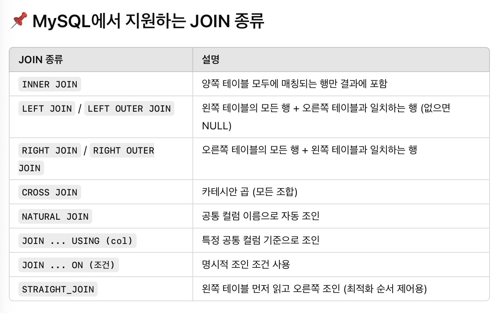
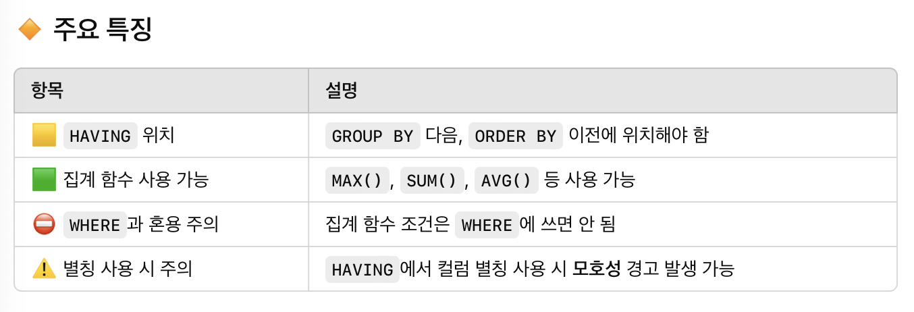
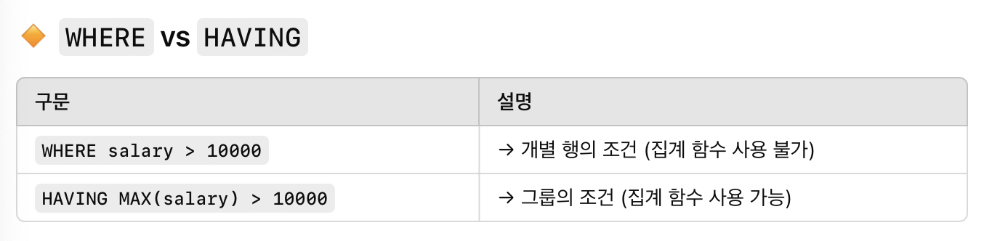

# SQL advanced week2
## 범위
15.2.13.2 JOIN Clause

14.19.3 MySQL Handling of GROUP BY

15.2.13 SELECT Statement

## 15.2.13.2 JOIN Clause

- JOIN은 여러 테이블을 연결해 하나의 결과로 만드는데 사용됨



- JOIN의 기본

```SQL
SELECT ...
FROM table1
JOIN table2 ON 조건
```

- 별칭 사용

```SQL
SELECT t1.name, t2.salary
FROM employee AS t1 JOIN info AS t2 ON t1.name = t2.name;
```

INNER JOIN
```SQL
SELECT * FROM a INNER JOIN b ON a.id = b.id;
```

LEFT JOIN
```SQL
SELECT * FROM a LEFT JOIN b ON a.id = b.id;
```

- JOIN의 우선순위 -> 괄호사용

```SQL
SELECT *
FROM A
JOIN B ON A.id = B.a_id
LEFT JOIN C ON A.id = C.a_id;
```
-> 이렇게 순서대로 하거나

```SQL
SELECT *
FROM (A JOIN B ON A.id = B.a_id)
LEFT JOIN C ON A.id = C.a_id;
```
-> 괄호로 직관적으로 만들기


## 14.19.3 MySQL Handling of GROUP BY

- GROUP BY를 사용할 때 집계 함수가 아닌 칼럼은 반드시 GROUP BY에 포함되어야 함

```SQL
SELECT o.custid, c.name, MAX(o.payment)
FROM orders AS o, customers AS c
WHERE o.custid = c.custid
GROUP BY o.custid;
```
-> 이는 오류, c.name은 집계 함수가 아니면서, GROUP BY에도 없다

해결방법 : c.name을 GROUP BY에 포함

<w/>

그러나 SQL1999에서는 기능적 종속 허용

```SQL
SELECT o.custid, c.name, MAX(o.payment)
FROM orders AS o
JOIN customers AS c ON o.custid = c.custid
GROUP BY o.custid;
```
-> name은 custid에 종속되어 있다! 즉 SELECT에 써도 됨
<w/>

- 예외: WHERE 조건으로 값이 하나로 제한될 경우

```SQL
SELECT a, b, SUM(c)
FROM mytable
WHERE a = 'abc' AND b = 'qrs';
```
-> 이 경우 a, b는 WHERE절에서 고정값으로 제한되었기 때문에 GROUP BY없이도 허용

<w/>

- ANY_VALUE() 함수로 우회

```SQL
SELECT name, ANY_VALUE(address), MAX(age)
FROM t
GROUP BY name;
```
-> address는 어떤 값이든 상관없다는 뜻

<w/>

- MYSQL GROUP BY 확장 기능

표현식도 GROUP BY에 사용 가능

```SQL
GROUP BY FLOOR(value/100)
```

별칭도 GROUP BY에 사용 가능

```SQL
SELECT FLOOR(value/100) AS val
GROUP BY val
```

## 15.2.13 SELECT Statement

- SELECT 문 간단 정리

```SQL
SELECT [옵션들] 선택할_컬럼들
FROM 테이블
[WHERE 조건]
[GROUP BY 그룹기준]
[HAVING 그룹조건]
[ORDER BY 정렬기준]
[LIMIT 제한]
[기타 옵션들...]
```
<w/>
- 옵션

<w/>

DISITNCT : 중복 제거

ALL : 중복 포함

HIGH_PRIOIRTY : SELECT를 UPDATE보다 우선 실행

STRAIGHT_JOIN : JOIN 순서를 FROM에 나열된 선수대로 강제

SQL_SMALL_RESULT, SQL_BIG_RESULT : GROUP BY 또는 DISTINCT 시 회적화 힌트

SQL_BUFFER_RESULT : 결과를 임시 테이블에 저장해 락을 빨리 해제


<w/>
- 조건 및 정렬

<w/>

WHERE : 행 필터링

GROUP BY : 그룹 지정

HAVING : 그룹 필터링

ORDER BY : 정렬

LIMIT : 결과 개수 제한


- HAVING : GROUP BY로 묶인 그룹에 대한 조건 필터링
- WHERE은 행 단위 필터링, HAVING은 그룹 단위 필터링

```SQL
SELECT user, MAX(salary)
FROM users
GROUP BY user
HAVING MAX(salary) > 10000;
```
-> 각 사용자별로 최고 연봉을 구하고, 그 값이 1만 초과인 그룹만 출력





## 문제1
```SQL
-- 코드를 입력하세요
SELECT
BOOK.AUTHOR_ID,
AUTHOR.AUTHOR_NAME,
BOOK.CATEGORY,
SUM(BOOK_SALES.SALES * BOOK.PRICE) as TOTAL_SALES

from (BOOK join AUTHOR ON BOOK.AUTHOR_ID = AUTHOR.AUTHOR_ID)
JOIN BOOK_SALES ON BOOK.BOOK_ID = BOOK_SALES.BOOK_ID

WHERE
BOOK_SALES.SALES_DATE <= '2022-01-31'
and BOOK_SALES.SALES_DATE >= '2022-01-01'

GROUP BY BOOK.AUTHOR_ID , BOOK.CATEGORY

ORDER BY BOOK.AUTHOR_ID ASC, BOOK.CATEGORY DESC;
```

## 문제2
비트마스크가 뭔지 모르겠다
```SQL
WITH FE_CODES AS (
    SELECT CODE
    FROM SKILLCODES
    WHERE CATEGORY = 'Front End'
),
FRONT_END_SUM AS (
    SELECT SUM(CODE) AS TOTAL_FE_CODE
    FROM FE_CODES
),
TARGET_CODES AS (
    SELECT
        (SELECT TOTAL_FE_CODE FROM FRONT_END_SUM) AS FE_CODE,
        MAX(CASE WHEN NAME = 'Python' THEN CODE END) AS PYTHON_CODE,
        MAX(CASE WHEN NAME = 'C#' THEN CODE END) AS C_SHARP_CODE
    FROM SKILLCODES
),
GRADED_DEVS AS (
    SELECT
        D.ID,
        D.EMAIL,
        CASE
            WHEN (D.SKILL_CODE & T.FE_CODE) > 0 AND (D.SKILL_CODE & T.PYTHON_CODE) > 0 THEN 'A'
            WHEN (D.SKILL_CODE & T.C_SHARP_CODE) > 0 THEN 'B'
            WHEN (D.SKILL_CODE & T.FE_CODE) > 0 THEN 'C'
            ELSE NULL
        END AS GRADE
    FROM DEVELOPERS D
    CROSS JOIN TARGET_CODES T
)
SELECT GRADE, ID, EMAIL
FROM GRADED_DEVS
WHERE GRADE IS NOT NULL
ORDER BY GRADE, ID;
```