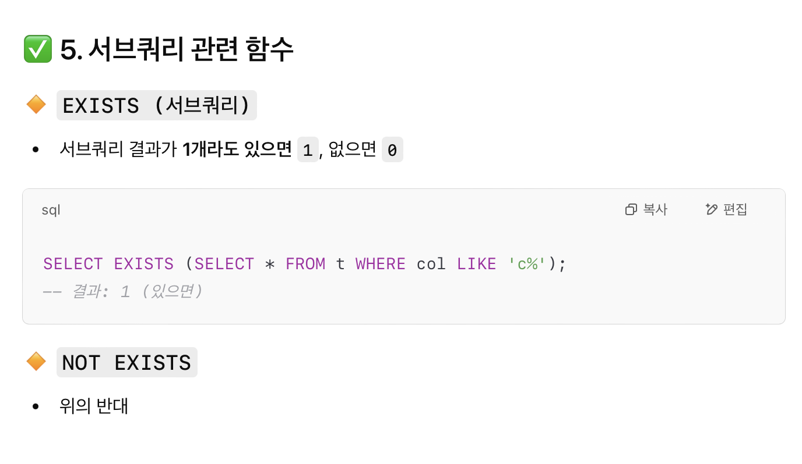

# SQL advanced week3
## 범위
14.5 Flow Control Functions

14.4.2 Comparison Functions and Operators


## 14.5 Flow Control Functions

- CASE, IF, IFNULL(), NULLIF()

### CASE
```SQL
CASE value
    WHEN 비교값 THEN 결과
    [WHEN 비교값 THEN 결과 ...]
    [ELSE 결과]
END
```
```SQL
CASE
    WHEN 조건 THEN 결과
    [WHEN 조건 THEN 결과 ...]
    [ELSE 결과]
END
```

GPT 예제
```SQL
SELECT 
    name, age,
    CASE
        WHEN age < 13 THEN '어린이'
        WHEN age < 20 THEN '청소년'
        WHEN age < 65 THEN '성인'
        ELSE '노인'
    END AS age_group
FROM people;
```
```SQL
SELECT 
    employee_id, salary,
    CASE
        WHEN salary >= 100000 THEN 'High'
        WHEN salary >= 50000 THEN 'Medium'
        ELSE 'Low'
    END AS salary_level
FROM employees;
```
```SQL
SELECT name, status
FROM orders
ORDER BY 
    CASE status
        WHEN '긴급' THEN 1
        WHEN '보통' THEN 2
        WHEN '느림' THEN 3
        ELSE 4
    END;
```

### IF
```SQL
IF(조건, 참일 때 반환값, 거짓일 때 반환값)
```
```SQL
SELECT IF(1>2, 2, 3);
-- 결과: 3

SELECT IF(1<2, 'yes', 'no');
-- 결과: 'yes'
```

### IFNULL
```SQL
SELECT IFNULL(NULL, 10);
-- 결과: 10

SELECT IFNULL(1/0, 'yes');
-- 결과: 'yes'  ← 0으로 나누면 오류지만, NULL로 처리돼서 'yes' 반환
```

### NULLIF

- a=b -> NULL
- a!=b -> a

```SQL
SELECT NULLIF(1, 1);
-- 결과: NULL

SELECT NULLIF(1, 2);
-- 결과: 1
```


## 14.4.2 Comparison Functions and Operators

### 기본 비교 연산자



