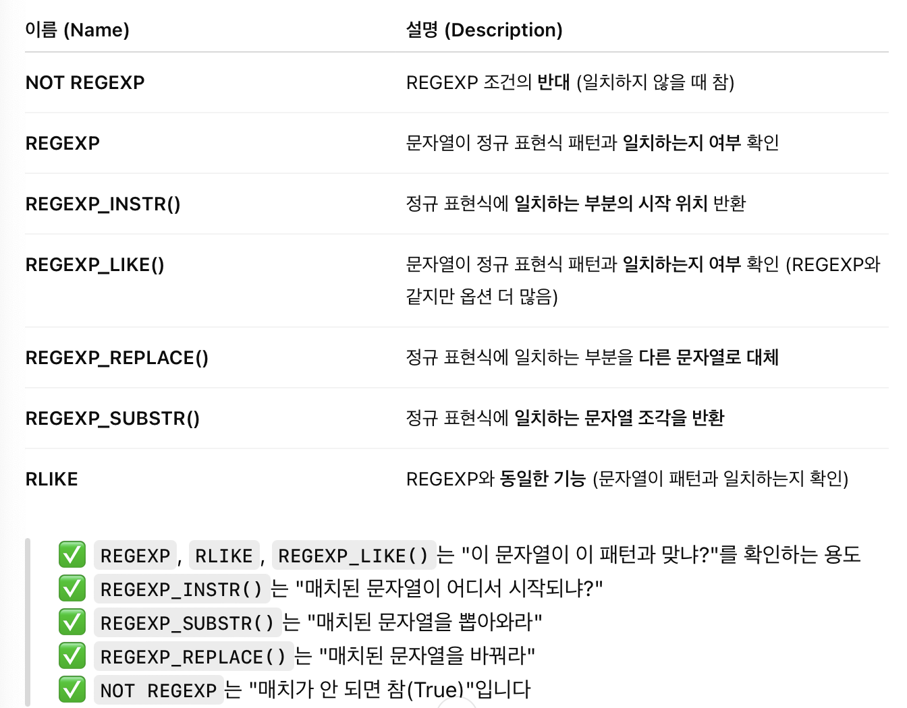
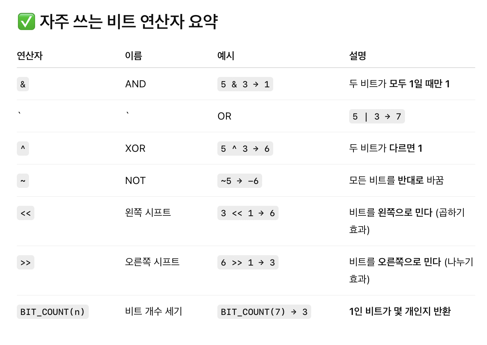
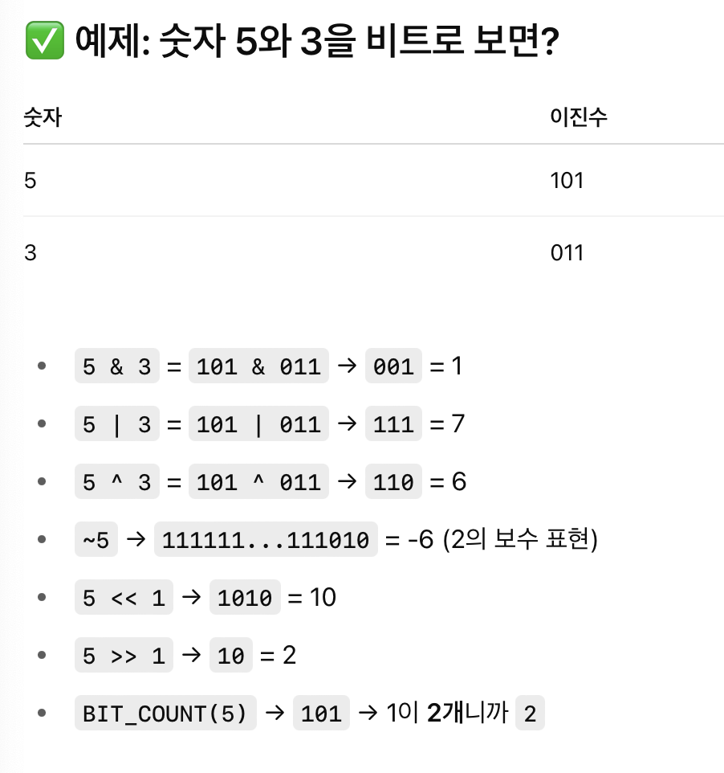
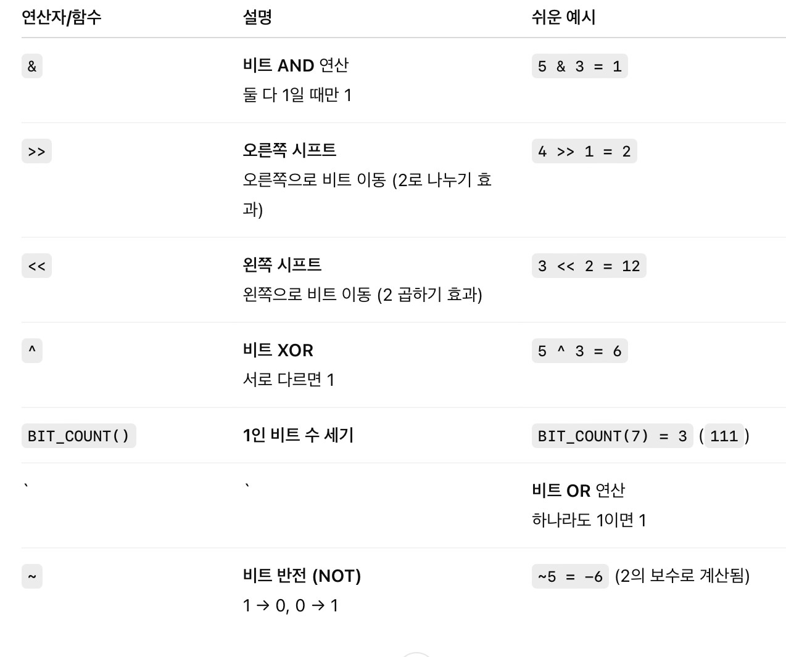
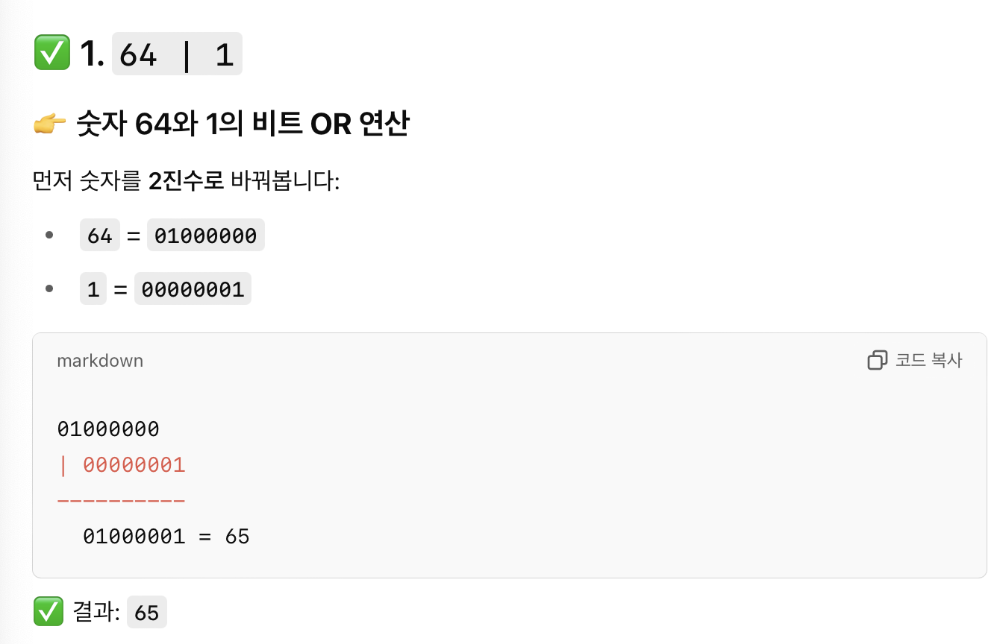
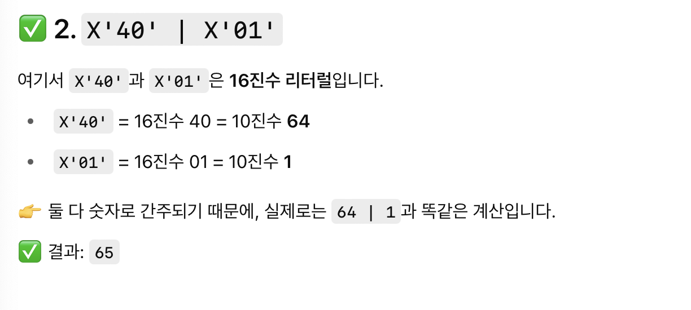

# SQL advanced week5
## 범위
14.8.2 Regular Expressions

14.12 Bit Functions and Operators

## 14.8.2 Regular Expressions

- 정규 표현식은 문자열에서 특정 패턴을 찾거나, 바꾸거나, 검사하는 데 쓰는 도구



예시
```SQL
-- 이름이 "Lee"로 끝나는지 확인
SELECT 'Daniel Lee' REGEXP 'Lee$';  -- 결과: 1

-- 영어 대소문자 구분 없이 "hello"인지 검사
SELECT REGEXP_LIKE('HELLO', 'hello', 'i');  -- 결과: 1

-- 숫자가 처음 나오는 위치 찾기
SELECT REGEXP_INSTR('abc123', '[0-9]');  -- 결과: 4

-- 첫 번째 숫자만 추출
SELECT REGEXP_SUBSTR('abc123def', '[0-9]+');  -- 결과: '123'

-- 공백을 모두 없애기
SELECT REGEXP_REPLACE('a b  c', ' ', '');  -- 결과: 'abc'
```

일치 여부 확인 : REEXP, RLIKE, REGEXP_LIKE()

일치 위치 찾기 : REGEXP_INSTR()

일치 문자열 추출 : REGEXP_SUBSTR()

문자열 변경 : REGEXP_REPLCACE()

일치하지 않을 떄만 : NOT_REGEXP

```SQL
SELECT 'Michael!' REGEXP '.*';
```
-> .*는 정규 표현식에서 아무 문자 0개 이상을 의미

```SQL
SELECT 'a' REGEXP '^[a-d]';
```
-> ^는 문자열의 시작, [a-d]는 이 중 하나를 의미

```SQL
SELECT REGEXP_INSTR('dog cat dog', 'dog');
```
-> dog가 처음 등장하는 위치 (1)

```SQL
SELECT REGEXP_INSTR('dog cat dog', 'dog', 2);
```
-> 검색을 두번째부터 해라는 뜻

```SQL
SELECT REGEXP_INSTR('aa aaa aaaa', 'a{2}');
```
-> a{2} : a가 연속으로 2개 이상있는 패턴 = (1)

```SQL
SELECT REGEXP_INSTR('aa aaa aaaa', 'a{4}');
```
-> 답 8

```SQL
SELECT REGEXP_LIKE('CamelCase', 'CAMELCASE');
```
-> 대소문자 구분 X : TRUE

```SQL
SELECT REGEXP_LIKE('CamelCase', 'CAMELCASE' COLLATE utf8mb4_0900_as_cs);
```
-> 대소문자 구분 O : FALSE


## 14.12 Bit Functions and Operators

- 비트 연산자란 숫자를 이진수로 바꾼 뒤 비트 단위로 연산하는 도구

예시
```
5 -> 101
3 -> 011
```




### 시프트 연산
```
n << k : n을 2^k배로 만든다

n >> k : n을 2^K로 나눈다
```

- 2진수

```
10진수 5  →  2진수 101
10진수 15 →  2진수 1111
```

```SQL
SELECT BIN(5);  -- 결과: '101'
```

- 16진수

```
2진수:  1111 1111 → 16진수: FF
2진수:  0100 0000 → 16진수: 40
```

```SQL
SELECT HEX(255);     -- 결과: 'FF'
SELECT HEX('ABC');   -- 결과: '414243' (ASCII 코드 기반)
```

- 바이너라 문자열
```SQL
SELECT _binary 'A';         -- 문자 'A'를 바이너리로 간주
SELECT HEX(_binary 'A');    -- 결과: '41'
```

```SQL
SELECT _binary X'40' | X'01';  -- 바이너리 연산 → 결과: 'A'
```

예제
```SQL
SELECT 64 | 1, X'40' | X'01';
```




## 문제1

```SQL
select
info.REST_ID,
info.REST_NAME,
info.FOOD_TYPE,
info.FAVORITES,
info.ADDRESS,
round(avg(review.review_score), 2)as SCORE

from rest_info as info
join rest_review as review on info.rest_id = review.rest_id
where
info.ADDRESS REGEXP '^서울'
group by rest_id

order by score desc, favorites desc
```

## 문제 2번 (풀이중...)