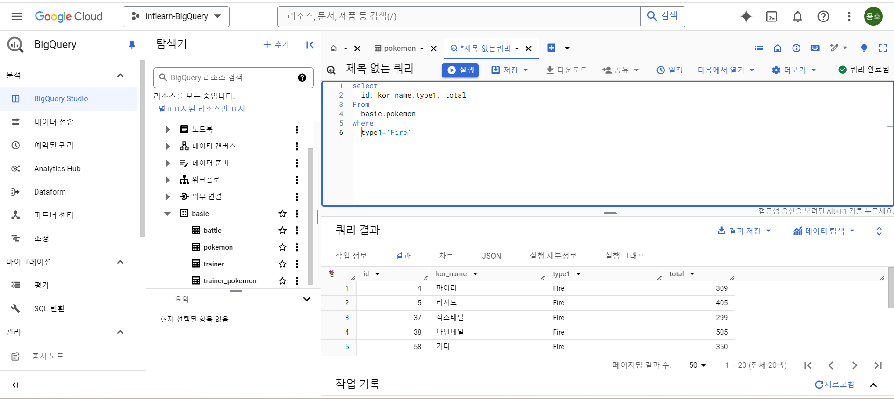

```
2-3 데이터 탐색

포켓몬 예시
포켓몬을 선택할 때 무엇을 보는가? 이름, 타임, 공격력 등등...

SQL 쿼리 구조
select, from, where

select : 어떤 컬럼을 선택할 것인가?
from : 어떤 테이블에서 데이터를 확인할 것인가?
where : 원하는 조건이 있다면 어떤 조건인가?

ex)
select *
from basic.pokemon
where type1="Fire"

*=모든 칼럼을 출력하겠다
* except (제외할 칼럼)

;이 쿼리 구분
```
