```
2-6. 연습 문제 1~3번

1. 포켓몬 중에 type2가 없는 포켓몬의 수를 작성하는 쿼리를 작성해주세요
```
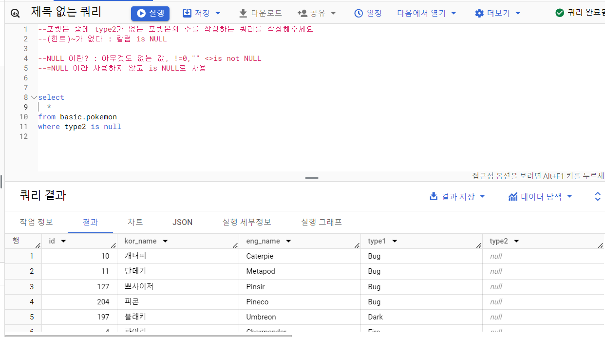
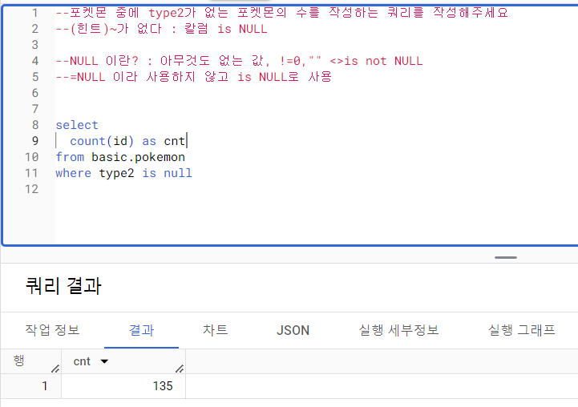
```
-> 조건을 만족하는 값의 개수 (필으 이름이 cnt)
```
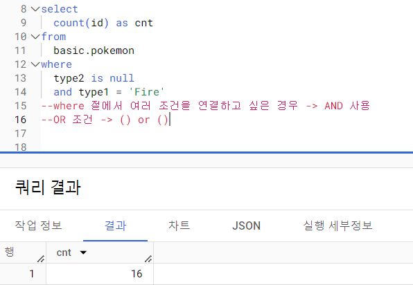
```
-> type2가 null이면서, type1이 'Fire' (AND 연습)
```
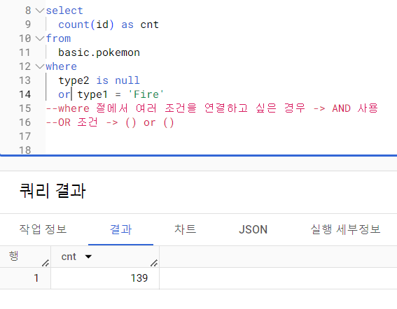
```
-> type2가 null이거나 type1이 'Fire' (OR 연습)
```
```
2. type2가 없는 포켓몬의 type1의 포켓몬 수를 알려주는 쿼리를 작성해 주세요. 단, type1의 포켓몬 수가 큰 순으로 정렬해 주세요
```
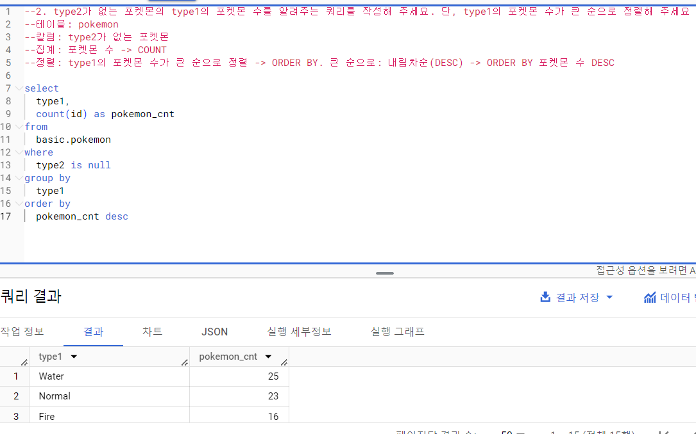
```
-> select, from, where, group by, order by 순

-> type1과 count(id)를 불러옴
-> basic의 pokemon 테이블에서
-> 조건은 type2 is null
-> 행은 type1으로 그룹화
-> 내림차순 정렬
```
```
3. type2 상관없이 type1의 포켓몬 수를 알 수 있는 쿼리를 작성해 주세요
```
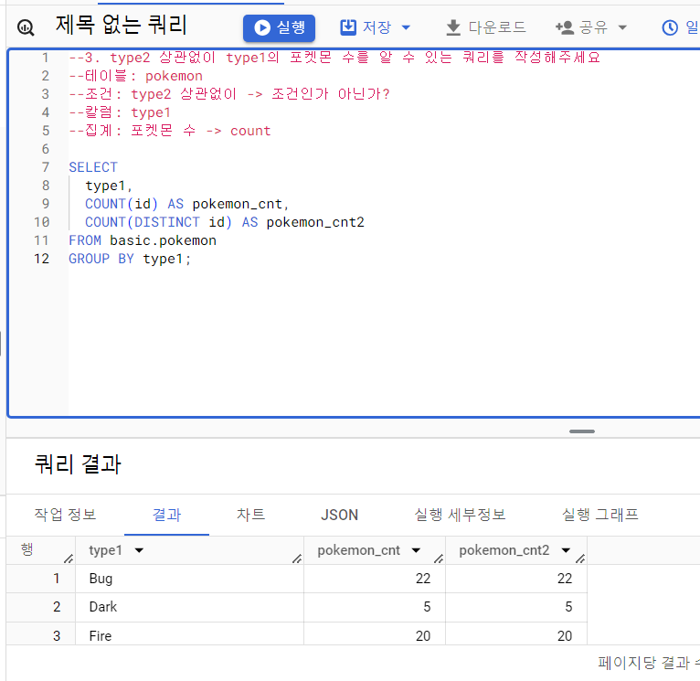
```
-> distinct 사용 -> 중복값 제거
but 문제에서 id는 중복값이 없기에 distinct 사용에 따른 차이 없음
```
```
2-6. 연습문제 7~9번

7. trainer 테이블에서 "Iris","Whiney","Cynthia" 트레이너의 정보를 알 수 있는 쿼리를 작성해 주세요
```
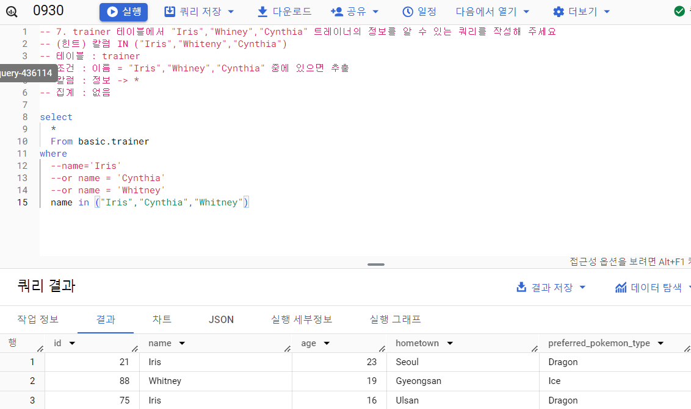
```
조건을 'OR'로 묶기엔 너무 많을 경우, in("","","") 이런식으로 in 사용 가능
```
```
8. 전체 포켓몬 수는 얼마나 되나요?
```
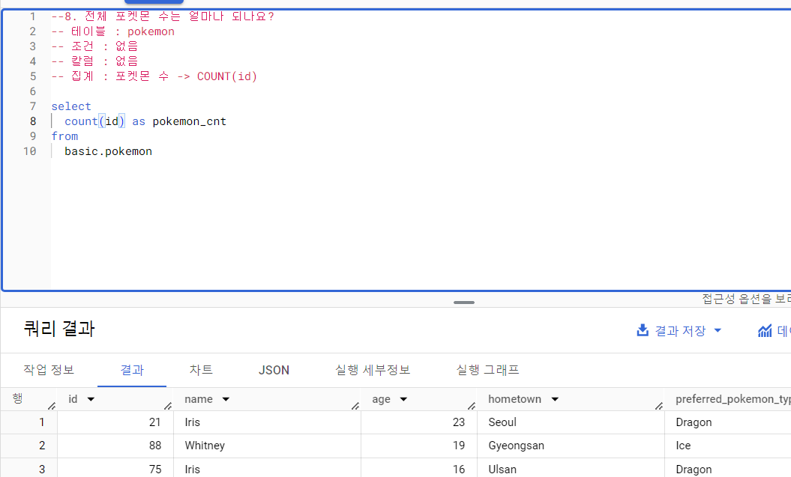
```
전체 수를 셀때는 중복이 없는 id값을 세면 된다.
```
```
9.세대(generation) 별로 포켓몬 수가 얼마나 되는지 알 수 있는 쿼리를 작성해주세요
```
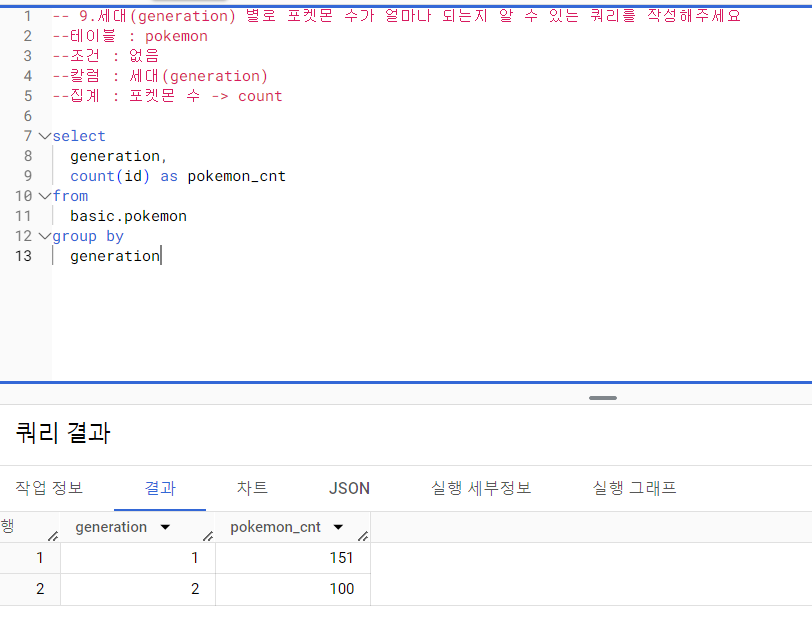
```
세대별 포켓몬 수를 나타내기에 필드는 세대와 개수를 가져와야 하고, 같은 세대끼리 그룹화를 진행해야 한다.
```
```
10. type2가 존재하는 포켓몬의 수는 얼마나 되나요?
```
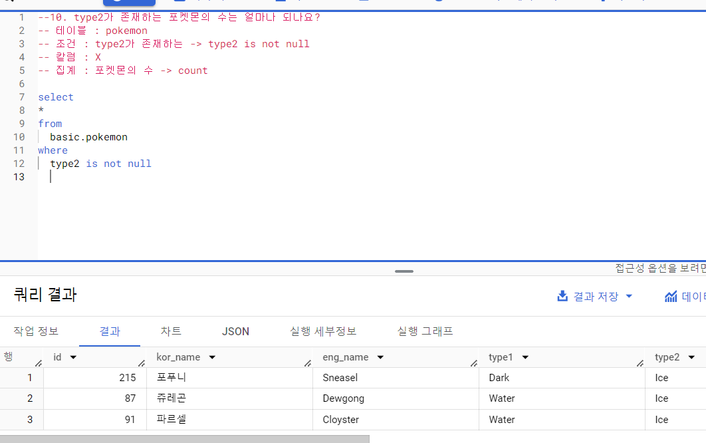
```
type2존재 = type2 is not null
```
```
11. type2가 있는 포켓몬 중에 제일 많은 type1은 무엇인가요?
```
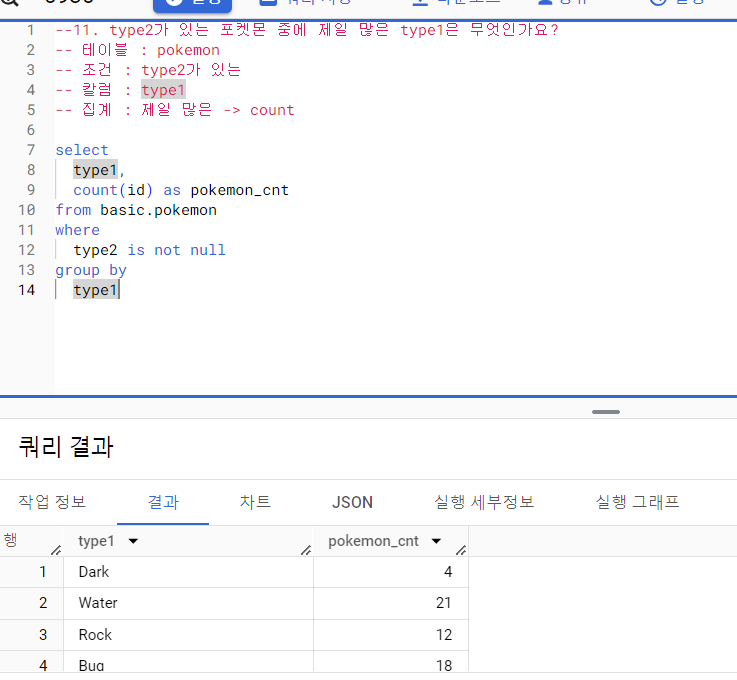
```
type1들끼리 묶어야 하기에 type1으로 그룹화, type2는 is not null, 고유값인 id count

limit : 보기 제한, limit1 -> 상위 하나만 보여줌
```
```
12. 단일(하나의 타입만 있는) 타입 포켓몬 중 많은 type1은 무엇일까요?
```
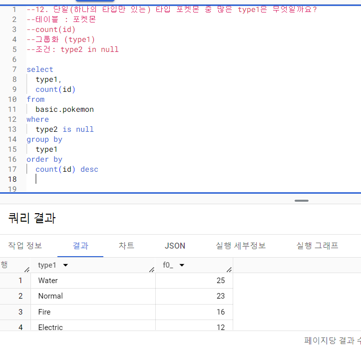
```
단일타입 -> type2 is null로 이해할 수 있어야함
```
```
13. 포켓몬의 이름에 "파"가 들어가는 포켓몬은 어떤 포켓몬이 있을까요?
```
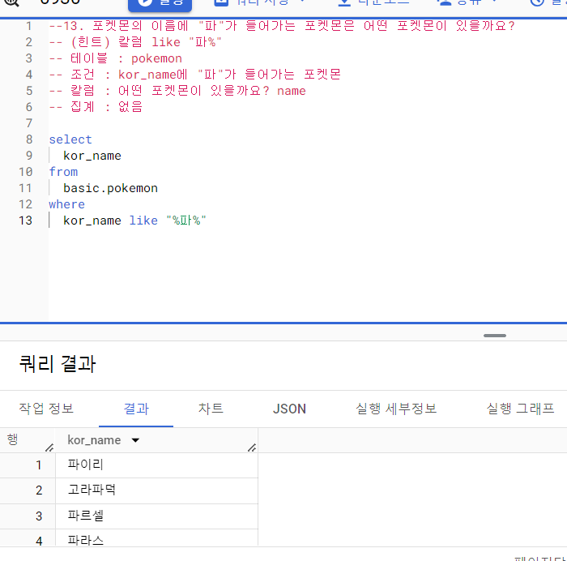
```
LIKE -> 문자열 칼럼에서 특정 단어가 포함되어 있는지 알고 싶은 경우에 사용

% 
    파% -> 파로 시작하는 단어
    %파 -> 파로 끝나는 단어
    %파% -> 파가 포함된 단어
```
```
14. 뱃지가 6개 이상인 트레이너는 몇 명이 있나요?
```
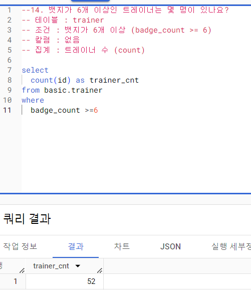
```
조건에 대소관계 <=, >=, <, > 등 사용
```
```
15. 트레이너가 보유한 포켓몬(trainer_pokemon)이 제일 많은 트레이너는 누구일까요?
```
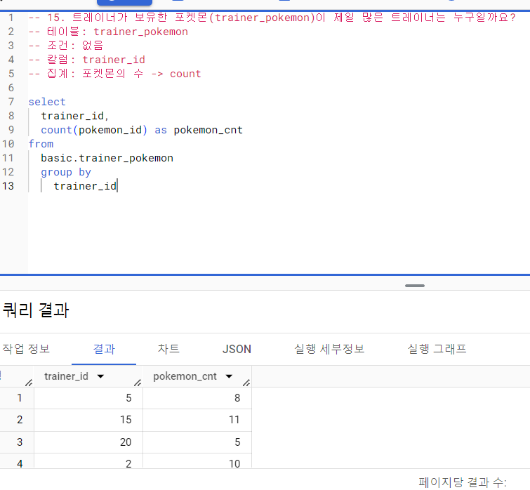
```
고유값인지 아닌지 헷갈릴때는 distinct를 하나는 사용하고 하나는 사용하지 않게하여 비교하고,
그 상황에 더 적절한 것이 무엇인지를 파악, distinct를 쓸지 말지 생각해 보아야함.
이 문제에선 같은 포켓몬을 여러마리 가지고 있을 수 있어서 distinct 사용 X
```
```
16. 포켓몬을 많이 풀어준 트레이너는 누구일까요?
```
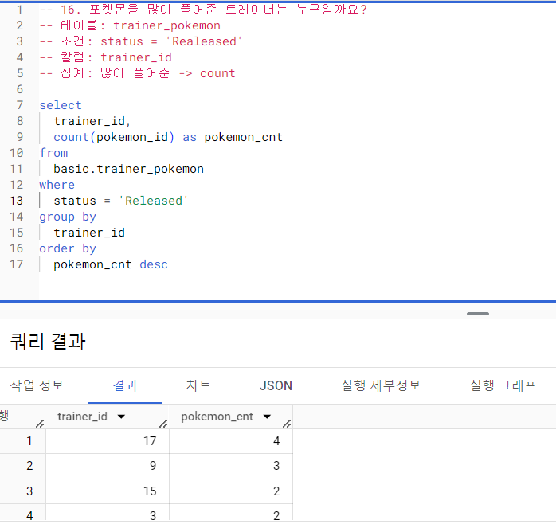
```
하 오타주의
```
```
17. 트레이너 별로 풀어준 포켓몬의 비율이 20%가 넘는 포켓몬 트레이너는 누구일까요?
```
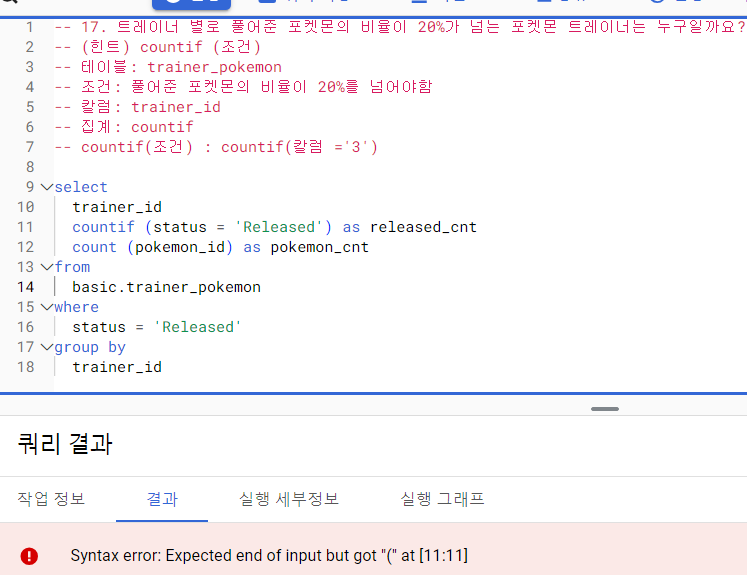
```
오류가 뜨는데 왜 뜨는지 진짜 모르겠음...
```