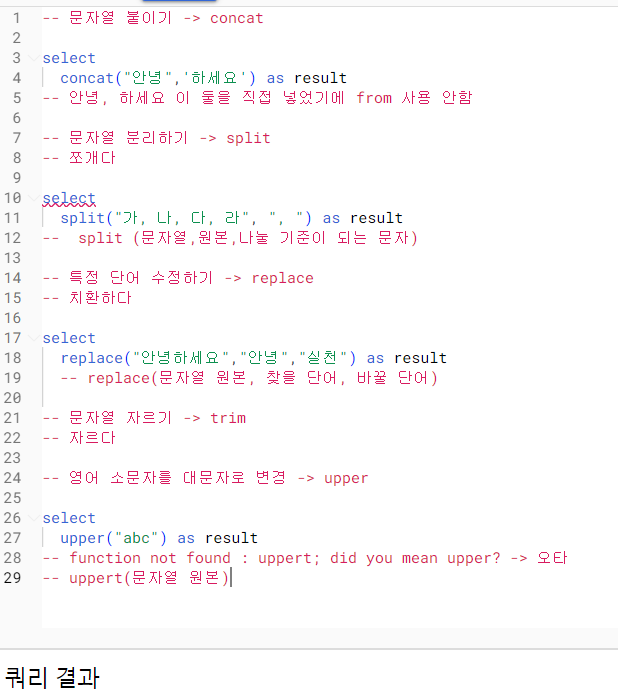

```
3-4 오류를 디버깅하는 방법

많은 오류들 어떻게 해결?
```
```
Syntax error : 문법 오류
번역 -> 검색 (구글, 공식문서, GPT)

select list must not be empty at []
-> select목록은 비어있으면 안됨
```
```
number of arguments does not match for aggregate function count
-> 집계함수 count의 인자 수가 일치하지 않음
```
```
select list expression references column type1 a which is neither grouped not aggreagated
-> select 목록 식은 다음에서 그룹화되거나 집계되지 않은 열을 참조함
-> group by에 적절한 칼럼을 명시하지 않았을 경우
```
```
expected end of input but got keyword select
-> 입력이 끝날 것으로 예상했으나, select 키워드가 입력됨
-> 하나의 쿼리엔 select가 하나만 있어야함
혹은 쿼리가 끝나는 부분에 ; 붙이고 실행할 부분만 드래그해서 실행 
```
```
expected end of input but got keyword WHERE at []
-> 입력이 끝날 것으로 예상되었지만 []에서 키워드 WHERE을 얻음
-> limit 옮기거나 삭제
```
```
expected ")" but got end of script at []
-> ) 가 예상되지만 []에서 스크립트 끝남
```
```
intro

데이터 탐색 : 변환
자료형에 따른 여러 함수
    문자열
    날짜, 시간 데이터
조건문 함수
```
```
4-2 데이터 타입과 데이터 변환

select문에서 데이터를 변활시킬 수 있음
또는 where의 조건문에서도 사용
데이터 타입에 따라 다양한 함수 존재

데이터 타입
    숫자
    문자
    시간,날짜
    부울

보이는 것과 저장된 것의 차이

ex)
"" 와 null
1 -> 숫자 1 혹은 문자 1
2024-10-08 -> date 혹은 문자

타입 변경 함수 CAST

ex)
select
cast(1,as string) #숫자 1을 문자 1로

select
cast("카일스쿨", as int64) # 문자를 숫자로?
->오류 -> safe_cast : 오류면 null

수학 함수
평균, 분산, 코사인 등...

safe_divide(x,y)
-> 오류를 null로 하는 나누기 함수
```
```
4-3 문자열 함수

문자열 데이터로 할 수 있는 대표적인 연산

concat(칼럼1, 칼럼2,...)
    concat("안녕","하세요")
    ->"안녕하세요"

split(문자열 원본, 나눌 기준이 되는 문자)
    split("가,나,다,라",",")
    -> "가","나","다","라" (배열)

replace(문자열 원본, 찾을 단어, 바꿀 단어)
    replace("안녕하세요","안녕","실천")
    -> "실천하세요"


```
