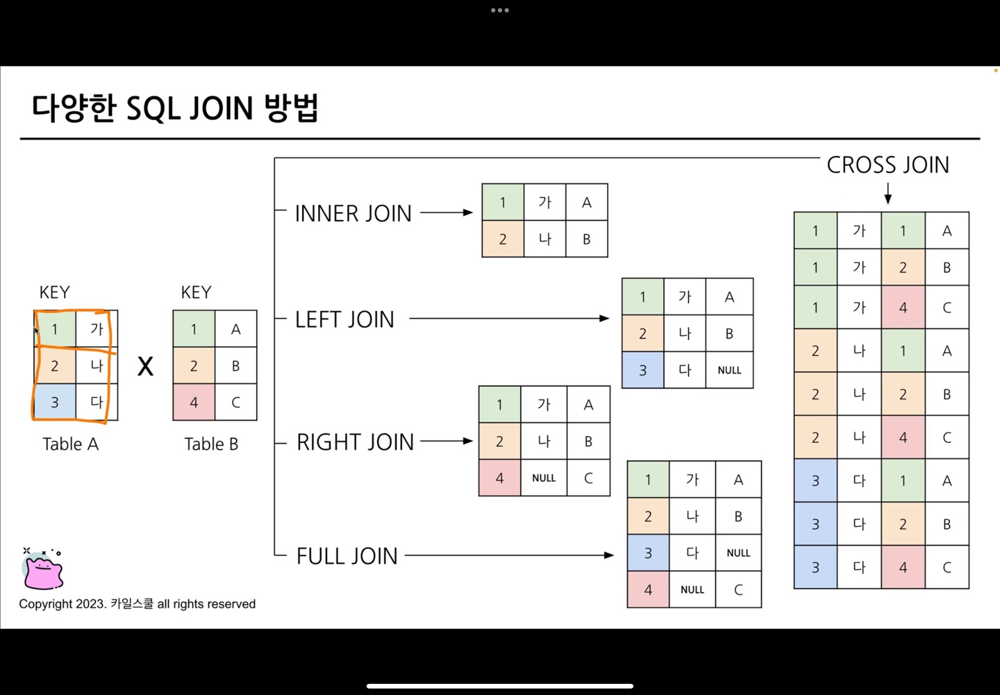
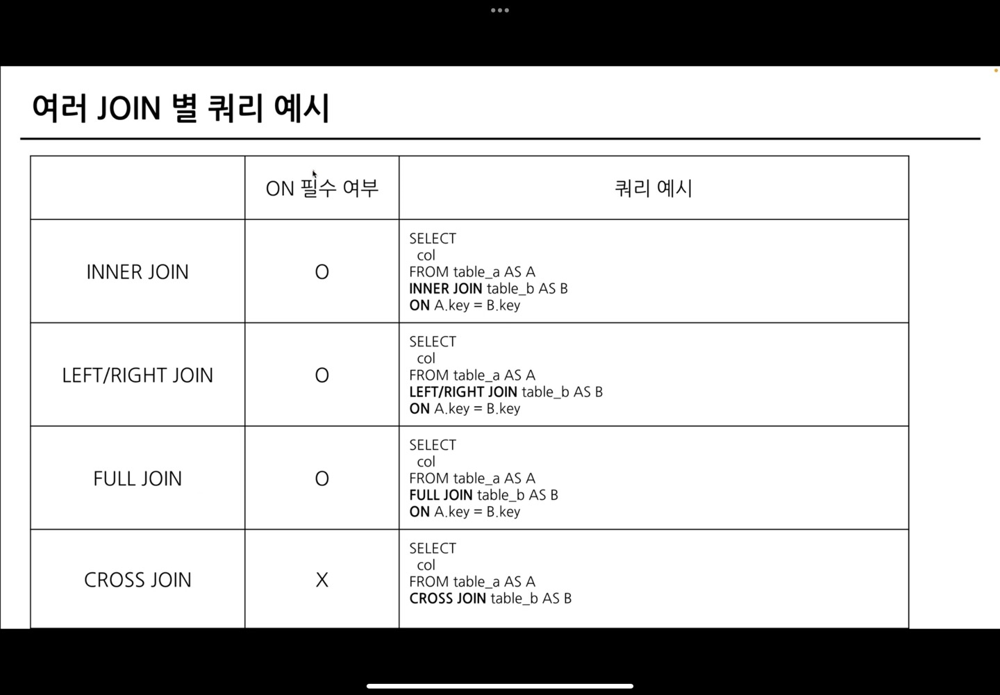
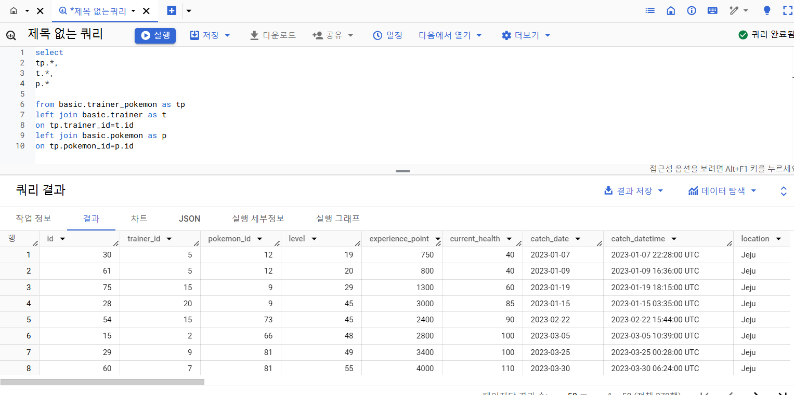
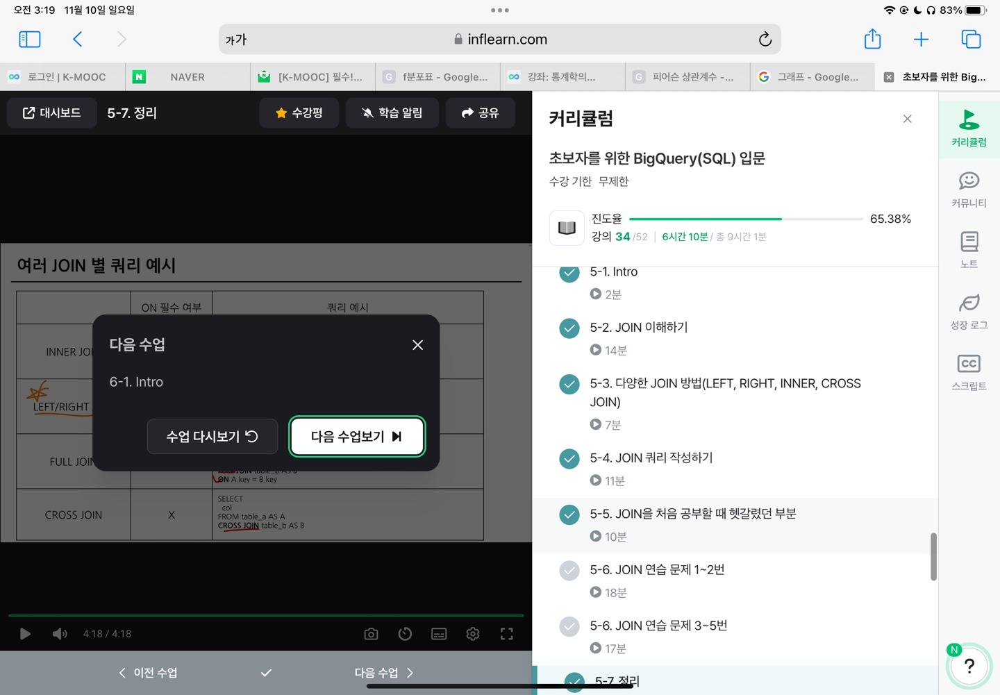

```
5-1 intro

다량의 자료를 연결 : join
여러가지 데이터를 참고하는 것

대부분은 다량의 자료, 그렇기에 조인 필수
```
```
5-2  join 이해하기

서로 다른 데이터 테이블을 연결하는 것!

ex) 포켓몬 데이터
두 데이터를 연결할 수 있는 공통 값이 있나?
trainer_id 와 pokemon_id 가 공통으로 들어간 칼럼
    -> 트레이너 데이터와 포켓몬 데이터를 조인시킬 매개체
    -> trainer_id를 기준으로 두 테이블을 결합

보통 id값을 Key로 사용, 특정범위도 가능

조인은 중복된 데이터를 최소화함
```
```
5-3 다양한 JOIN 방법 (LEFT, RIGHT, INNER, CROSS, JOIN)

SQL join 방법

    inner join : 두 테이블의 공통 요소만 연결
    left/right join : 왼쪽/오른쪽 테이블 기준으로 연결
    full outer join : 양쪽 기준으로 연결
    cross join : 두 테이블의 각각의 요소를 곱하기

left join만 잘 사용하자!

```


```
5-4 JOIN 쿼리 작성하기

흐름

    테이블 확인
    기준 테이블 정의 -> 가장 많이 참고할 테이블 정의
    Join Key 찾기
    결과 예상
    쿼리 작성/ 검증

문법

    select
        A.col1,
        A.col2,
        B.col11,
        B.col12
    from table1 as A
    Left Join table2 as B
    ON A.key=B.key
    -> 별칭 정의 가능

같을 칼럼 이름이 있으면 '_2' 생김
-> EXCEPT() 제외 함수 사용으로 해결 가능
```


```
5-5 JOIN을 처음 공부할 때 헷갈렸던 부분

1. 여러 join 중 어떤 것을 사용해야 할까?
    목적에 따라 다르다
    일반적은 left

2. 어떤 테이블이 왼쪽으로?
    기준이 되는 테이블을 왼쪽으로
    더 알고싶은 데이터가 담긴 테이블?

3. 여러 테이블을 연결할 수 있는걸까?
    한계는 없다
    너무 많은 join도 좋지 않음

4. 칼럼을 모두 선택해야 하나?
    무엇을 하고자 하냐에 따라 다름
    사용하지 않을 칼럼은 선택하지 않는 것이 비용을 줄일 수 있음
    id는 unique한지 확인하기 위해 자주 사용됨

5. NULL?
    NULL은 값이 없음, 알 수 없음
    0이나 공백은 아예 없는 건 아님
    join에서 연결할 값이 없으면 나타남
```
```
5-7 정리

join은 여러 테이블을 연결하는 문법
```
