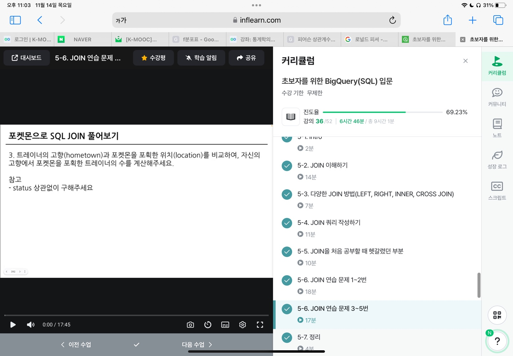

```
5-1 intro

다량의 자료를 연결 : join
여러가지 데이터를 참고하는 것

대부분은 다량의 자료, 그렇기에 조인 필수
```
```
5-2  join 이해하기

서로 다른 데이터 테이블을 연결하는 것!

ex) 포켓몬 데이터
두 데이터를 연결할 수 있는 공통 값이 있나?
trainer_id 와 pokemon_id 가 공통으로 들어간 칼럼
    -> 트레이너 데이터와 포켓몬 데이터를 조인시킬 매개체
    -> trainer_id를 기준으로 두 테이블을 결합

보통 id값을 Key로 사용, 특정범위도 가능

조인은 중복된 데이터를 최소화함
```
```
5-3 다양한 JOIN 방법 (LEFT, RIGHT, INNER, CROSS, JOIN)

SQL join 방법

    inner join : 두 테이블의 공통 요소만 연결
    left/right join : 왼쪽/오른쪽 테이블 기준으로 연결
    full outer join : 양쪽 기준으로 연결
    cross join : 두 테이블의 각각의 요소를 곱하기

left join만 잘 사용하자!

```


```
5-4 JOIN 쿼리 작성하기

흐름

    테이블 확인
    기준 테이블 정의 -> 가장 많이 참고할 테이블 정의
    Join Key 찾기
    결과 예상
    쿼리 작성/ 검증

문법

    select
        A.col1,
        A.col2,
        B.col11,
        B.col12
    from table1 as A
    Left Join table2 as B
    ON A.key=B.key
    -> 별칭 정의 가능

같을 칼럼 이름이 있으면 '_2' 생김
-> EXCEPT() 제외 함수 사용으로 해결 가능
```


```
5-5 JOIN을 처음 공부할 때 헷갈렸던 부분

1. 여러 join 중 어떤 것을 사용해야 할까?
    목적에 따라 다르다
    일반적은 left

2. 어떤 테이블이 왼쪽으로?
    기준이 되는 테이블을 왼쪽으로
    더 알고싶은 데이터가 담긴 테이블?

3. 여러 테이블을 연결할 수 있는걸까?
    한계는 없다
    너무 많은 join도 좋지 않음

4. 칼럼을 모두 선택해야 하나?
    무엇을 하고자 하냐에 따라 다름
    사용하지 않을 칼럼은 선택하지 않는 것이 비용을 줄일 수 있음
    id는 unique한지 확인하기 위해 자주 사용됨

5. NULL?
    NULL은 값이 없음, 알 수 없음
    0이나 공백은 아예 없는 건 아님
    join에서 연결할 값이 없으면 나타남
```
```
5-6 JOIN 연습 문제 1~2번

테이블을 그대로 쓸 필요는 없다
경우에 따라 줄여 써도 됨
```
```
1번
어디서 어떤 열만 가져올것인지 조인 전에 생각하자
가져올 열과 조건을 적고 괄호쳐서 진짜 from 문으로 쓰자
조인은 일단 left로
모호한 칼럼? 중복된 이름이 있는 경우, 테이블.칼럼으로 쓰면됨
where은 from절 뒤로 빼도 되긴한데 데이터를 줄이는게 낫다
where 1=1 , 항상 TRUE? where을 적되 조건을 안거는 경우?
```

```
2번
조인에서 어디가 왼쪽이냐
내가 구하고자 하는 데이터가 제일 잘 저장된 것
LEFT 조인으로 NULL이 생길지 안생길지 생각해보기
count걸면 p.type1이 오류가 뜨는데 이유를 모르겠음

select
  p.type1 ,
  count(tp.id) as pokemon_cnt
from
(
select
id,
trainer_id,
pokemon_id,
status

from
basic.trainer_pokemon

where
status in ("Active","Training")
) as tp
left join basic.pokemon as p
on tp.pokemon_id=p.id
where
type1='Grass'

order by
  2 desc

```

```
5-6 JOIN 연습 문제 3~5번

3번
JOIN을 하면 갑자기 데이터가 많아지는 것 처럼 보임
가령 Goh가 6마리 포켓몬을 소지하면, Goh가 6명이 되는 거 같음
현장에서는 결측치가 있는지 조건 걸어보기
count에서 distinct 항상 생각해보기
```

```
4번
조인이 여러번 나오면 많이 나오는 테이블을 왼쪽으로
```

```
5번
약어 정리 잘하자
3세대가 있으면?
where generation in (1,2)
```

```
5-7 정리

join은 여러 테이블을 연결하는 문법
```
