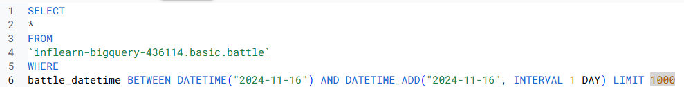
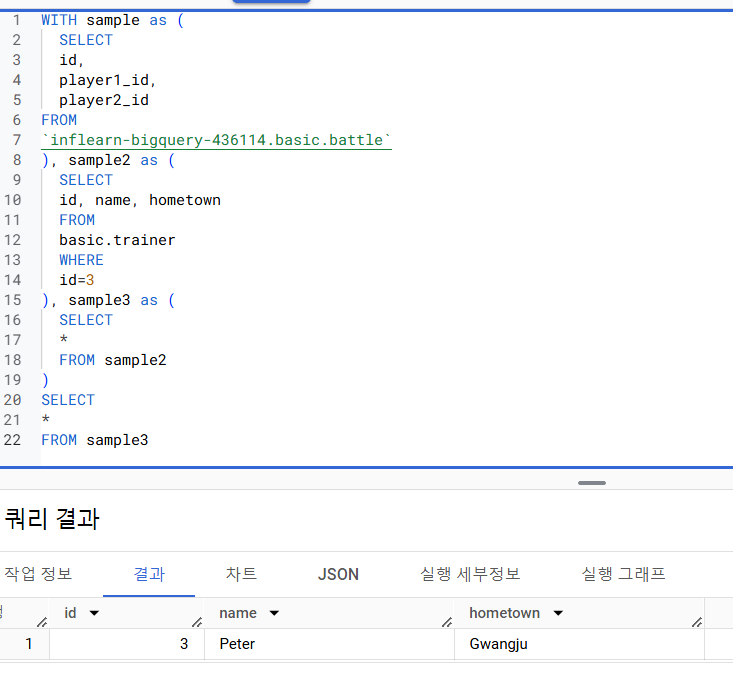
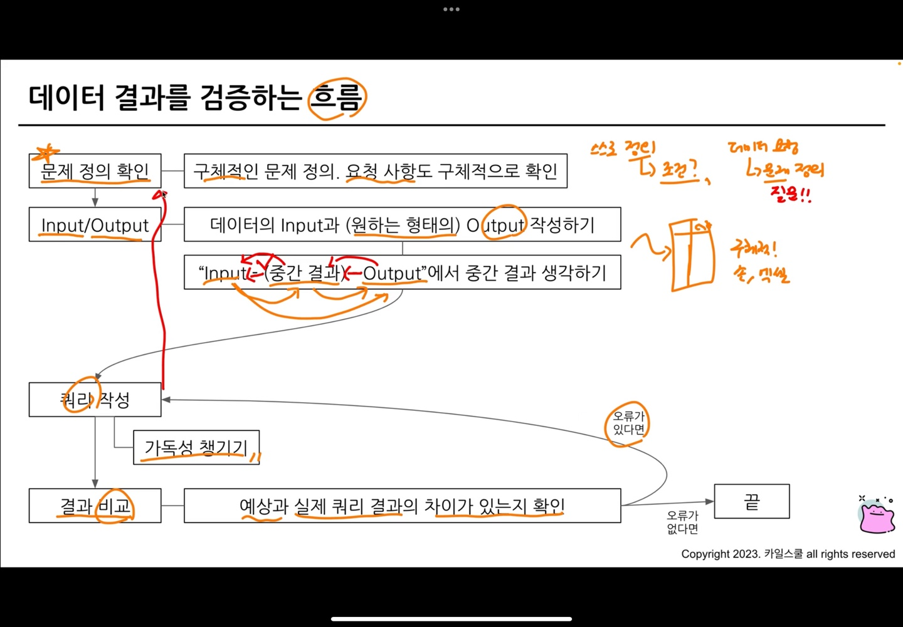
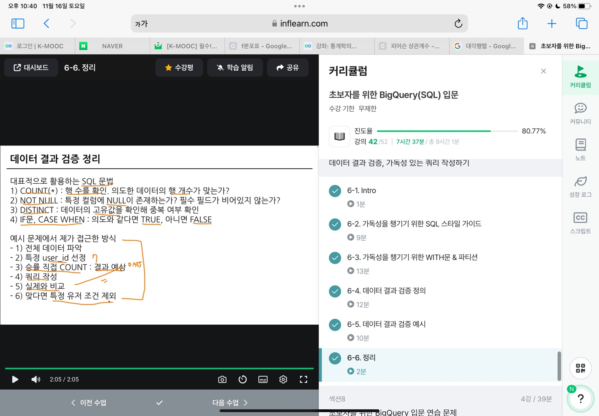

```
6-1 intro

가독성을 챙기기 위한 SQL 스타일 가이드

가독성이 좋아야 검증도 쉽다
```
```
6-2 가독성을 챙기기 위한 SQL 스타일 가이드

실수가 발생하는 경우
1. 문법을 잘못 알고 있을때
2. 데이터를 파악하지 않고 퀴리를 작성할때
3. 쿼리가 복잡할때

데이터 결과 검증 전
타인의 쿼리를 보는경우, 타인이 내 쿼리를 보는경우있음
    -> 이해하기 쉽게 쿼리를 짜야함
    -> 쿼리를 단순하게

SQL 스타일 가이드
https://www.sqlstyle.guide/

Mozilla(FireFox)의 SQL 스타일 가이드
https://docs.telemetry.mozilla.org/concepts/sql_style.html

1. 예약어는 대문자로 작성
    예약어란 SELECT, FROM, WHERE, 각종함수

2. 칼럼 이름은 snake_case로 작성

3. 명시적 vs 암시적인 이름
    Alias는 명시적으로
    별칭은 보통 명시적으로

4. 왼쪽 정렬
    왼쪽에 맞춰서 쓰기

5. 예약어나 컬럼은 한 줄에 하나씩
    SELCET
    col1,
    col2,
    이런식으로

6. 쉼표는 바로 뒤에
```
```
6-3 가독성을 챙기기 위한 WITH문 & 파티션

WITH 문을 사용해 쿼리를 정의해서 재사용 가능

ex)
WITH temp_table AS(
    SELCET
    col1, col2
    FROM
    table
)

여기서 temp_table이 이름
SELECT구문에 이름을 정해주는것

PARTITION
    비용을 챙기는 관점
    1. 쿼리 성능 향상
    2. 데이터 관리 용이
    3. 비용
```


```
6-4 데이터 결과 검증 정의

데이터 결과 검증을 어떻게 할 수 있을까?

데이터 결과 검증이란
    SQL 쿼리 후 얻은 결과가 예상과 일치하는지 확인하는 과정

문제를 잘 정의하고,
미리 작성해보고,
도메인 특수성 잘 파악하기 중요

COUNT(*) : 행 수를 확인. 의도한 데이터의 행 개수가 맞는가?
NOT NULL : 특정 칼럼에 NULL이 존재하는가? 필수 필드가 비어있지 않는가?
DISTINCT : 데이터의 고유값을 확인해 중복 여부 확인
IF문 CASE WHEN : 의도와 같다면 TRUE, 아니면 FALSE

특정 user_id로 필터링을 걸어서 확인
    1명의 데이터 확인 (WHERE user_id = 402)
    결과를 예상할 때 RAW 데이터에서 하나씩 눈으로 세고 적어둠
    1명의 데이터의 예상 결과와 쿼리 결과가 동일한지 확인
    다른 user_id 3~4건 더 추가해서 확인 (여러 케이스가 존재할 수 있음)
    3~4개에서 동일한 결과가 나오면 user_id 조건을 삭제

샘플 데이터 생성하기
    WITH 문을 사용해 예시 데이터를 생성한 후, 결과를 예상하고 쿼리 작성
    복잡한 데이터에서 하기 전에, 쿼리 자체가 올바른지 확인할 때 주로 사용
    문법이 익숙하지 않을때 주로 사용
```

```
6-5 데이터 결과 검증 예시

데이터 결과 검증 프로세스 흐름
1. 전체 데이터 파악
2. 특정 user_id 선정
3. 승률 직접 COUNT : 결과 예상
4. 쿼리 작성
5. 실제와 비교
6. 맞다면 특정 유저 조건 제외

UNION ALL로 SELECT문 합치기가능
```
```
6-6 정리

문제정의
input/output 작성
그 둘의 중간 결과 생각
쿼리 작성 (가독성 챙기기)
결과 비교 (예상과 차이 있는지 확인)

SQL문법으로 검증
    COUNT, NOT NULL, DISTINCT, IF, CASE WHEN
```

