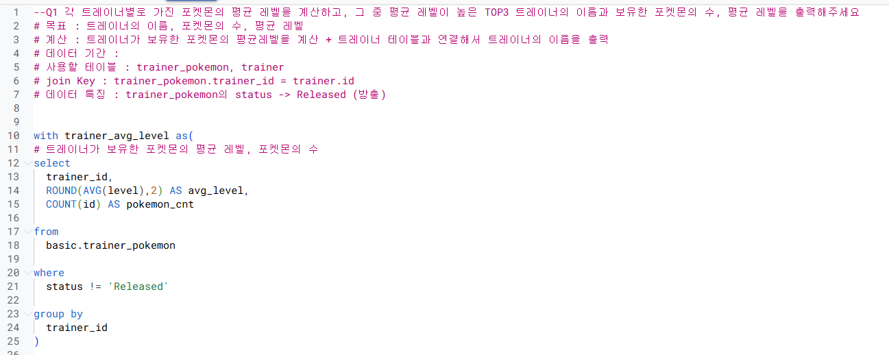
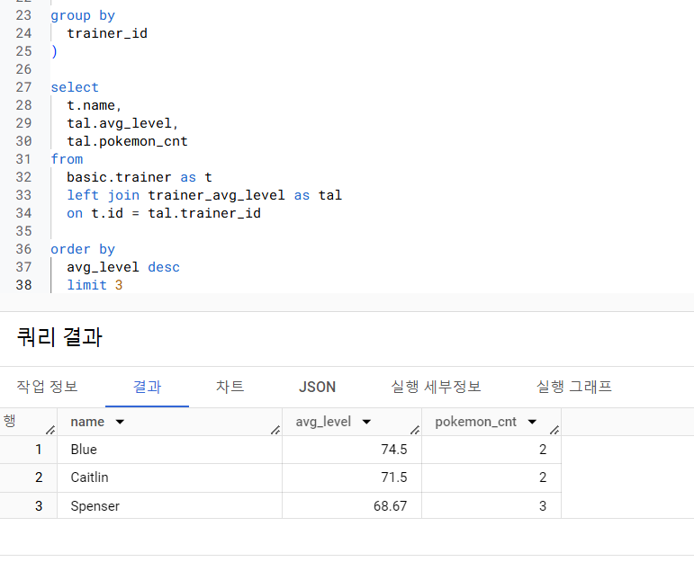
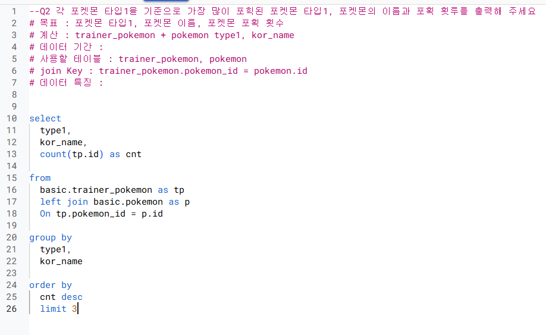
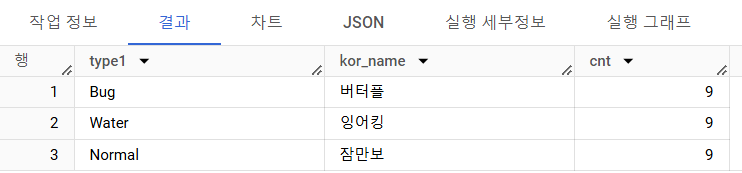

```
총 정리 문제 풀이 1~3번
1번

with as 잘 기억 안났음
-> 보강필요
    with as는 완성된 select~where 구문을 하나의 테이블로 사용하는 장치

order by로 정렬하고 limit를 상위 몇개만 지정할 수 있다는 점 숙지

중복의심 시 select에 distinct 사용 항상 염두할것
```



```
2번
```


```
3번


```