```
2-3 데이터 탐색

포켓몬 예시
포켓몬을 선택할 때 무엇을 보는가? 이름, 타임, 공격력 등등...

SQL 쿼리 구조
select, from, where

select : 어떤 컬럼을 선택할 것인가?
from : 어떤 테이블에서 데이터를 확인할 것인가?
where : 원하는 조건이 있다면 어떤 조건인가?

ex)
select *
from basic.pokemon
where type1="Fire"

*=모든 칼럼을 출력하겠다
* except (제외할 칼럼)

;이 쿼리 구분
```
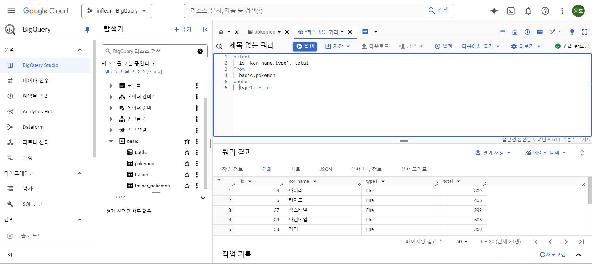
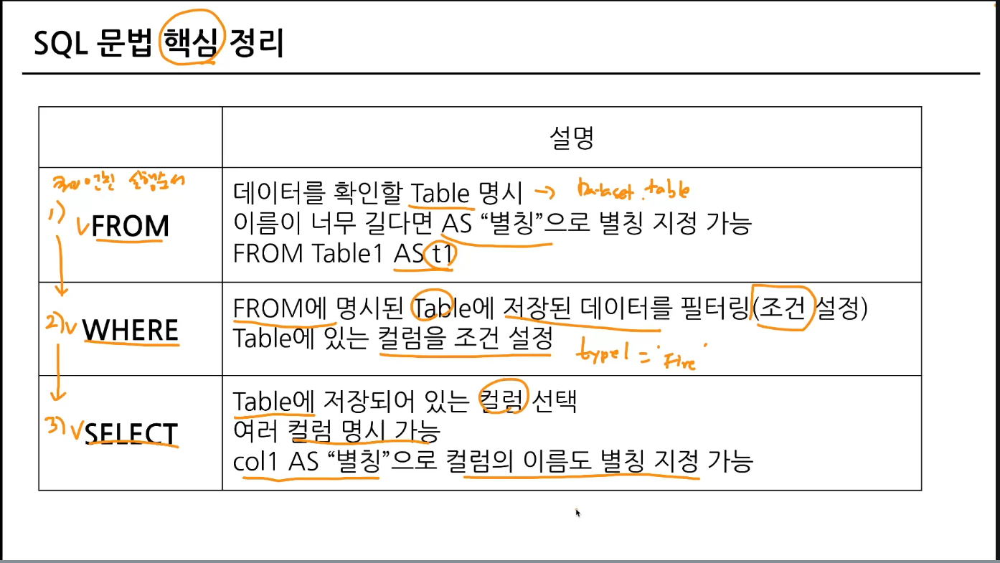


```
2-4 select 연습문제
```

1번

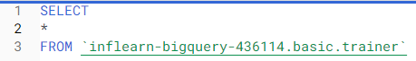

2번

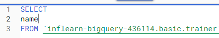

3번

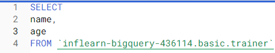

4번

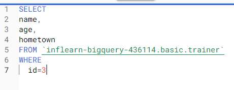

5번

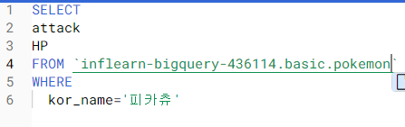


```
2-5 집계

집계하다: 모아서 계산하다
ex) 더하기 빼기 최대 최소값 평균 개수 ...

GROUP BY : 같은 값끼리 모아서 그룹화
특정 컬럼을 기준으로 모으면서 다른 컬럼에선 집계 가능

정렬 (order by) 가능
조건 (having) 가능

select
    집계할 칼럼1
    집계 함수(count,max 등)
from table
group by
    집계할_칼럼1

distinct : 고유값을 알고 싶은 경우
별개의 여러 값 중에서 unique한 것만 보고 싶은 경우 활용

ex)
메인 페이지 view 수는? : 4번
count(user_id)

메인 페이지 view 한 유저 수는? : 3명
count(distinct user_id)

그룹화 활용
일자별, 연령대별, 특정 타입별, 앱 화면별 집계 등등...

where vs having
having : group by 후 조건을 설정하고 싶은 경우

서브 쿼리: select 문 안에 존재하는 select 쿼리

order by <칼럼> <순서> (asc, desc)

limit : row 수 제한
```

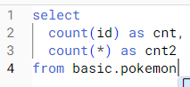
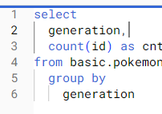
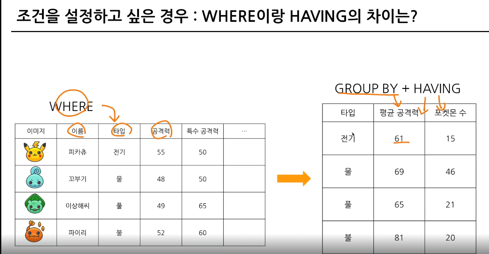
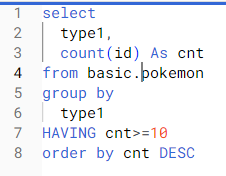
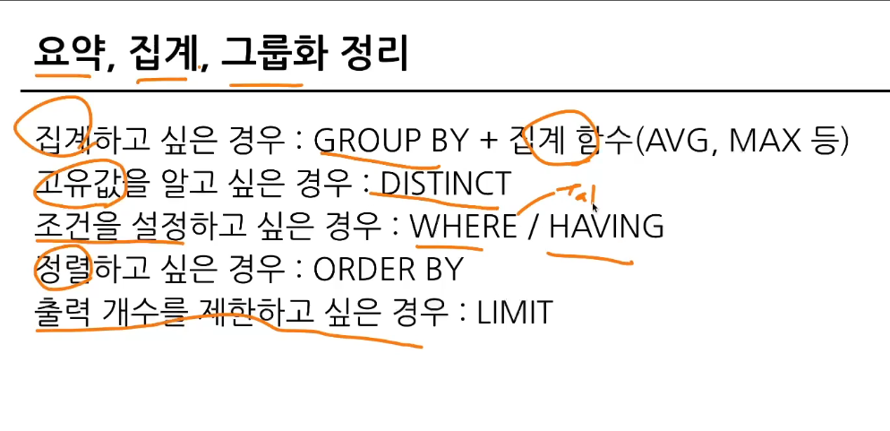
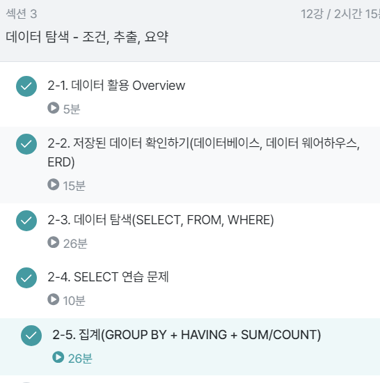
