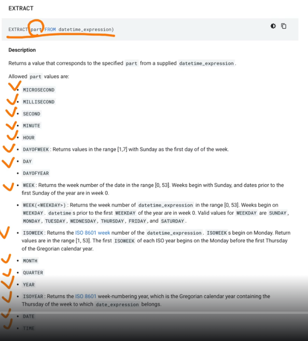
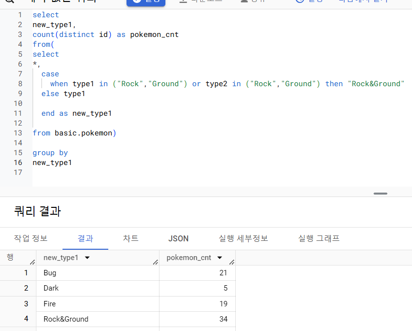
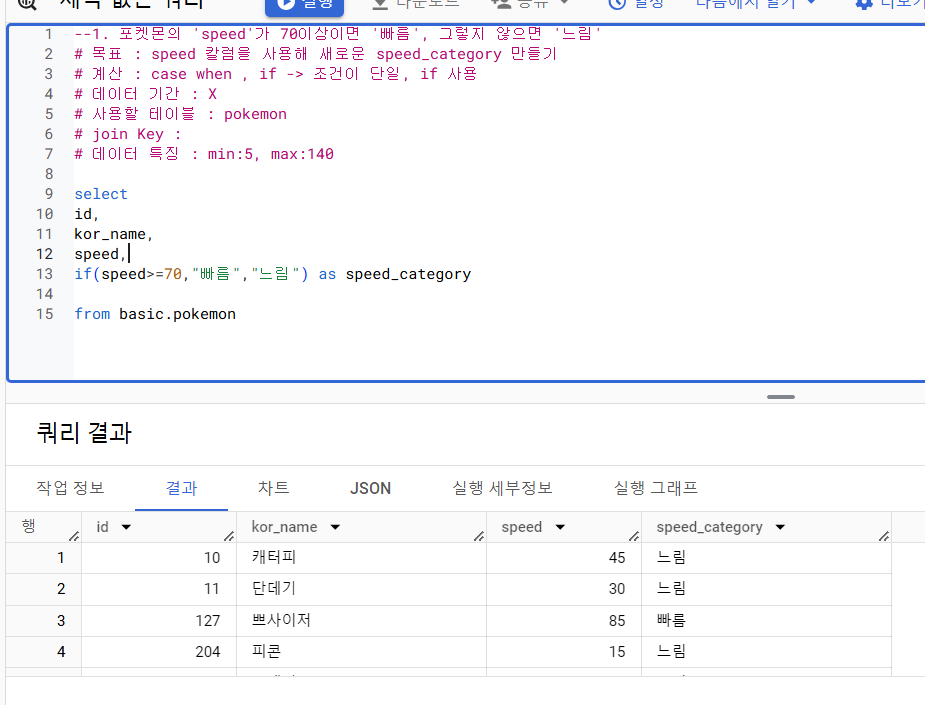
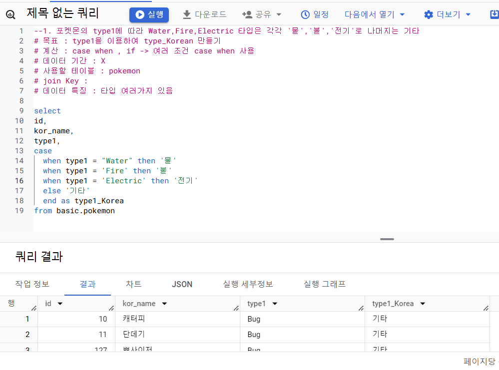
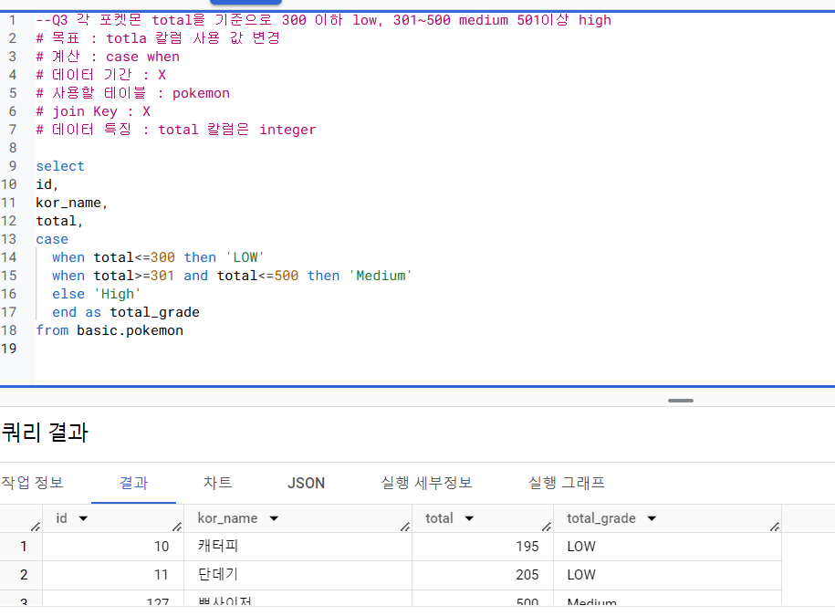
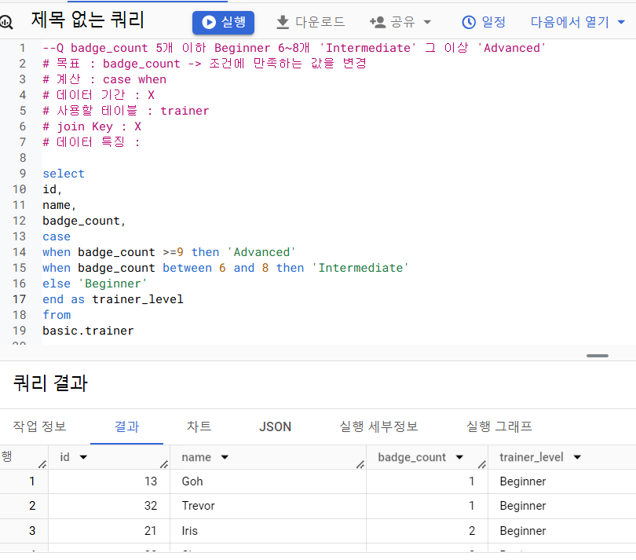
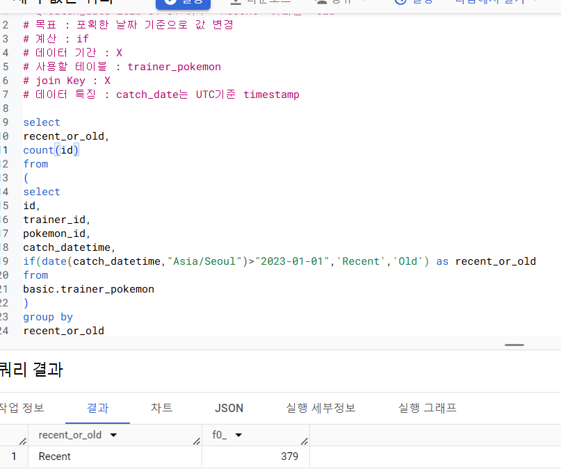
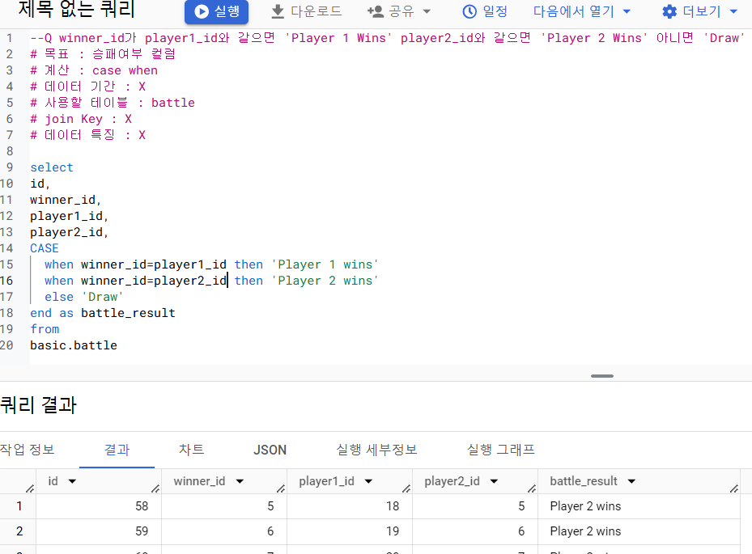
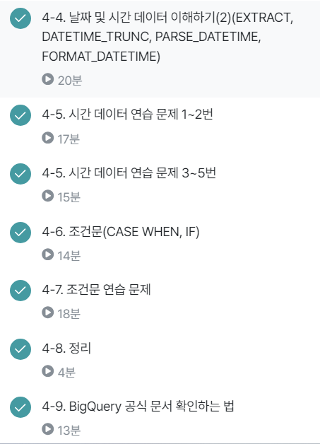

```
4-4 날짜 및 시간 테이터 이해하기 (2)
current_datetime([time zone]) : 현재 DATETIME 출력

select
current_date() as current_date,
current_date("Asia/Seoul") as asia_date,
current_datetime() as current_datetime,
current_datetime("Asia/Seoul") as current_datetime_asia;

자정을 넘어갈 때 시간이 다를 수 있음에 유의
```
```
EXTRACT
datetime에서 특정 부분만 추출
거의 대부분을 추출 가능

ex)
select
extract(date from datetime "2024-01-02 14:00:00") as date,
    -> 2024-01-02

요일 추출? DAYOFWEEK 사용
```

```
시간 자르기? datetime_trunc(datetime_col,hour)
hour로 자르면 hour까지만 제대로 표시되고 뒤에는 다 기본값(최소값)변경
```
```
PARSE_DATETIME
문자열로 저장된 datetime을 datetime타입으로 변경
PARSE_DATETIME('문자열 형태',datetime 문자열') as datetime

select
parse_datetime('%Y-%m-%d %H:%M:%S,'2024-01-11 12:35:35')
as parse_datetime;
```

```
FORMAT_DATETIME
DATETIME 타입을 문자열로 변환

select
    format_datetime("%c",DATETIME "2024-01-11 12:35:35") as formatted;
```
```
LAST_DAY
월의 마지막 값을 반환
    월이 기본값이지만 주 등으로 변경가능

select
    last_day(DATETIME '2024-01-03 15:30:00') as last_day
```
```
DATETIME_DIFF
두 datetime의 차이

datetime_diff(첫 datetime , 두번째 datetime, 궁금한 차이)
```

```
4-5 시간 데이터 연습 문제 1~2번

데이터 특징 : 직접 봐야함
  --catch_date : date 타입
  --catch_datatime : UTC TIMESTAMP 타입 -> 컬럼의 이름은 datetype인데 timestamp로 저장됨
  --catch_date 한국기준인지 UTC인지 확인
  --catch_date 칼럼 catch_datetime 칼럼을 비교 -> date(datetime(catch_Datetime,'Asia/Seoul'))
  --데이터를 저장하는 부분에서 이슈가 발생한 경우가 있음
```
```
select
count(distinct id) as battle_cnt
from basic.battle
where
  extract(hour from battle_datetime)>=6
  and extract(hour from battle_datetime)<=18
```
```
4-5 시간 데이터 연습 문제 3~5번

select
  trainer_id,
  min_catch_date,
  format_date("%d%m%Y",min_catch_date) as new_min_cat
from
  (select
trainer_id,
min(date(catch_datetime,"Asia/Seoul")) as min_catch_date
from basic.trainer_pokemon
group by
  trainer_id
order by
  trainer_id)
```
```
select
  day_of_week,
  count(distinct id) as battle_cnt
from(
select
  *,
  extract(dayofweek from battle_date) as day_of_week
from basic.battle)
group by
  day_of_week
order by
  day_of_week
```
```
select
*,
datetime_diff(max_catch_datetime,min_catch_datetime,day) as diff
from(
select
  trainer_id,
  min(datetime(catch_datetime,"Asia/Seoul")) as min_catch_datetime,
  max(datetime(catch_datetime,"Asia/Seoul")) as max_catch_datetime,

from basic.trainer_pokemon

group by
  trainer_id)
order by
diff desc
```
```
4-6 조건문

조건문
  특정 조건이 충족되면 어떤 행동을 하자

사용법
1. case when
2. if

ex)
1~6학년 -> 저학년 고학년?
월~일 -> 주중 주말?

1. case when

select

case
  when 조건1 then 조건1이 참일 경우 결과
  when 조건2 then 조건2가 참일 경우 결과
  else 그 외 조건일 경우 결과
end as 새로운_칼럼_이름

from...
```

```
if문

단일 조건일 경우 유용

if (조건문, true일 때의 값, False일 때의 값) as 새로운_칼럼_이름

select
if(1=1,'동일한 결과','동일하지 않은 결과') as result1,...
```
```
4-7 조건문 연습 문제

count, group by 조금 더 공부하기
```






```
4-8 정리

데이터 타입
숫자 문자 시간,날짜 부울 정리
  다양한 변환법 적용 (전부 암기 X)
```
```
4-9 BigQuery 공식 문서 확인하는 법

공식문서 잘 활용해야함
최근 데이터는 구글링해도 잘 안나오기도 함

개발 공식 문서
  기술을 어떻게 사용하면 좋은지에 대한 문서
  찾는 방법 : 기술명 + documentation

BigQuery는 기능이 많고 오래된 제품이라 공식 문서에 자료가 많음

만약 concat을 알고 싶다
  -> BigQuery CONCAT document 검색

공식문서는 근간이니 볼줄 알아야함 (최신화 되어있음)

Slack RSS Feed
BigQuery Release Note 페이지에서 확인가능
슬랙 알림 받아보기
```
