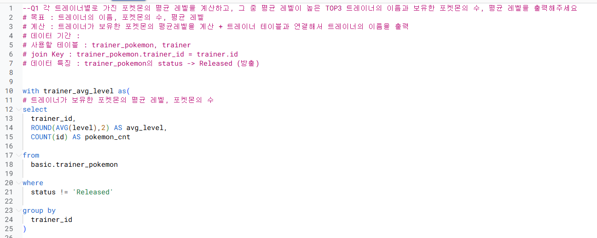
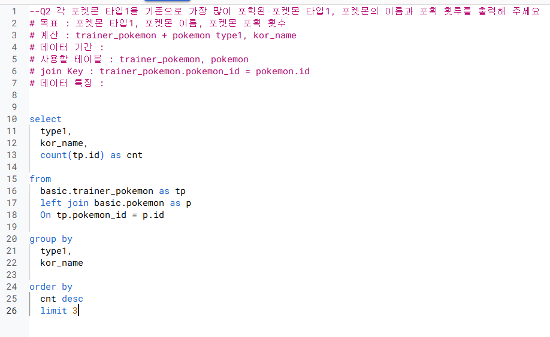
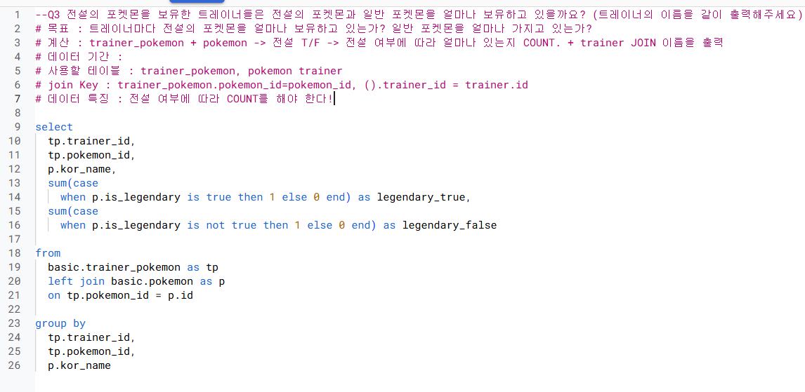
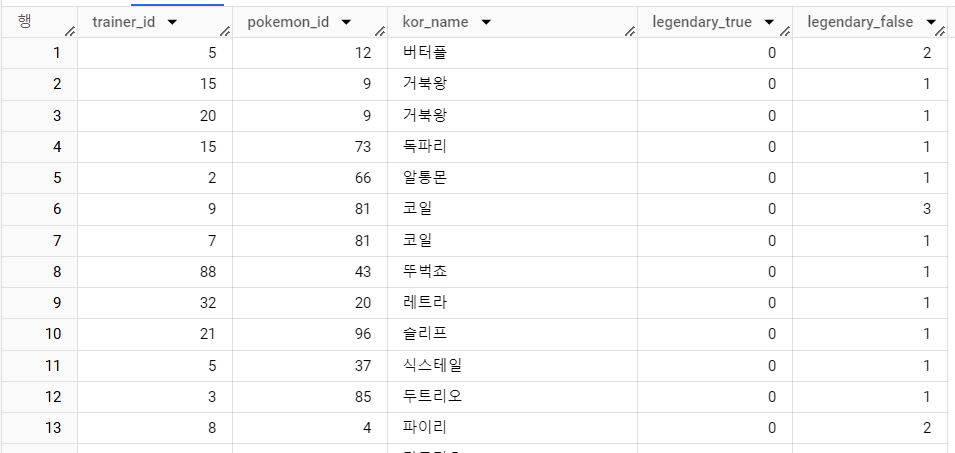
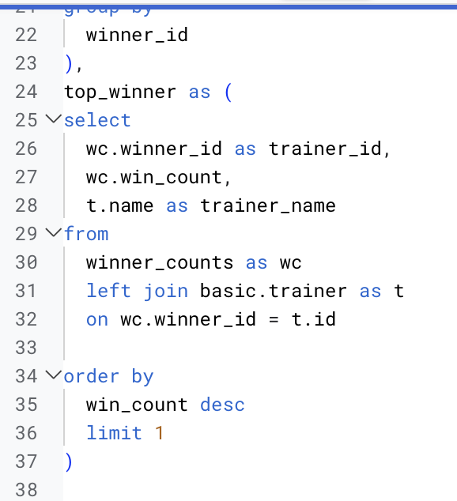
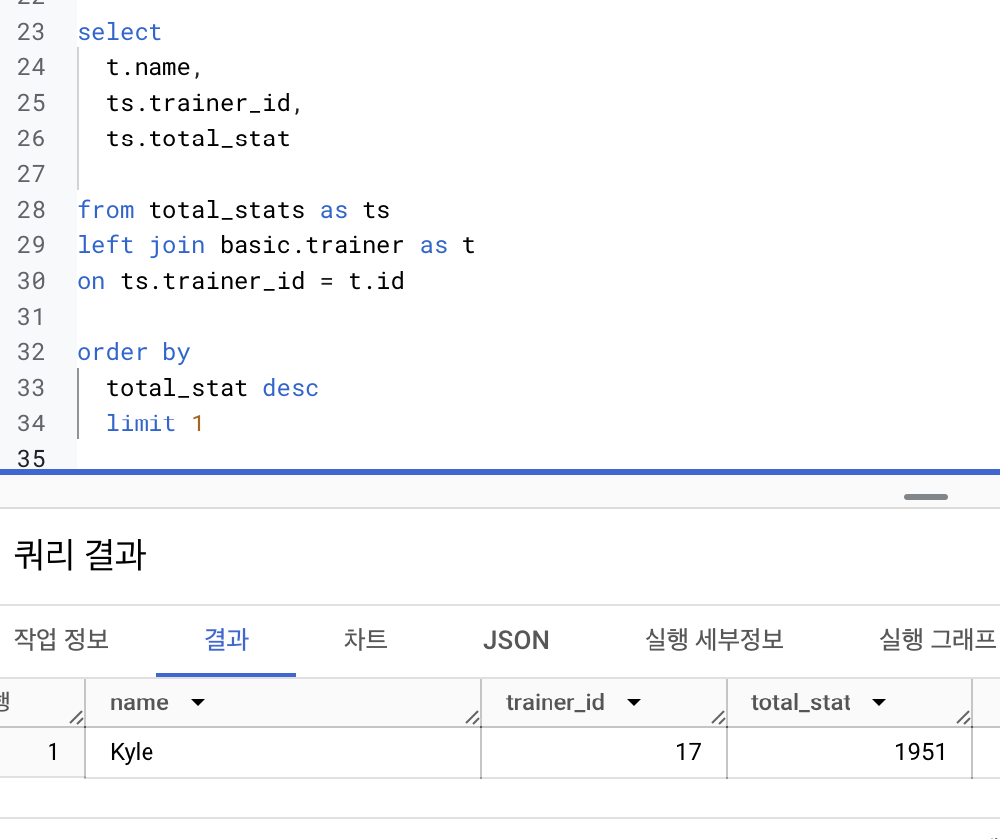
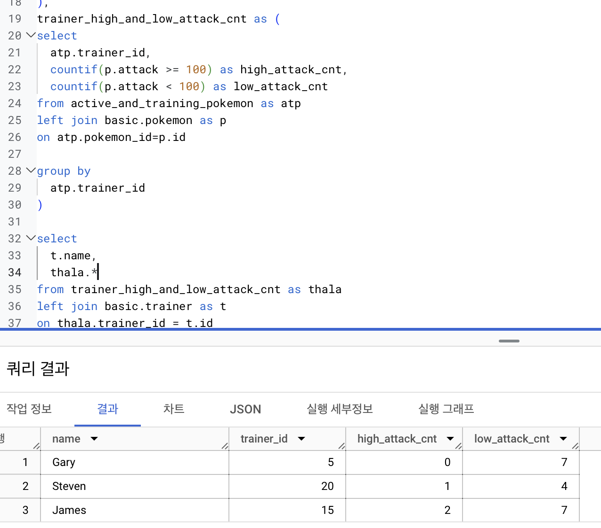
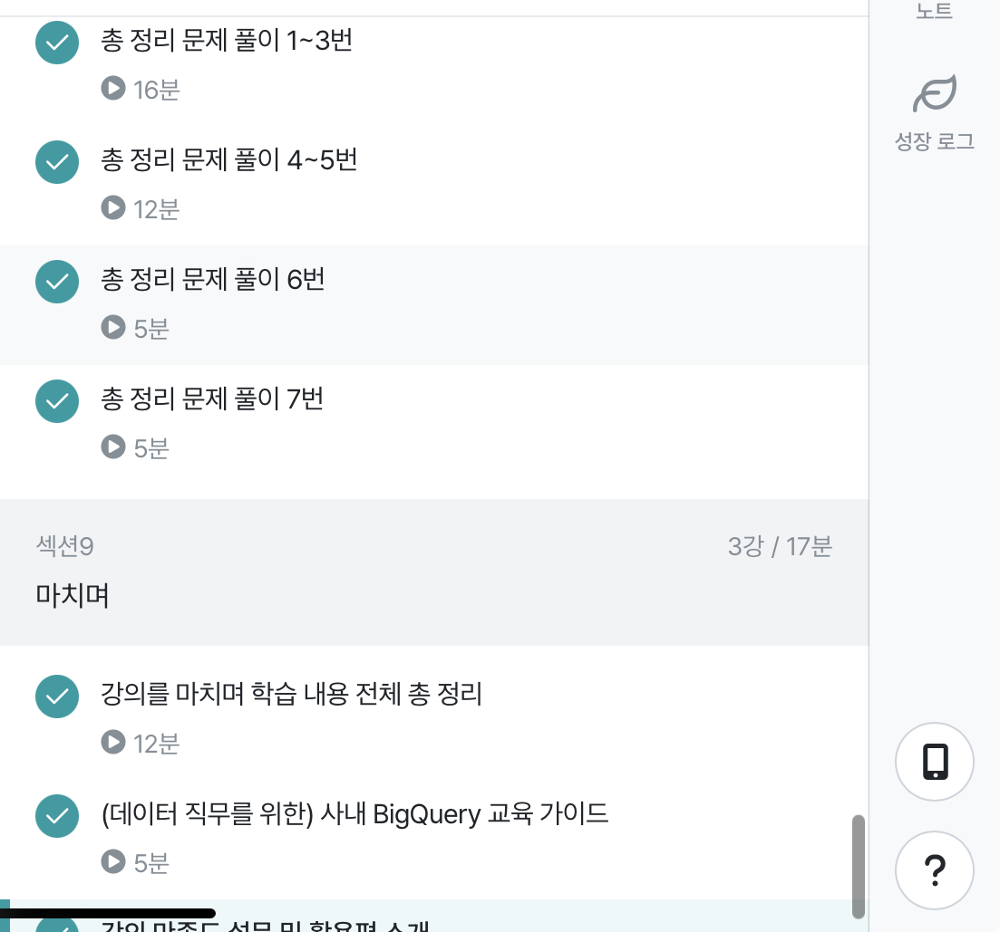

```
총 정리 문제 풀이 1~3번
1번

with as 잘 기억 안났음
-> 보강필요
    with as는 완성된 select~where 구문을 하나의 테이블로 사용하는 장치

order by로 정렬하고 limit를 상위 몇개만 지정할 수 있다는 점 숙지

중복의심 시 select에 distinct 사용 항상 염두할것
```



```
2번
```


```
3번

case when 숙지 필요, 케이스를 둘로 나눠서 1 혹은 0 등으로 반환하는 칼럼 생성
```


```
4번

쿼리가 상당히 복잡하다.
조인만 3번이고 with를 두번 사용한다는 점에서 복잡함
그러나 쪼개서 보면 마냥 어려운 것은 아니다
오타의 유의해야할것
```



```
5번
```



```
6번

결국 조인과 위드를 잘 사용하는 것이 이 문제들의 관건이다
사용할 테이블을 잘 만들어서 마지막엔 간단하게 select문 작성하는 것이 관건
```


```
7번

잊고있었던 countif 상기,
역시 조인과 with 활용 중요
```



```
강의를 마치며 학습한 내용 전체 총 정리


-데이터 활용 과정
데이터 탐색 : 조건과 추출
데이터 탐색 : 요약, 집계
SQL 쿼리 작성하는 흐름
    쿼리 작성 템플릿, 생산성 도구
    오류를 디버깅하는 방법
데이터 탐색 : 변환
    데이터 타입과 타입 별 함수
    빅쿼리 공식 문서 확인하는 방법
다양한 자료를 연결 : JOIN
데이터 결과 검증
    가독성을 챙기기 위한 SQL 스타일 가이드


1. from을 먼저 쓰는 것 습관화
2. 집계함수 group by하기
3. distinct는 unique한 값
4. with문 잘 작성하자


-데이터타입
숫자 문자 시간,날짜 부울

UTC : 세계 협정시?
부울 : 참거짓

-JOIN 숙지할것
일단 안헷갈리게 LEFT로 통일


-흐름
테이블 확인
기준 테이블 정의
JOIN JEY 찾기
결과 예상하기
쿼리 작성/검증


-오류메세지 읽어보기 and 검색하기


-데이터 검증
문제정의, 요청사항 확인
중간결과, 단계적 검증
가독성 챙기기
결과 비교
```
```
(데이터 직무를 위한) 사내 BigQuery 교육 가이드

이 강의는 기본
더 열심히 하자

빅쿼리는 어려운 언어가 아니다
많이 활용중!
한국에서도 종종 사용
```
