# 통계학 1주차 정규과제

📌통계학 정규과제는 매주 정해진 분량의 『*데이터 분석가가 반드시 알아야 할 모든 것*』 을 읽고 학습하는 것입니다. 이번 주는 아래의 **Statistics_1st_TIL**에 나열된 분량을 읽고 `학습 목표`에 맞게 공부하시면 됩니다.

아래의 문제를 풀어보며 학습 내용을 점검하세요. 문제를 해결하는 과정에서 개념을 스스로 정리하고, 필요한 경우 추가자료와 교재를 다시 참고하여 보완하는 것이 좋습니다.

1주차는 `1부. 데이터 기초체력 기르기`를 읽고 새롭게 배운 내용을 정리해주시면 됩니다.


## Statistics_1st_TIL

### 1부. 데이터 기초체력 기르기
### 01. 통계학 이해하기
### 02. 모집단과 표본추출
### 03. 변수와 척도
### 04. 데이터의 기술 통계적 측정
### 05. 확률과 확률변수
### 06. 확률분포
### 07. 가설검정

## Study Schedule

|주차 | 공부 범위     | 완료 여부 |
|----|--------------|----------|
|1주차| 1부 ~p.79    | ✅      |
|2주차| 2부 ~p.120   | 🍽️      | 
|3주차| 2부 ~p.202   | 🍽️      | 
|4주차| 2부 ~p.299   | 🍽️      | 
|5주차| 3부 ~p.356   | 🍽️      | 
|6주차| 3부 ~p.437   | 🍽️      | 
|7주차| 3부 ~p.542   | 🍽️      | 
|8주차| 3부 ~p.615   | 🍽️      | 
|9주차|데이터 분석 실습| 🍽️      |

<!-- 여기까진 그대로 둬 주세요-->

# 01. 통계학 이해하기

```
✅ 학습 목표 :
* 통계학의 필요성을 안다.
* 기술통계와 추론통계의 특성을 구분하여 이해한다.
```
<!-- 새롭게 배운 내용을 자유롭게 정리해주세요.-->
```
<통계학의 필요성>

ㅇ 데이터 과학에 통계학은 필수다!
ㅇ EDA 시, 데이터의 분포, 연관성 확률을 분석해야함
```
```
<머신러닝과 전통적 통계학>

ㅇ  머신러닝 -> 예측
    통계학 -> 해석

ㅇ 머신러닝은 예측의 정확성에 집중한다
   통계학은 모델의 신뢰도를 중시하고, 단순함을 추구한다

ㅇ 통계학은 우선 가설을 설정하고 데이터를 확인하지만,
   머신러닝은 데이터를 기반으로 가설을 끄렁내어 검증하는 경향이 있다!
```
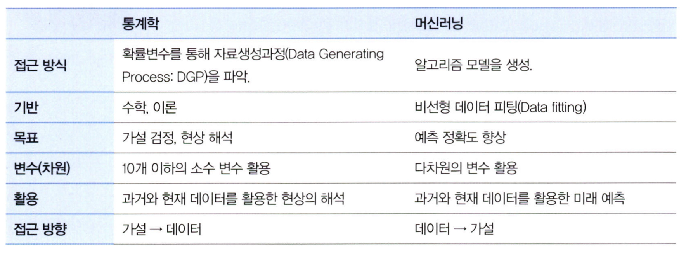

```
<기술통계, 추론통계>

ㅇ 기술통계란
    주어진 데이터의 특성을 사실에 근거하여 설명하고 묘사하는 것
    e.g) 학급 전체의 키를 일일이 나열하는 것보다 평균 키를 설명하는 것이 효율적

ㅇ 추론통계란
    한 학급의 통계치를 통해 학교 전체 학생의 통계치를 추정하는 것
    e.g) 평균키를 통해 학생들의 키 분포를 추정
```
# 02. 모집단과 표본추출

```
✅ 학습 목표 :
* 모집단과 표본, 모수와 통계량의 정의와 관계를 설명할 수 있다.
* 분석가가 비논리적인 추론을 내리는 패턴인 인지적 편향의 종류를 이해한다.
* 편향과 분산의 차이를 이해한다.
```
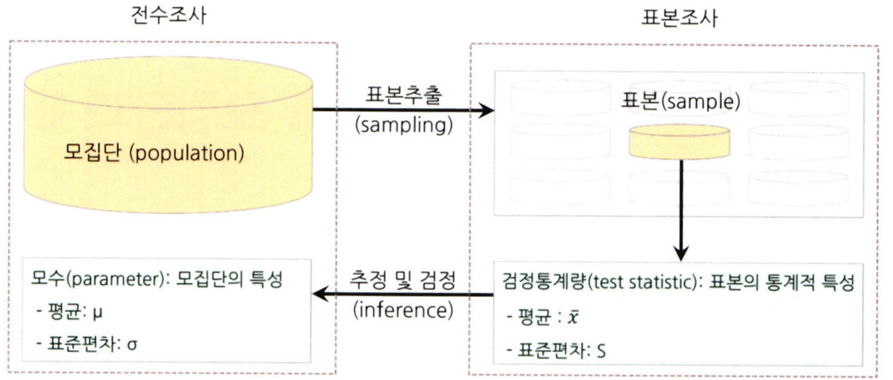

<!-- 새롭게 배운 내용을 자유롭게 정리해주세요.-->
```
<용어 정리>

ㅇ 모집단
    분석 대상 전체의 집합

ㅇ 표본
    모집단의 일부를 추출한 것

ㅇ 전수조사
    모집단의 자료 전체를 조사하여, 정보를 추출하는 것

ㅇ 표본조사
    표본을 통해 정보를 추정하고 검정하는 것
```

**편향**
```
ㅇ 표본 오차
    모집단의 모수와 표본의 통계량 간의 차이로 인해 통계치가 모수치의 주위에 분산되어 있는 정도
    모집단과 표본의 자연 발생적인 변동
    같은 크기의 두 개의 표본을 주의해서 추출한다고 해도 완전히 동일한 표본을 얻을 수 없다!

ㅇ 비표본 오차
    이를 제외한 변동
    비표본 오차의 편향
    e.g) 조사원의 미숙, 그릇된 해석
```
```
<인지적 편향>

ㅇ 확증편향
    자신이 믿고 있는대로 정보를 선택적으로 받아들임

ㅇ 기준점 편향
    처음에 접하는 정보에 매몰

ㅇ 선택 지원 편향
    본인이 의사결정을 내리는 순간 그 선택의 긍정적인 부분에 더 많이 생각

ㅇ 분모 편향
    분수 전체가 아닌 분자에만 집중하여 현황을 왜곡

ㅇ 생존자 편향
    소수의 성공한 사례를 일반화된 것으로 인식
    e.g) 전투기 총탄 자국
```
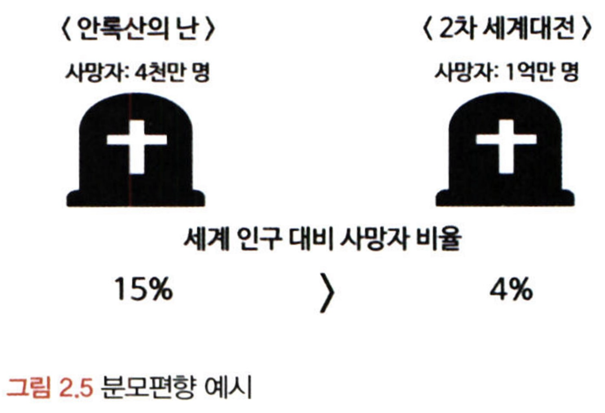

```
<편향과 분산>
    ㅇ 편행과 분산은 트레이드오프 관계이다!
    ㅇ 둘의 균형을 잘 맞추는 것이 모델의 핵심
```
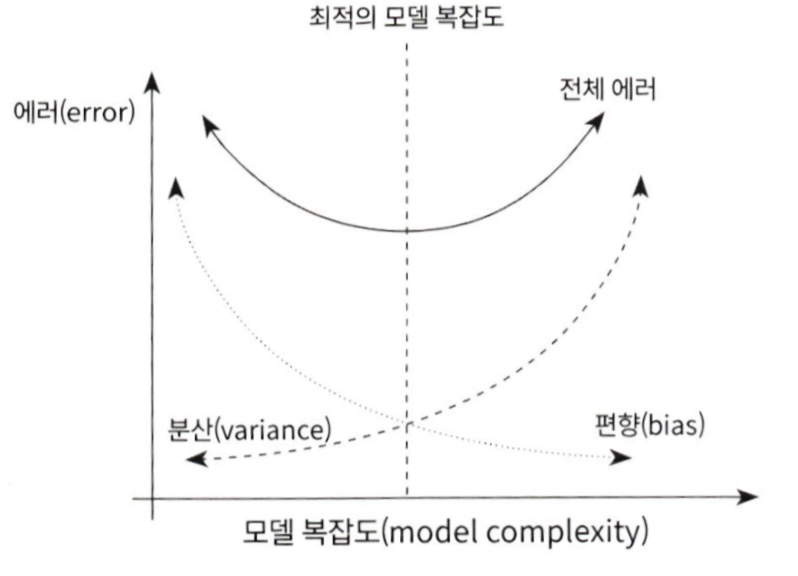
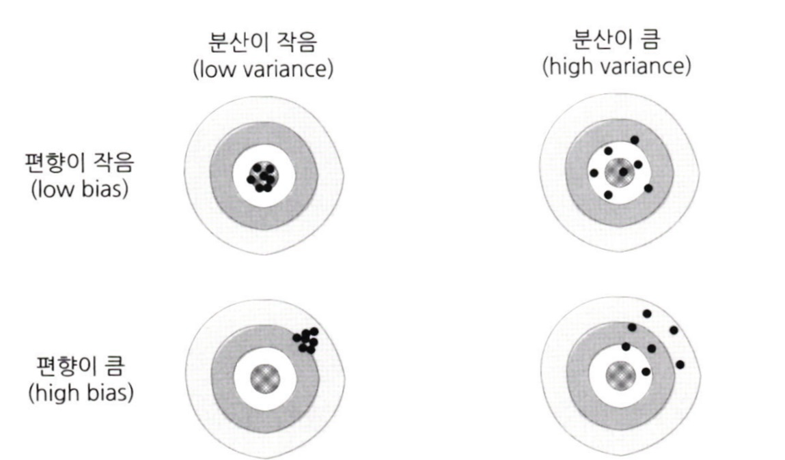

**표본추출**

```
<데이터 수집 단계>

    순서
    1. 모집단 확정
    2. 표본 프레임 결정
    3. 표본 추출방법 결정
    4. 표본크기 결정
    5. 표본추출
```
```
<추출 방법>

    ㅇ 단순 임의 추출방법
        랜덤

    ㅇ 게층적 표본추출방법
        일련번호를 부여한 뒤 일정한 간격으로 표본 선택
    
    ㅇ 층화 표본추출방법
        소집단으로 나누어서 추출
        e.g) 소형가게, 대형마트로 나누어서 추출
    
    ㅇ 군집 표본추출방법
        하나의 소집단을 정하여 그곳에서만 추출
        e.g) 서울의 여러 대학생들 중 중대생만 정하여 표본추출
    
<복원 비복원>

    ㅇ 복원추출
        한번 추출한 표본을 다시 모수에 복원 (중복되어 뽑힐 수 있음)
    
    ㅇ 비복원추출
        한번 추출한 표본을 제외시킴 (중복된 표본 추출 불가)
```
# 03. 변수와 척도
```
✅ 학습 목표 :
* 독립변수, 종속변수에 대해 이해한다.
* 척도(변수의 데이터적 속성)의 종류를 알아본다.
* 척도에 따라 어떤 분석방법이 적절한지 판단할 수 있다.
```
<!-- 새롭게 배운 내용을 자유롭게 정리해주세요.-->

**변수**

데이터분석은 변수와 벼수의 관계를 밝혀내는 활동!
```
<양적, 질적 변수>

ㅇ 양적 변수
    사칙연산 가능한 변수

        -이산변수 : 정수만 취할 수 있음
        -연속변수 : 연속적인 모든 실수 취할 수 있음

ㅇ 질적 변수
    사칙연산 불가
    남성을 1, 여성을 2라 가정할지라도, 이를 사칙연산할 수 있을까? -> 없을것
```
```
<독립변수,종속변수>
    
    ㅇ 이 둘은 원인과 결과의 관계
        e.g) 흡연->폐암
    
    ㅇ 독립변수 간에는 상관관게가 없어야 한다!

    ㅇ 독립변수와 상관관계는 인과관계가 있어야한다! 
```

**척도**
원활한 분석을 위해서는 객관적 척도로 변환하는 작업이 필요하다!

```
<척도의 종류>

    ㅇ 질적 척도
        - 명목 척도 (성별, 혈액형) -> A=B, A=!B
        - 서열 척도 (석차) -> A>B

    ㅇ 양적 척도
        - 등간 척도 (온도, IQ) -> A+B, A-B
        - 비율 척도 (키, 몸무게) -> A*B, A/B
```
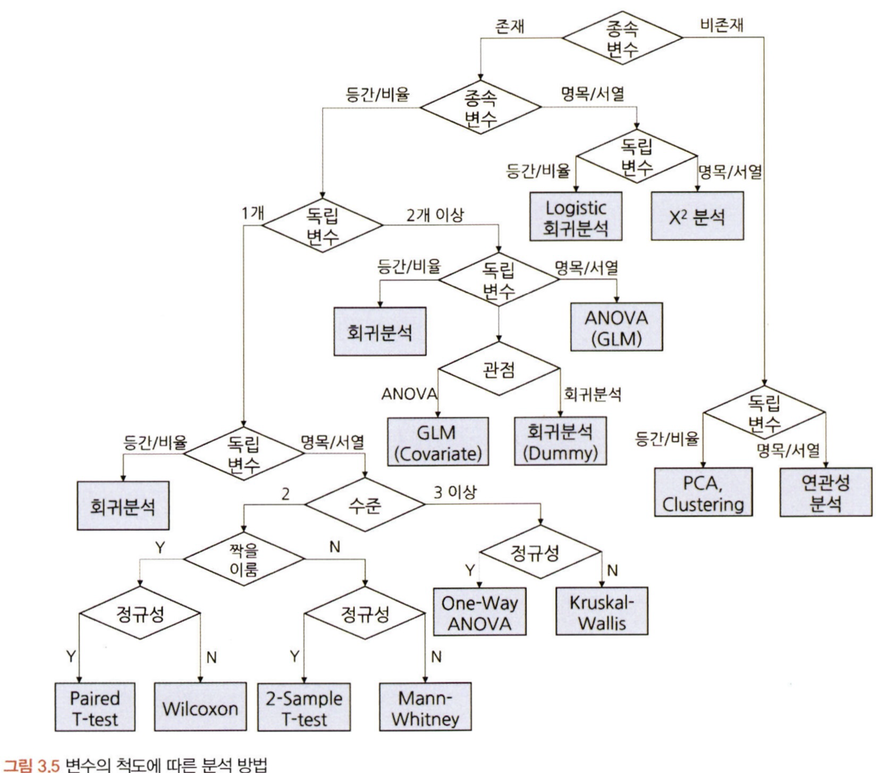

# 04. 데이터의 기술 통계적 측정

```
✅ 학습 목표 :
* 산포도의 의미와 산포도를 측정하는 방법에 대해 설명할 수 있다.
* 정규분포의 왜도값과 첨도값이 얼마인지 답할 수 있다.
```

<!-- 새롭게 배운 내용을 자유롭게 정리해주세요.-->
**표본의 중심 성향**

```
<평균>

    ㅇ 산술평균 : 값을 모두 더하고 값의 개수로 나누기
    ㅇ 가중평균 : 더 큰 비중을 차지하는 집단에 가중치를 줌
    ㅇ 조화평균 : 시간적으로 변화하는 데이터에서 평균을 측정
```

**분산**

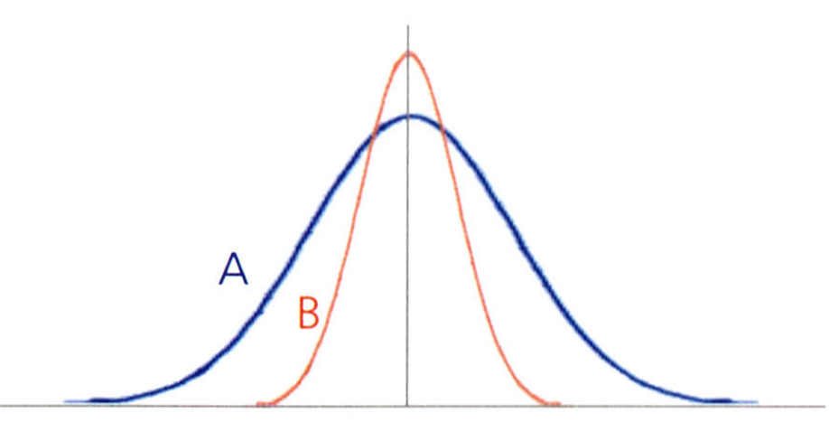

얼마나 퍼져있는가?
```
<자유도란?>

자유롭게 선택할 수 있는 숫자의 개수

e.g)
3개의 숫자를 골라 합이 10이 되야한다면, 자유도는 2이다!
2개의 숫자는 아무 숫자나 골라도 되지만, 나머지 숫자는 더했을때 10이 되는 숫자를 선택해야한다

모집단이 아닌 표본의 경우에는 분산을 구할때 하나는 정해진 표본평균에 맞춰야하기에,
자유도 하나를 줄인다 (n-1)

다른 측면으로 보면, 표본이 모집단보다 분산이 작게 계산되는 경향이 있기 떄문이다 (적은 표본을 쓰기에!)
그렇기에 분모를 줄여 값을 크게 하는 역할도 한다
```

**산포도, 사분위수, 변동계수**

```
<산포도>

    ㅇ 대푯값을 중심으로 자료들이 흩어져 있는 정도를 의미
    ㅇ 측정 방법으로 범위, 분산, 표준편차, 사분위수 범위, 변동계수 등이 있음
```
<사분위수>
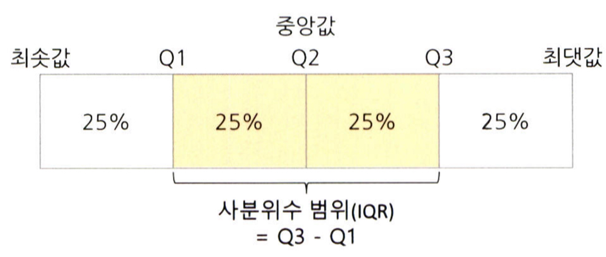

```
<변동계수>

    ㅇ 표준편차를 산술평균으로 나누어준 값
    ㅇ 서로 다른 두 자료의 산포도를 비교할 수 있다
        e.g) 발사이즈와 키의 산포도 비교가능
```

**왜도와 첨도**

```
<왜도>

    ㅇ 데이터 분포의 좌우 비대칭도를 표현하는 척도
    ㅇ 정규분포에 가까울 수록 왜도는 작아짐
    ㅇ 3*(mean - median) / s.d
    또는 3*(mean - mode) / s.d
```
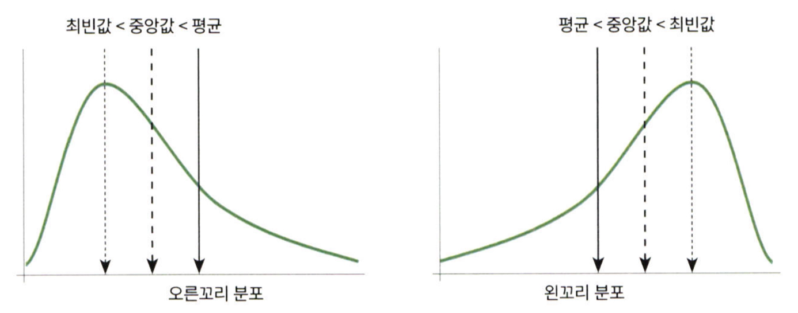

```
<첨도>

    ㅇ 분포가 얼마나 뾰족하거나 완만한지를 나타내는 척도
    ㅇ 기준보다 크면 급첨 or 양의 첨도
    ㅇ 기준보다 작으면 완첨 or 음의 첨도
```
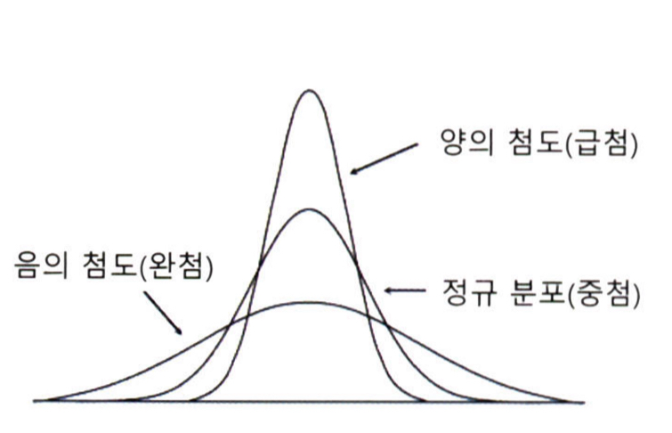

**표준편차**

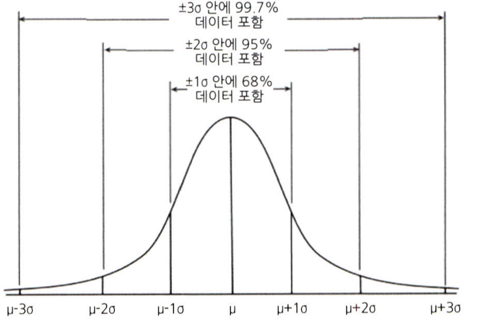

**체비셰프의 정리**

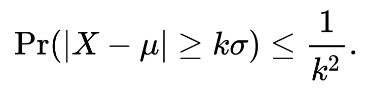

# 05. 확률과 확률변수

```
✅ 학습 목표 :
* 베이즈 정리의 개념을 이해하고 이를 실생활 예제에 적용할 수 있다.
* 심슨의 역설을 경계하여 데이터를 분석할 때 세부 그룹별 패턴을 고려해 잘못된 결론을 방지할 수 있다.
```

<!-- 새롭게 배운 내용을 자유롭게 정리해주세요.-->

```
<조건부 혹률>

    ㅇ 하나의 사건이 먼저 발생했다는 조건이 전제된 상황에서 다른 사건이 발생할 확률
    ㅇ 두 사건이 독립이면 조건부 확률은 뒷 사건이 발생할 확률과 동일하다
```
```
<베이지안 이론>

    ㅇ  조건부 확률 개념을 이용
    ㅇ  P(A)와 P(B), P(B|A)를 알면 P(A|B)를 알 수 있다

proof

    P(A|B) = P(AnB) / P(B)
            
           = P(B|A)*P(A)  /  P(B)

```
```
<심슨의 역설>

    ㅇ 데이터의 세부 비중에 따라 전체 확률이 왜곡되는 경우
    ㅇ 확률을 그대로 받아들이는 경향 주의할것
    ㅇ 가중평균에 유의하자
```
# 06. 확률분포

```
✅ 학습 목표 :
* 이산확률분포의 종류에 대해 알고, 각각의 특징과 활용 사례를 설명할 수 있다.
* 연속확률분포의 종류와 특징을 설명할 수 있다. 
* 중심극한정리(CLT)의 개념을 이해하고 설명 할 수 있다.
```

[이산확률분포와 연속확률분포 추가자료](https://velog.io/@tngus0325/%EC%9D%B4%EC%82%B0%ED%99%95%EB%A5%A0-%EB%B6%84%ED%8F%AC%EC%99%80-%EC%97%B0%EC%86%8D%ED%99%95%EB%A5%A0-%EB%B6%84%ED%8F%AC-%EC%A0%95%EB%A6%AC)

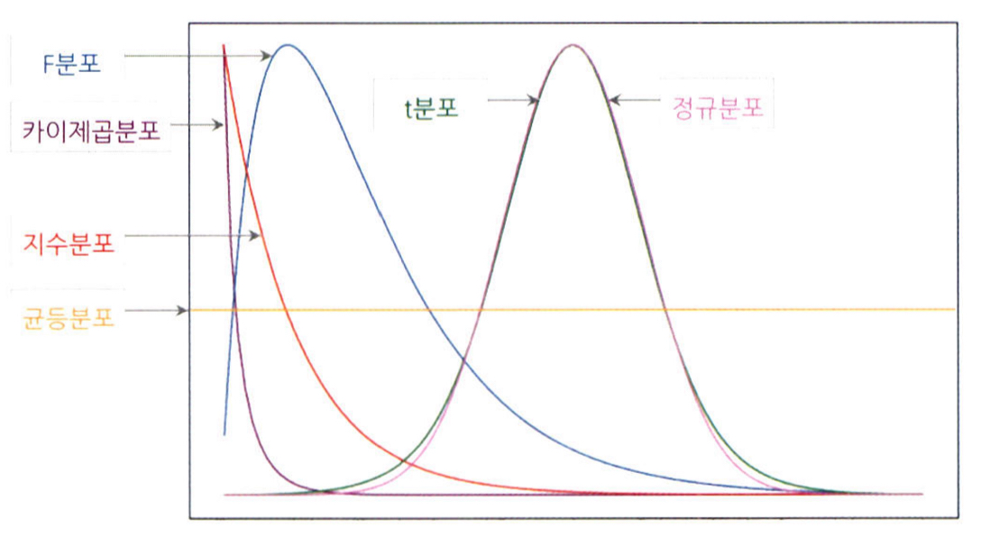

## 6.2. 이산확률분포

> **🧚 이산확률분포에 대해 학습한 내용을 정리해주세요.**

<!--수식과 공식을 암기하기보다는 분포의 개념과 특성을 위주로 공부해주세요. 분석 대상의 데이터가 어떠한 확률분포의 특성을 가지고 있는지를 아는 것이 더 중요합니다.-->
```
<이산확률분포>

    ㅇ 전체 경우 중 특정 값의 사건이 발생할 수 있는 확률의 크기를 나타냄
    ㅇ 특정 값을 가질 확률 계산
    e.g) 이항 분포, 초기하 분포, 포아송 분포
```
```
<균등분포>

    ㅇ 모든 변수가 동일한 확률을 가짐 (주사위 눈)

<베르누이 분포>

    ㅇ 성공 혹은 실패 (동전 앞, 뒷면)

<이항 분포>

    ㅇ 성공 혹은 실패의 횟수 (동전 앞면이 나온 횟수)
    ㅇ 베르누이 시행의 반복

<초기하 분포>

    ㅇ 모집단에서 비복원 추출을 할 때 특정한 유형의 개체가 선택될 확률을 나타내는 분포

    초기하 분포 예시:
    상자 안에 10개의 공이 있는데 그중 3개는 빨간공, 7개는 파란공이다.
    그 중에서 5개의 공을 임의로 뽑을때 (비복원 추출), 빨간공의 갯수에 대한 확률분포를 구하라

<포아송 분포>

    ㅇ 일정한 관측 공간에서 사건이 발생하는 횟수
    ㅇ 포아송분포는 이항분포로도 나타낼 수 있지만, 그 계산이 복잡하여 간편한 포아송분포를 사용한다
    ㅇ 긴 시간동안 발생확률이 매우 낮은 사건의 발생 횟수를 파악할때 용이
```
포아송 분포 확률식

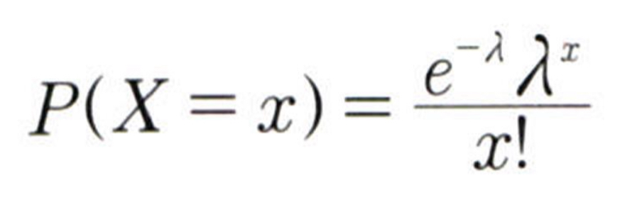

## 6.3. 연속확률분포

> **🧚 연속확률분포에 대해 학습한 내용을 정리해주세요.**

<!--수식과 공식을 암기하기보다는 분포의 개념과 특성을 위주로 공부해주세요. 분석 대상의 데이터가 어떠한 확률분포의 특성을 가지고 있는지를 아는 것이 더 중요합니다.-->
```
<연속확률분포>
    ㅇ 실수의 연속적인 값을 가지는 확률변수가 따르는 확률분포
    ㅇ 연속확률분포는 구간 안에서 사건이 발생할 확률을 계산함
    ㅇ 구간의 확률을 구하기 위해 사용되는 확률밀도함수를 PDF라고 한다
```
구간의 확률 예시

랜덤으로 1명을 지목할 때, 그 사람의 키가 180일 확률?

정답은 0이다. 키가 정확하게 180인 사람은 없을것이다. 180.000.....1cm일 것이기에.
그러나 179와 181 사이일 확률 등으로는 설명이 가능하다.

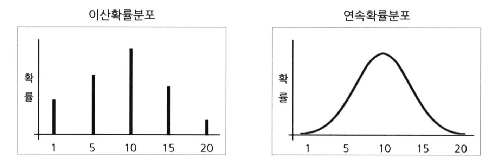
## 6.4. 중심극한정리

[중심극한정리 시뮬레이션](https://www.youtube.com/watch?v=aIPvgiXyBMI)

> **🧚 중심극한정리에 대해 학습한 내용을 정리해주세요.**

```
<정규 분포>

    ㅇ 데이터가 평균을 중심으로 대칭적으로 분포하는 확률분포
    ㅇ 자연적인 발생 확률이 정규분포를 많이 따름
    ㅇ 이항분포의 시행을 많이 늘리면 정규분포를 따른다
        B(n,p) -> N(np,npq)
    ㅇ 다른 정규분포간의 비교를 위해 '표준화' 필요
        (x-mu)/sigma
```
```
<지수 분포>

    ㅇ 특정 사건이 발생한 시점으로부터 다음 사건이 발생할 때까지의 시간을 확률변수값으로 하는 분포

포아송과 지수분포의 관계
    1시간에 인스타를 3번 들어갈때, 포아송의 관점에서 평균(람다)은 3번, 지수분포의 관점에서 평균(1/람다)은 1/3시간
```
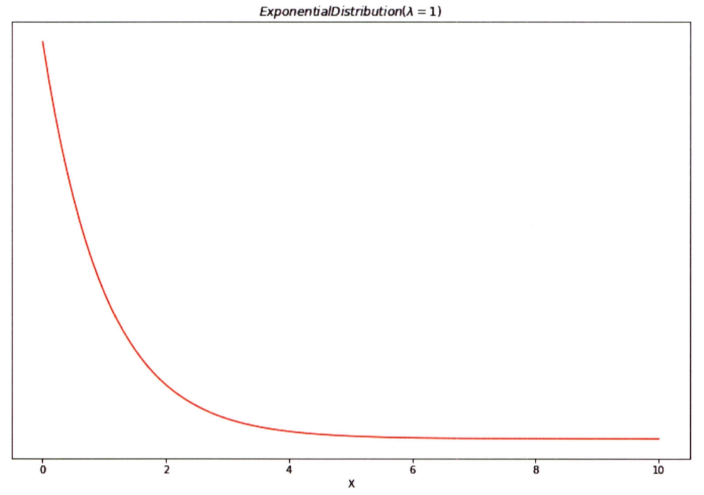
```
<중심극한정리>

    ㅇ 표본평균의 분포는 정규분포에 근사한다! (n>30)
    ㅇ 모집단으로부터 무작위로 표본을 추출한 다음, 각각의 표본평균을 분포로 그리면 정규분포를 그린다
    ㅇ 모집단의 분포는 상관없이 언제나 만족
```
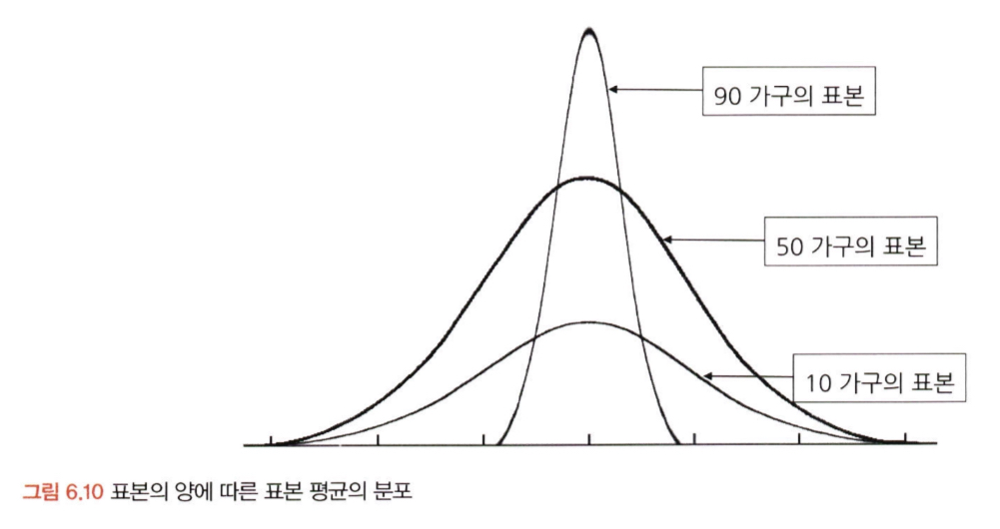
# 07. 가설검정

```
✅ 학습 목표 :
* 귀무가설과 대립가설의 개념을 이해하고, 가설을 설정하는 원리를 설명할 수 있다.
* 가설검정의 유의수준과 p값의 의미를 이해하고, p값을 해석하여 귀무가설을 기각할지 여부를 판단할 수 있다.
* 1종 오류와 2종 오류의 차이를 설명하고, 실제 사례에서 어떤 오류를 더 중요하게 고려해야 하는지 분석할 수 있다.
```

<!-- 새롭게 배운 내용을 자유롭게 정리해주세요.-->
```
귀무가설(H0) = 증명하고자 하는 가설과 반대되는 가설 (기각될 가설)
대립가설(H1) = 귀무가설이 기각되었을 때 대안적으로 채잭되는 가설
```
```
<가설검정의 절차>

    1. 가설 설정
    2. 유의수준 설정
    3. 실험 수행
    4. 검정 통계량 산출
    5. 대립가설 기각/채택
```
```
<유의수준>

    ㅇ 귀무 가설이 맞거나 틀린 것을 판단하기 위한 통곗값
    ㅇ 유의수준이 0.05라는 의미는, 귀무가설이 참일 확률이 5%미만이라는 것
    ㅇ 일반적인 채택/기각 판단 기준값이 0.05
```
```
<P-value>

    ㅇ 유의수준과 같이 사용되는 통곗값
    ㅇ p 값이 유의수준보다 적은 값이 나오면 귀무가설 기각
```
```
<신뢰수준>

    ㅇ 유의수준 + 신뢰수준 = 100%
    ㅇ 신뢰수준이 95%로면 귀무가설이 참임에도 귀무가설을 기각하는 오류의 최대 허용 한계를 5번으로 한다는 것
```
```
<1종 오류, 2종 오류>

    ㅇ 1종 오류
        귀무가설이 참임에도 귀무가설을 기각하는 오류
    
    ㅇ 2종 오류
        귀무가설이 거짓임에도 불구하고 귀무가설을 채택하는 오류
    
    1종오류의 확률과 2종오류의 확률은 트레이드오프 관계

경우에 따라 1종오류가 더 중요한 경우가 있고(제약), 2종오류가 더 중요한 경우가 있다(암 진단)
```
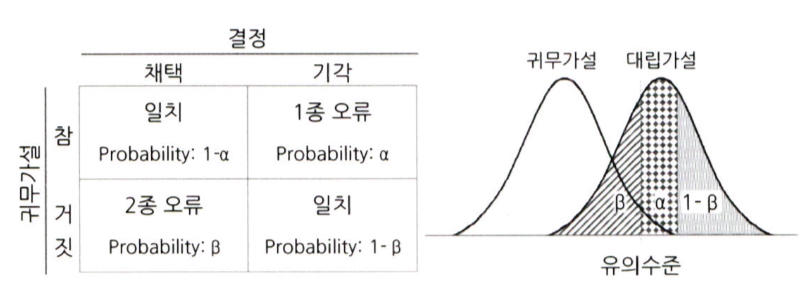
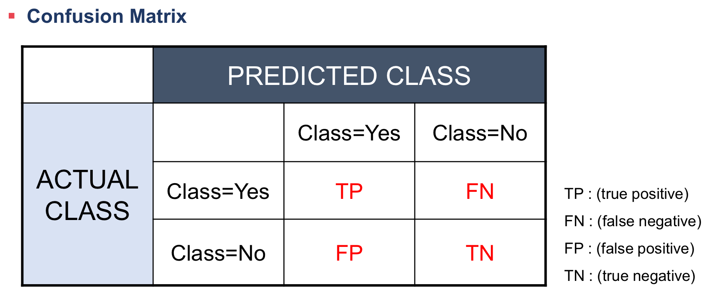

<br>
<br>

# 확인 문제

## 문제 1.

> **🧚 어떤 분석 방법이 적절할까요?**
<br>

> 🔍 **Q1. 연속형 변수 간 유사성을 기반으로 그룹을 나누고자 하는 경우**   
Ex1) 고객을 유사한 구매 패턴이나 성향을 가진
그룹으로 나누는 경우   
Ex2) 유사한 주제를 가진 문서들을 같은 그룹으로
분류하는 경우

```
클러스터링
```

<br>

> 🔍 **Q2. 범주형 변수 간 인과관계를 확인하고자 하는 경우**   
Ex1) 광고 유형(A/B 테스트)과 고객 구매 여부 간의
관계를 분석하는 경우     
Ex2) 성별과 특정 질병 유무 간의 연관성을 분석
하는 경우

```
?
```

<br>

> 🔍 **Q3. 연속형 변수 간 인과관계가 존재하는 경우**   
Ex1) 광고비 지출과 매출 간의 관계를 분석하는 경우     
Ex2) 체중과 혈압 간의 관계를 분석하는 경우

```
회귀분석
```

## 문제 2.

> **🧚Q. (주)다트비의 조일 과장은 이커머스 플랫폼의 마케팅 업무를 담당하고 있다. 최근 회사에서는 배너 광고의 클릭률(CTR)이 기대보다 낮아 최적의 광고 타겟층을 선정하는 프로젝트를 진행 중이다. 조 과장은 광고 효과를 높이기 위해 고민하던 중, 사이트 방문자의 70%가 모바일 유저, 30%가 PC 유저라는 정보를 알아냈다. 그래서 모바일 유저를 타깃으로 배너 광고를 올리면 되겠다 생각했는데 알고 보니 PC 유저의 광고 클릭률(CTR)이 5%로, 모바일 유저의 광고 클릭률(CTR)보다 4%p 높았다. 이런 경우, 모바일과 PC 중 어느 유저층에 집중하여 배너 광고를 올리는 것이 더 효과적일까? (소수점 둘째자리까지 반올림하여 답해주세요.)**

> 💝 **Hint**   
-P(클릭)을 구한다.  
-P(모바일 유저|클릭)과 P(PC 유저|클릭)을 구하고 값을 비교한다.

<!-- 베이즈 정리를 이해하였는지 확인하기 위한 문제입니다. 문제의 답과 풀이를 작성해주세요. 힌트를 참고하셔도 좋습니다.-->

```
PC에 집중한다
베이즈 정리에 따르면, 클릭한 경우에서, PC인 경우가 모바일인 경우보다 더 많다
```
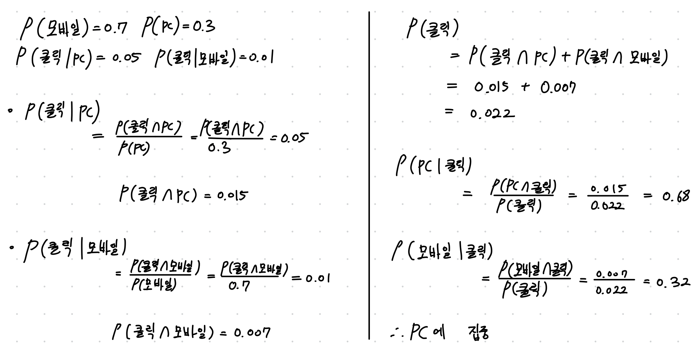

## 문제 3.

> **🧚Q. 한 대형 병원이 두 명의 외과 의사(A와 B)의 수술 성공률을 비교하려고 한다. 과거 1년간의 데이터를 보면, A 의사의 전체 수술 성공률은 80%, B 의사의 전체 수술 성공률은 90%였다. 이 데이터를 본 병원 경영진은 A 의사의 실력이 B 의사보다 별로라고 판단하여 A 의사의 수술 기회를 줄이는 방향으로 정책을 조정하려 한다.
그러나 일부 의료진은 이 결론에 의문을 제기했다.
그들은 "단순한 전체 성공률이 아니라 더 세부적인 데이터를 분석해야 한다"고 주장했다.**

> **-A 의사의 실력이 실제로 B 의사보다 별로라고 결론짓는 것이 타당한가?   
-그렇지 않다면, 추가로 확인해야 할 정보는 무엇인가?**

<!-- 심슨의 역설을 이해하였는지 확인하기 위한 문제입니다-->

<!-- 정해진 답은 없습니다. 자유롭게 작성해주세요-->

```
타당하지 않다.
A가 난이도가 더 어려운 수술을 도맡아 왔을 수도 있다.
```

## 문제 4. 

> **🧚 OX 문제입니다.**

> **다음 명제가 유의수준 5%를 설정한 것과 동일한 의미인지 판단하세요.   
1️⃣ 표본이 귀무가설과 같을 확률이 5% 미만이다.   
2️⃣ 귀무가설이 참일 확률이 5%이다.   
3️⃣ 귀무가설이 참일 때, 극단적인 표본이 나올 확률을 5%로 설정한 것이다.**

<!-- 동일하면 O, 동일하지 않으면 X.-->

```
1번 -> X
2번 -> X
3번 -> O (유의수준의 정의)
```

## 문제 5.

> **🧚Q. 다음 중 귀무가설(H₀)을 기각해야 하는 경우는 언제인가요? 정답을 고르고, 그 이유를 간단히 설명해주세요.**

> **1️⃣ 유의수준(α)이 0.05이고, p값이 0.03일 때   
2️⃣ 유의수준(α)이 0.01이고, p값이 0.02일 때**

```
1번이다

p값이 유의수준보다 작다
이는 혀용범위 그 이상으로 두 분포가 다르다는 뜻이다.
```

### 🎉 수고하셨습니다.