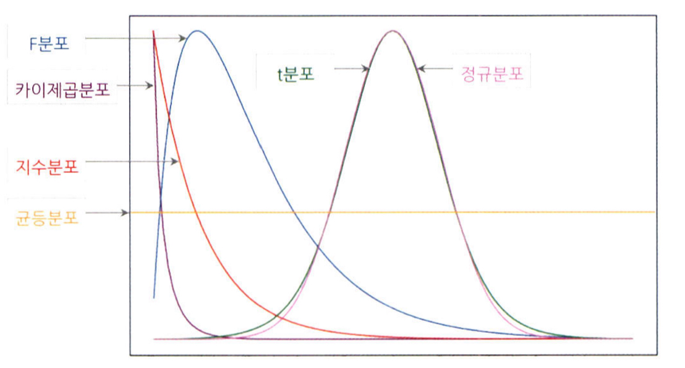
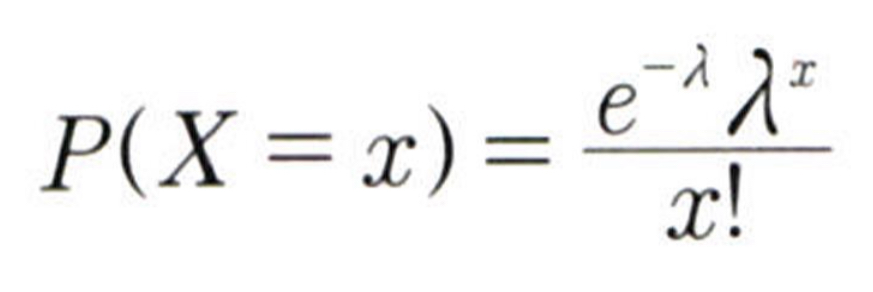
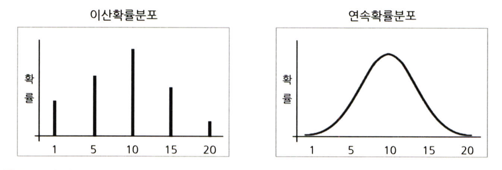
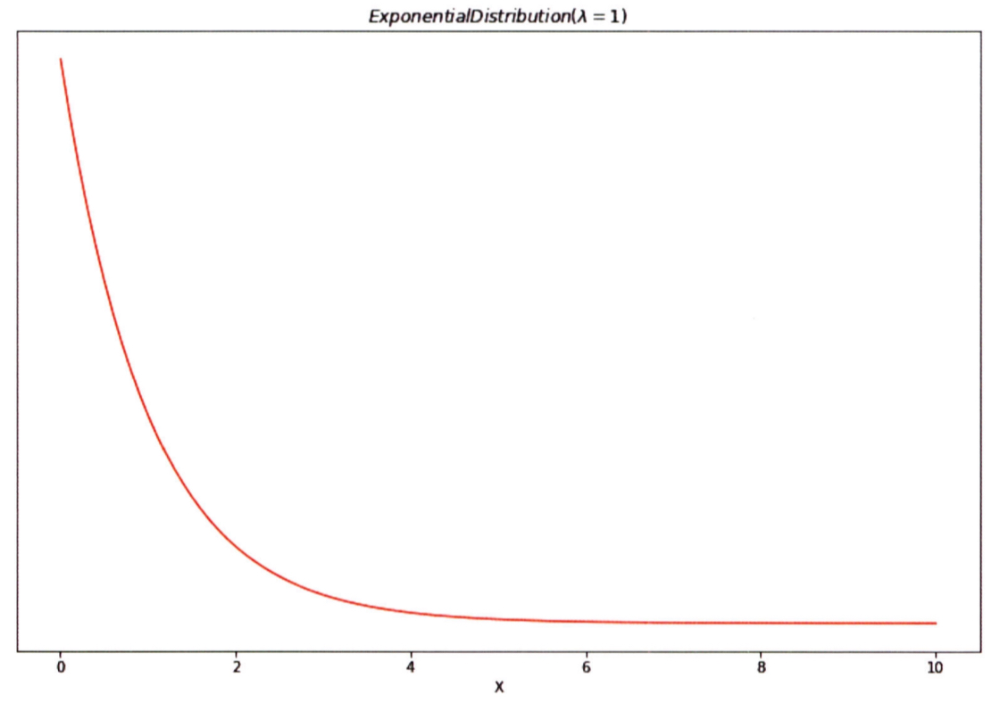
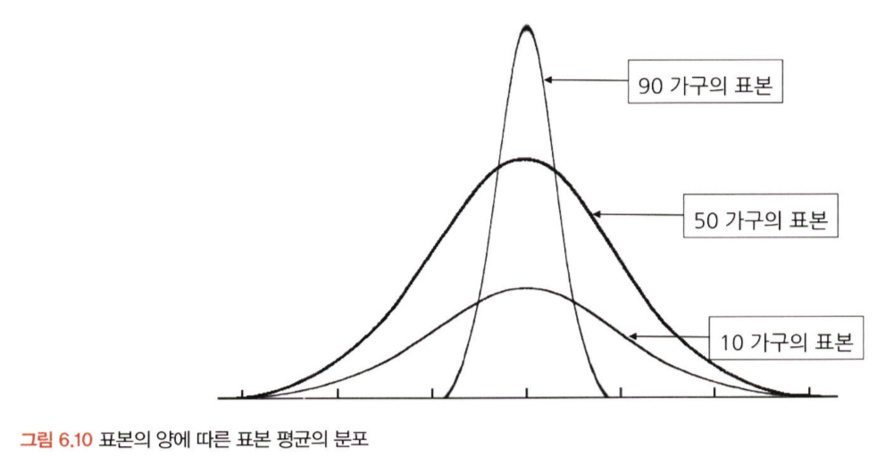
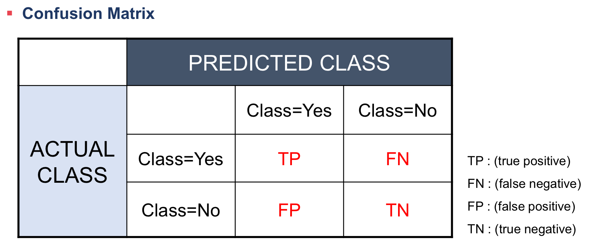

# 06. 확률분포

```
✅ 학습 목표 :
* 이산확률분포의 종류에 대해 알고, 각각의 특징과 활용 사례를 설명할 수 있다.
* 연속확률분포의 종류와 특징을 설명할 수 있다. 
* 중심극한정리(CLT)의 개념을 이해하고 설명 할 수 있다.
```

[이산확률분포와 연속확률분포 추가자료](https://velog.io/@tngus0325/%EC%9D%B4%EC%82%B0%ED%99%95%EB%A5%A0-%EB%B6%84%ED%8F%AC%EC%99%80-%EC%97%B0%EC%86%8D%ED%99%95%EB%A5%A0-%EB%B6%84%ED%8F%AC-%EC%A0%95%EB%A6%AC)



## 6.2. 이산확률분포

> **🧚 이산확률분포에 대해 학습한 내용을 정리해주세요.**

<!--수식과 공식을 암기하기보다는 분포의 개념과 특성을 위주로 공부해주세요. 분석 대상의 데이터가 어떠한 확률분포의 특성을 가지고 있는지를 아는 것이 더 중요합니다.-->
```
<이산확률분포>

    ㅇ 전체 경우 중 특정 값의 사건이 발생할 수 있는 확률의 크기를 나타냄
    ㅇ 특정 값을 가질 확률 계산
    e.g) 이항 분포, 초기하 분포, 포아송 분포
```
```
<균등분포>

    ㅇ 모든 변수가 동일한 확률을 가짐 (주사위 눈)

<베르누이 분포>

    ㅇ 성공 혹은 실패 (동전 앞, 뒷면)

<이항 분포>

    ㅇ 성공 혹은 실패의 횟수 (동전 앞면이 나온 횟수)
    ㅇ 베르누이 시행의 반복

<초기하 분포>

    ㅇ 모집단에서 비복원 추출을 할 때 특정한 유형의 개체가 선택될 확률을 나타내는 분포

    초기하 분포 예시:
    상자 안에 10개의 공이 있는데 그중 3개는 빨간공, 7개는 파란공이다.
    그 중에서 5개의 공을 임의로 뽑을때 (비복원 추출), 빨간공의 갯수에 대한 확률분포를 구하라

<포아송 분포>

    ㅇ 일정한 관측 공간에서 사건이 발생하는 횟수
    ㅇ 포아송분포는 이항분포로도 나타낼 수 있지만, 그 계산이 복잡하여 간편한 포아송분포를 사용한다
    ㅇ 긴 시간동안 발생확률이 매우 낮은 사건의 발생 횟수를 파악할때 용이
```
포아송 분포 확률식



## 6.3. 연속확률분포

> **🧚 연속확률분포에 대해 학습한 내용을 정리해주세요.**

<!--수식과 공식을 암기하기보다는 분포의 개념과 특성을 위주로 공부해주세요. 분석 대상의 데이터가 어떠한 확률분포의 특성을 가지고 있는지를 아는 것이 더 중요합니다.-->
```
<연속확률분포>
    ㅇ 실수의 연속적인 값을 가지는 확률변수가 따르는 확률분포
    ㅇ 연속확률분포는 구간 안에서 사건이 발생할 확률을 계산함
    ㅇ 구간의 확률을 구하기 위해 사용되는 확률밀도함수를 PDF라고 한다
```
구간의 확률 예시

랜덤으로 1명을 지목할 때, 그 사람의 키가 180일 확률?

정답은 0이다. 키가 정확하게 180인 사람은 없을것이다. 180.000.....1cm일 것이기에.
그러나 179와 181 사이일 확률 등으로는 설명이 가능하다.


## 6.4. 중심극한정리

[중심극한정리 시뮬레이션](https://www.youtube.com/watch?v=aIPvgiXyBMI)

> **🧚 중심극한정리에 대해 학습한 내용을 정리해주세요.**

```
<정규 분포>

    ㅇ 데이터가 평균을 중심으로 대칭적으로 분포하는 확률분포
    ㅇ 자연적인 발생 확률이 정규분포를 많이 따름
    ㅇ 이항분포의 시행을 많이 늘리면 정규분포를 따른다
        B(n,p) -> N(np,npq)
    ㅇ 다른 정규분포간의 비교를 위해 '표준화' 필요
        (x-mu)/sigma
```
```
<지수 분포>

    ㅇ 특정 사건이 발생한 시점으로부터 다음 사건이 발생할 때까지의 시간을 확률변수값으로 하는 분포

포아송과 지수분포의 관계
    1시간에 인스타를 3번 들어갈때, 포아송의 관점에서 평균(람다)은 3번, 지수분포의 관점에서 평균(1/람다)은 1/3시간
```

```
<중심극한정리>

    ㅇ 표본평균의 분포는 정규분포에 근사한다! (n>30)
    ㅇ 모집단으로부터 무작위로 표본을 추출한 다음, 각각의 표본평균을 분포로 그리면 정규분포를 그린다
    ㅇ 모집단의 분포는 상관없이 언제나 만족
```

# 07. 가설검정

```
✅ 학습 목표 :
* 귀무가설과 대립가설의 개념을 이해하고, 가설을 설정하는 원리를 설명할 수 있다.
* 가설검정의 유의수준과 p값의 의미를 이해하고, p값을 해석하여 귀무가설을 기각할지 여부를 판단할 수 있다.
* 1종 오류와 2종 오류의 차이를 설명하고, 실제 사례에서 어떤 오류를 더 중요하게 고려해야 하는지 분석할 수 있다.
```

<!-- 새롭게 배운 내용을 자유롭게 정리해주세요.-->
```
귀무가설(H0) = 증명하고자 하는 가설과 반대되는 가설 (기각될 가설)
대립가설(H1) = 귀무가설이 기각되었을 때 대안적으로 채잭되는 가설
```
```
<가설검정의 절차>

    1. 가설 설정
    2. 유의수준 설정
    3. 실험 수행
    4. 검정 통계량 산출
    5. 대립가설 기각/채택
```
```
<유의수준>

    ㅇ 귀무 가설이 맞거나 틀린 것을 판단하기 위한 통곗값
    ㅇ 유의수준이 0.05라는 의미는, 귀무가설이 참일 확률이 5%미만이라는 것
    ㅇ 일반적인 채택/기각 판단 기준값이 0.05
```
```
<P-value>

    ㅇ 유의수준과 같이 사용되는 통곗값
    ㅇ p 값이 유의수준보다 적은 값이 나오면 귀무가설 기각
```
```
<신뢰수준>

    ㅇ 유의수준 + 신뢰수준 = 100%
    ㅇ 신뢰수준이 95%로면 귀무가설이 참임에도 귀무가설을 기각하는 오류의 최대 허용 한계를 5번으로 한다는 것
```
```
<1종 오류, 2종 오류>

    ㅇ 1종 오류
        귀무가설이 참임에도 귀무가설을 기각하는 오류
    
    ㅇ 2종 오류
        귀무가설이 거짓임에도 불구하고 귀무가설을 채택하는 오류
    
    1종오류의 확률과 2종오류의 확률은 트레이드오프 관계

경우에 따라 1종오류가 더 중요한 경우가 있고(제약), 2종오류가 더 중요한 경우가 있다(암 진단)
```

