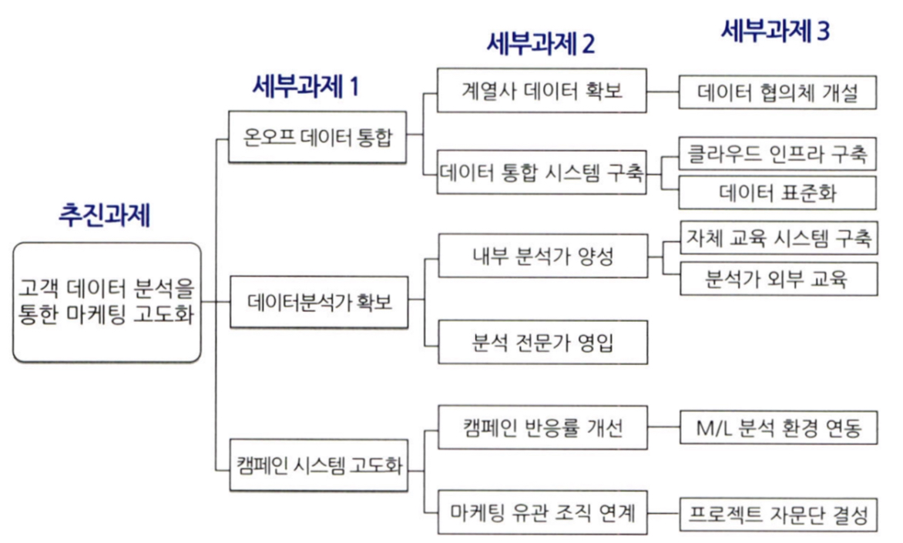

# 통계학 2주차 정규과제

📌통계학 정규과제는 매주 정해진 분량의 『*데이터 분석가가 반드시 알아야 할 모든 것*』 을 읽고 학습하는 것입니다. 이번 주는 아래의 **Statistics_2nd_TIL**에 나열된 분량을 읽고 `학습 목표`에 맞게 공부하시면 됩니다.

아래의 문제를 풀어보며 학습 내용을 점검하세요. 문제를 해결하는 과정에서 개념을 스스로 정리하고, 필요한 경우 추가자료와 교재를 다시 참고하여 보완하는 것이 좋습니다.

2주차는 `2부-08.분석 프로젝트 준비 및 기획`과 `2부-09.분석 환경 세팅하기`를 읽고 새롭게 배운 내용을 정리해주시면 됩니다.


## Statistics_2nd_TIL

### 2부. 데이터 분석 준비하기
### 08. 분석 프로젝트 준비 및 기획
### 09. 분석 환경 세팅하기


## Study Schedule

|주차 | 공부 범위     | 완료 여부 |
|----|--------------|----------|
|1주차| 1부 ~p.79    | ✅      |
|2주차| 2부 ~p.120   | ✅      | 
|3주차| 2부 ~p.202   | 🍽️      | 
|4주차| 2부 ~p.299   | 🍽️      | 
|5주차| 3부 ~p.356   | 🍽️      | 
|6주차| 3부 ~p.437   | 🍽️      | 
|7주차| 3부 ~p.542   | 🍽️      | 
|8주차| 3부 ~p.615   | 🍽️      | 
|9주차|데이터 분석 실습| 🍽️      |

<!-- 여기까진 그대로 둬 주세요-->

# 08. 분석 프로젝트 준비 및 기획

```
✅ 학습 목표 :
* 데이터 분석 프로세스를 설명할 수 있다.
* 비즈니스 문제를 정의할 때 주의할 점을 설명할 수 있다.
* 외부 데이터를 수집하는 방법을 배우고 간단한 크롤링 코드를 작성할 수 있다.
```
<!-- 새롭게 배운 내용을 자유롭게 정리해주세요.-->
```
<데이터 분석의 3단계>

    1. 설계 단계 : 무엇을 하고자 하는지 명확히 분석
    2. 분석 및 모델링 단계 : 서버 환경을 마련하고 본격적인 분석과 모델링
    3. 구축 및 활용 단계 : 최종적으로 선정된 모델을 실무에 적용하고 성과를 측정
```
```
<CRISP-DM 방법론>

    1. 비즈니스 이해
        현재 상황 평가, 데이터 마이닝 목표 결정, 프로젝트 계획 수립
    
    2. 데이터 이해
        데이터 설명, 데이터 탐색(EDA), 데이터 품질 확인
    
    3. 데이터 준비
        데이터 선택, 데이터 정제, 필수 데이터 구성, 데이터 통합
    
    4. 모델링
        모델링 기법 선정, 테스트 디자인 생성, 모델 생성, 모델 평가
    
    5. 평가
        결과 평가, 프로세스 검토, 다음 단계 설정
    
    6. 배포
        배포 계획, 모니터링 및 유지관리, 최종 보고서 작성, 프로젝트 검토
```
```
<데이터 분석 시 주의점>

    ㅇ 비즈니스 이해 및 문제 정의
        - 이것이 조금이라도 잘못되면 아주 큰 결과 오류를 야기할 수 있음
        - MECE를 생각하라
    
    ㅇ 도메인 지식
        - 해당되는 분야의 업에 대한 이해
        - 의미있는 변수를 찾아내고 분석 방향을 설정하는 것은 도메인 지식이 충분히 수반되야함
```


```
<크롤링>

    ㅇ 데이터는 부족하다 -> 외부데이터를 이용
        데이터 구매, 데이터 공유, 오픈데이터 그리고 크롤링
    
    ㅇ 크롤링은 원하는 데이터를 실시간으로 자유롭게 수집할 수 있음
    
    ㅇ 프로그래밍이 필요하며, 해당 웹페이지가 리뉴얼되면 이에 맞춰 코드를 변경해야함

    ㅇ 또한 크롤링을 활용할 때는 법적인 이슈를 고려해야함

    ㅇ 스크래핑과 동일하게 사용되지만 미세한 차이가 있음

    ㅇ 크롤링 -> 모든 내용, 스크래핑 -> 원하는 부분만

    ㅇ 파이썬 BeatifulSoup, Selenium 라이브러리 사용
```
# 09. 분석 환경 세팅하기

```
✅ 학습 목표 :
* 테이블 조인의 개념과 종류를 이해하고, 각 조인 방식의 차이를 구분하여 설명할 수 있다.
* ERD의 개념과 역할을 이해하고, 기본 구성 요소와 관계 유형을 설명할 수 있다.
```

<!-- 새롭게 배운 내용을 자유롭게 정리해주세요.-->
```
<파이썬>

    ㅇ 다양한 분야에서 사용 가능
    ㅇ 이해하기 쉬움
    ㅇ c언어보다 느림
    ㅇ 다양한 데이터 분석용 도구가 있음
    ㅇ R에 비해 시각화가 복잡함
```
```
<SQL>

    ㅇ 관계형 데이터베이스 시스템에서 관리 및 처리하기 위해 설계된 언어
    ㅇ 대화식 언어이기에 명령문이 짧고 간결
```
**테이블 조인**
```
<테이블 조인>

    ㅇ 테이블을 결합하는 것
    ㅇ 각 테이블의 속성과 관계를 명확히 인지해야함
```
```
<레프트, 라이트 조인>

    ㅇ 하나의 테이블을 기준으로 다른 테이블에서 겹치는 부분을 겨랗ㅂ
    ㅇ 기준이 되는 테이블의 데이터는 그대로 유지, 조인하는 테이블의 데이터만 추가됨
    ㅇ 기본키가 NULL이면 오른쪽 테이블의 값도 NULL
    ㅇ 기본키가 중복이면 행이 중복으로 들어감
```
***레프트 조인***
|id | name|department_id|
|----|--------------|----------|
|1| Alice   | 101     |
|2| Bob   | 102   | 
|3| Charlie   | NULL      | 

|department_id | department_name|
|----|--------------|
| 101   | HR     |
| 102   | IT   | 
| 103   | Sales      | 

->
|id | name|department_name|
|----|--------------|----------|
|1| Alice   | HR    |
|2| Bob   | IT  | 
|3| Charlie   | NULL      | 

```
<이너 조인>

    ㅇ 이너 조인은 두 부분의 겹치는 부분만 가져오는 방법
    ㅇ 기본키가 NULL이면 행에서 사라짐

<풀 조인>

    ㅇ 모든 행을 살리는 조인
```
***이너 조인***
|id | name|department_id|
|----|--------------|----------|
|1| Alice   | 101     |
|2| Bob   | 102   | 
|3| Charlie   | NULL      |
|4| David   | 104    |

|department_id |department_name|
|----|---------------|
|101| HR     |
|102| IT   | 
|103| Sales      | 

->

id | name|department_name|
|----|--------------|----------|
|1| Alice   | HR     |
|2| Bob   | IT   |


***풀 조인***

|id | name|department_id|
|----|--------------|----------|
|1| Alice   | 101     |
|2| Bob   | 102   | 
|3| Charlie   | NULL      |
|4| David   | 104    |

|department_id |department_name|
|----|---------------|
|101| HR     |
|102| IT   | 
|103| Sales      | 

->

|id | name|department_id|department_name|
|----|--------------|----------|-----------|
|1| Alice   | 101          |HR       |
|2| Bob   | 102       |IT       | 
|3| Charlie   | NULL         |NULL     |
|4| David   | 104        |NULL       |
|NULL| NULL  | 103       |Sales     |


```
<크로스 조인>

    ㅇ 머신러닝에 사용되는 데이터셋을 생성할 때 사용
```


<br>
<br>

# 확인 문제

## 문제 1.

> **🧚 아래의 테이블을 조인한 결과를 출력하였습니다. 어떤 조인 방식을 사용했는지 맞춰보세요.**

> 사용한 테이블은 다음과 같습니다.

|
---|---|

> 보기: INNER, FULL, LEFT, RIGHT 조인

<!-- 테이블 조인의 종류를 이해하였는지 확인하기 위한 문제입니다. 각 테이블이 어떤 조인 방식을 이용하였을지 고민해보고 각 테이블 아래에 답을 작성해주세요.-->

### 1-1. 

```
여기에 답을 작성해주세요!
```

### 1-2. 

```
여기에 답을 작성해주세요!
```

### 1-3. 

```
여기에 답을 작성해주세요!
```

### 1-4. 

```
여기에 답을 작성해주세요!
```

### 1-5. CROSS JOIN을 수행할 경우, 결과 테이블의 행 개수는 몇 개인가요?
```
여기에 답을 작성해주세요!
```

## 문제 2.

> **🧚 다음과 같은 시나리오를 기반으로 ERD를 설계할 때, 주요 엔터티와 관계를 정의하세요.**

```
[시나리오]  

한 도서관에는 여러 개의 도서(Book)가 존재하며, 각 도서는 도서 ID, 제목, 저자 정보를 가진다.  
회원(Member)은 회원 ID, 이름, 가입 날짜를 가진다.  
회원은 한 번에 여러 권의 책을 대출할 수 있으며, 같은 책을 여러 번 대출할 수도 있다.  
즉, 같은 회원이 같은 도서를 여러 번 빌릴 수 있으므로, 대출(Loan) 정보에는 개별 대출을 구분할 수 있는 대출 ID가 필요하다.  
대출 기록에는 대출 날짜와 반납 날짜가 포함되며, 대출되지 않은 도서도 존재할 수 있다.  
```

> **질문:   
1️⃣ 주요 엔터티와 그 속성을 정의하세요.   
2️⃣ 각 엔터티의 기본키(PK)를 정의하세요.   
3️⃣ 엔터티 간의 관계를 정의하세요.**

<!-- ERD에 관한 문제입니다. 엔터티의 정의와 관계 유형을 떠올려보세요.-->

<!--참고. 기본키는 각 엔터티에서 레코드를 고유하게 식별하기 위해 설정됩니다-->

```
여기에 답을 작성해주세요!
```

### 🎉 수고하셨습니다.