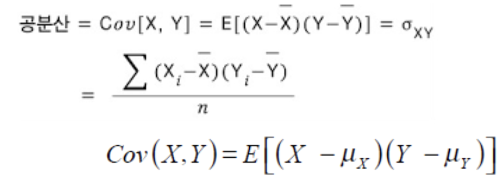
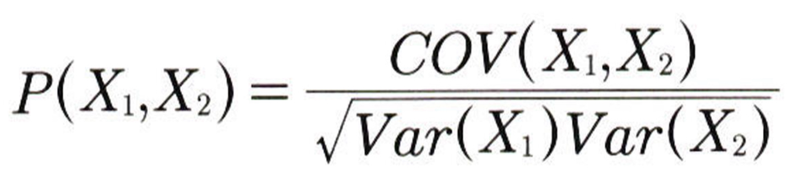
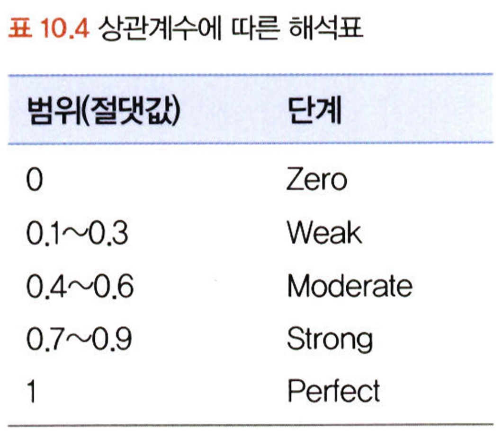
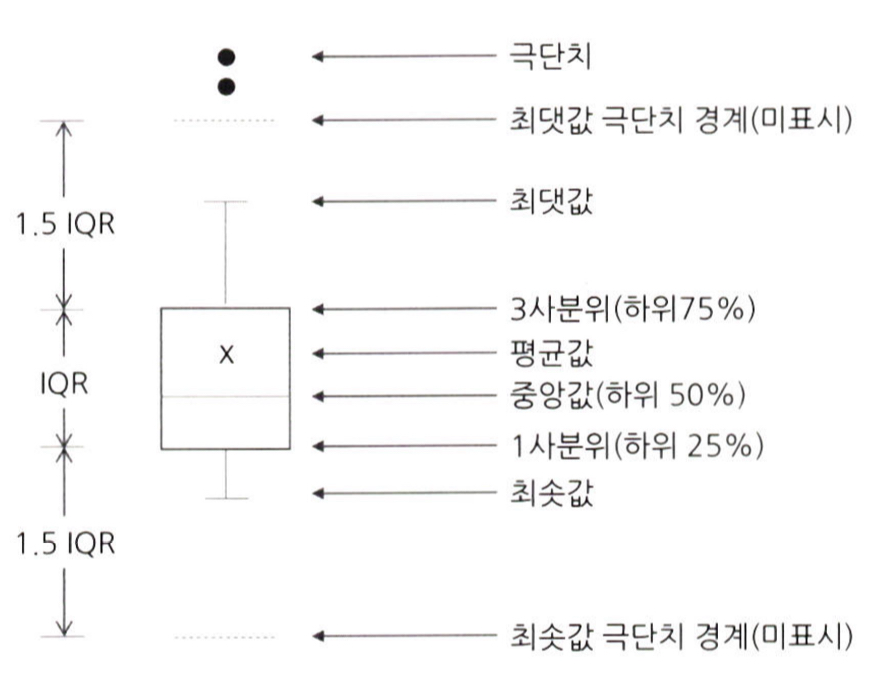

# 통계학 3주차 정규과제

📌통계학 정규과제는 매주 정해진 분량의 『*데이터 분석가가 반드시 알아야 할 모든 것*』 을 읽고 학습하는 것입니다. 이번 주는 아래의 **Statistics_3rd_TIL**에 나열된 분량을 읽고 `학습 목표`에 맞게 공부하시면 됩니다.

아래의 문제를 풀어보며 학습 내용을 점검하세요. 문제를 해결하는 과정에서 개념을 스스로 정리하고, 필요한 경우 추가자료와 교재를 다시 참고하여 보완하는 것이 좋습니다.

3주차는 `2부-10.데이터 탐색과 시각화`를 읽고 새롭게 배운 내용을 정리해주시면 됩니다.

[실습코드](https://github.com/c-karl/DA_DS_Book001)를 참고하여 학습해주세요.


## Statistics_3rd_TIL

### 2부. 데이터 분석 준비하기
### 10. 데이터 탐색과 시각화


## Study Schedule

|주차 | 공부 범위     | 완료 여부 |
|----|--------------|----------|
|1주차| 1부 ~p.79    | ✅      |
|2주차| 2부 ~p.120   | ✅      | 
|3주차| 2부 ~p.202   | ✅      | 
|4주차| 2부 ~p.299   | 🍽️      | 
|5주차| 3부 ~p.356   | 🍽️      | 
|6주차| 3부 ~p.437   | 🍽️      | 
|7주차| 3부 ~p.542   | 🍽️      | 
|8주차| 3부 ~p.615   | 🍽️      | 
|9주차|데이터 분석 실습| 🍽️      |

<!-- 여기까진 그대로 둬 주세요-->

# 10. 데이터 탐색과 시각화

```
✅ 학습 목표 :
* EDA의 목적을 설명할 수 있다.
* 주어진 데이터셋에서 이상치, 누락값, 분포 등을 식별하고 EDA 결과를 바탕으로 데이터셋의 특징을 해석할 수 있다.
* 공분산과 상관계수를 활용하여 두 변수 간의 관계를 해석할 수 있다.
* 적절한 시각화 기법을 선택하여 데이터의 특성을 효과적으로 전달할 수 있다.
```
<!-- 새롭게 배운 내용을 자유롭게 정리해주세요.-->
<데이터 탐색과 시각회>
```
ㅇ EDA와 전처리 단계는 데이터 분석 프로세스에서 가장 많은 시간과 노력이 소모됨
ㅇ RAW 데이터는 오류와 이상치를 가지고 있는 경우가 많다
```
<br/>

<EDA와 시각화>
```
ㅇ EDA에서 시각화를 하기도 하지만 시각화의 궁극적 목적은 분석 결과를 커뮤니케이션하기 위함이다
```

<br>

<EDA란?>
```
ㅇ 가공하지 않은 원천의 데이터를 있는 그대로 탐색하고 분석하는 기법
ㅇ 기술통계와 데이터 시각화를 통해 데이터의 특성을 파악하는 것
ㅇ EDA를 할 때는 극단적인 해석은 피해야 하며 지나친 추론이나 자의적 해석도 지양해야함
```

<br>

<EDA시 하는 것>
```
ㅇ 전반적인 정보 확인 (info())
ㅇ 통계치 확인 (describe())
ㅇ 왜도 확인 (skew())
ㅇ 첨도 확인 (jurtosis())

등등
```

<br>

<공분산과 상관성>
```
ㅇ 데이터 탐색과정에서는 변수 간의 관계를 파악해야함
ㅇ 이를 통해 다중공산성을 방지하고, 데이터에 대한 이해도를 높일 수 있음
ㅇ 상관관계를 파악하는 대표적인 개념이 공분산과 상관계수
```

<Br>

<공분산>
```
ㅇ 공분산은 공유하는 분산
ㅇ 즉 두 분산의 관계를 말함
ㅇ 값이 0이면 상관관계가 없는 것이고, 양수면 양, 음수면 음의 상관관계
```


<br>

<상관계수>
```
ㅇ 공분산의 약점을 보완한 방법
ㅇ 각 변수 간의 다른 척도기준이 그대로 반영되어 공분산 값이 지니는 크기가 상관성의 정도를 나타내지 못함
ㅇ 공분산을 변수 각각의 표준편차 값으로 나누는 정규화를 하여 상관성을 비교
ㅇ 하지만 이도 절대적인 기준이 될 수 없기에 피어슨 상관계수를 사용
```

<br>

<피어슨 상관계수>


-1<R<1

결정계수 = R^2

산점도의 기울기와 상관계수는 관련이 없다!

```
<상관분석의 단점>

ㅇ 상관분석은 선형관계만을 측정하기에 비선형적인 관계에서는 사용할 수 없다
ㅇ 따라서 다양한 통계적 방법과 시각화 기법을 함께 사용해야 한다
```

<br>

<시간 시각화>
```
ㅇ 시점 요소가 있는 데이터는 시계열 형태로 표현 가능
```

<br>

<비교 시각화>
```
<히트맵>
    ㅇ 히트맵 차트는 그룹과 비교 요소가 많을 때 효과적으로 시각화 가능
    ㅇ 히트맵 차트는 다른 시각화 방법에 비해 그리는 것이 까다롭기 때문에, 현재 가지고 있는 데이터의 구조와 자신이 확인하고자 하는 목적을 정확히 파악한 다음 차트를 그려야함
    ㅇ 분류 그룹이나 변수가 너무 많으면 혼란을 유발할 수 있기 때문에 적정한 수준으로 데이터를 정제하는 작업이 필요하다

<방사선 차트>
    ㅇ 온라인 게임에서 캐릭터 특성을 설명할 때 자주 사용하는 육각형
```

<br>

<분포 시각화>
```
ㅇ 분포 시각화는 연속형과 같은 양적 척도인지, 명목형과 괕은 질적 척도인지에 따라 구분해서 그린다

양적 : 히스토그램
질적 : 파이, 도넛차트, 트리맵 차트, 와플 차트
```

<br>

<관계 시각화>
```
ㅇ 산점도는 단순해서 이해하기 쉽다
ㅇ 산점도를 그릴때는 극단치를 제거하는 것이 좋다
ㅇ 버블 차트를 이용하면 세가지 요소의 상관관계를 표현할 수 있다
```

<br>

<박스 플롯>
```
ㅇ 박스 플롯은 하나의 그림으로 양적 척도 데이터의 분포 및 편향성, 평균과 중앙값 등 다양한 수치를 보기 쉽게 정리해줌
```
<박스 플롯의 5가지 수치>
```
1. 최솟값: 제1사분위에서 1.5*IQR을 뺀 위치
2. 제1사분위: 25%의 위치
3. 제2사분위: 중앙값
4. 제3사분위: 75%의 위치
5. 최댓값: 제3사분이ㅜ에서 1.5*IQR을 더한 위치
```


<br>
<br>

# 확인 문제

## 문제 1.
> **🧚 공분산과 상관계수의 차이점에 대해 간단히 설명하세요.**

```
공분산은 두 변수의 분산의 관계를 말한다
상관계수는 공분산이 각 변수 간의 다른 척도 기준이 그대로 반영되어 공분산 값이 지니는 크기가 상관성의 정도를 나타내지 못한다는 점을 보완하여, 공분산을 변수 각각의 표준편차로 나눈 것이다
```
## 문제 2.
> **🧚 다음 데이터 분석 목표에 적합한 시각화 방법을 보기에서 모두 골라 연결해주세요.**

> 보기: 산점도, 선그래프, 막대그래프, 히스토그램, 박스플롯, KDE

(a) 변수의 분포 확인   
(b) 두 변수 간의 관계 확인   
(c) 집단별 평균 비교   
(d) 시계열 데이터 분석

<!--중복 가능-->

```
(a) 히스토그램, 박스플롯, KDE
(b) 산점도
(c) 박스플롯
(d) 선그래프, 막대그래프
```


### 🎉 수고하셨습니다.