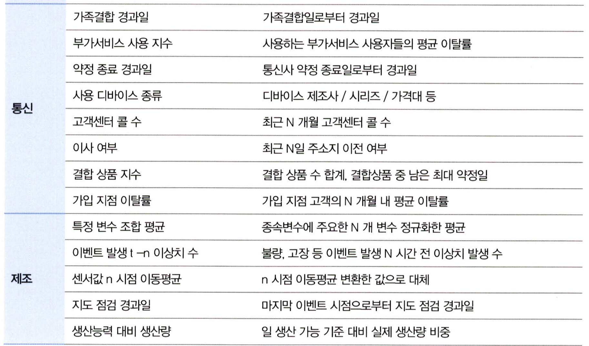

# 통계학 5주차 정규과제

📌통계학 정규과제는 매주 정해진 분량의 『*데이터 분석가가 반드시 알아야 할 모든 것*』 을 읽고 학습하는 것입니다. 이번 주는 아래의 **Statistics_5th_TIL**에 나열된 분량을 읽고 `학습 목표`에 맞게 공부하시면 됩니다.

아래의 문제를 풀어보며 학습 내용을 점검하세요. 문제를 해결하는 과정에서 개념을 스스로 정리하고, 필요한 경우 추가자료와 교재를 다시 참고하여 보완하는 것이 좋습니다.

5주차는 `2부. 데이터 분석 준비하기`를 읽고 새롭게 배운 내용을 정리해주시면 됩니다.


## Statistics_5th_TIL

### 2부. 데이터 분석 준비하기
### 11.데이터 전처리와 파생변수 생성


## Study Schedule

|주차 | 공부 범위     | 완료 여부 |
|----|----------------|----------|
|1주차| 1부 p.2~56     | ✅      |
|2주차| 1부 p.57~79    | ✅      | 
|3주차| 2부 p.82~120   | ✅      | 
|4주차| 2부 p.121~202  | ✅      | 
|5주차| 2부 p.203~254  | ✅      | 
|6주차| 3부 p.300~356  | 🍽️      | 
|7주차| 3부 p.357~615  | 🍽️      | 

<!-- 여기까진 그대로 둬 주세요-->

# 11.데이터 전처리와 파생변수 생성

```
✅ 학습 목표 :
* 결측값과 이상치를 식별하고 적절한 방법으로 처리할 수 있다.
* 데이터 변환과 가공 기법을 학습하고 활용할 수 있다.
* 모델 성능 향상을 위한 파생 변수를 생성하고 활용할 수 있다.
```


## 11.1. 결측값 처리
<!-- 새롭게 배운 내용을 자유롭게 정리해주세요. -->
```
ㅇ 완전 무작위 결측
    이름 그대로 순수하게 결측값이 무작위로 발생한 경우
    결측값을 포함한 데이터를 제거해도 편향이 거의 발생되지 않음

ㅇ 무작위 결측
    다른 변수의 특성에 의해 해당 변수의 결측치가 발생
    e.g. 특정 체인점의 오류

ㅇ 비무작위 결측
    결측값들이 해당 변수 자체의 특성을 갖고 있는 경우
    e.g. 고객 소득 변수에서 대부분의 소득이 적어서 공개를 꺼리는 경우
```
```
ㅇ 가장 간단한 결측치 처리법은 행 혹은 열 제거

ㅇ 평균 대치법
    통계량의 표준오차가 축소되고, p-value가 부정확해짐

표본제거방법과 평균 대치법은 완전 무작위 결측이 아닌 경우 적절치 않다

ㅇ 보간법 (시계열적 특성일때)

ㅇ 회귀 대치법
    해당 변수와 다른 변수 사이의 관계성을 고려하여 결측값을 계산
    변수의 분산을 과소 추정하는 문제가 있음
    -> 인위적으로 회귀식에 확률 오차항을 추가하는 확률적 회귀대치법 사용 가능
```

## 11.2. 이상치 처리
<!-- 새롭게 배운 내용을 자유롭게 정리해주세요. -->
```
전체 데이터의 양이 많을수록 튀는 값이 통곗값에 미치는 영향력이 줄어들어 이상치 제거의 필요성이 낮아짐

ㅇ 관측값 변경
    하한 값과 상한 값을 결정한 후 하한 값보다 작으면 하한 값으로 대체하고, 상한 값보다 크면 상한 값으로 대체

ㅇ  +-n*σ 이상 떨어져 있는 값을 이상치로 보는데, 보통 n=3

ㅇ 그러나 평균은 이상치에 통계량이 민감하게 변하기에, 이상치에 강건한 중위수와 MAD를 사용하는 것이 좀 더 효과적

ㅇ 또한 분석 도메인에 따라 이상치가 중요한 분석 요인일 수 있음
```

## 11.3. 변수 구간화
<!-- 새롭게 배운 내용을 자유롭게 정리해주세요. -->
```
ㅇ 변수 구간화 : 성능 향상 혹은 해석의 편리를 위해 이산형 변수를 범주형 변수로 변환

ㅇ 구간화는 여러 케이스로 응용 가능

ㅇ 평활화 : 이산 값을 동일한 특정 값으로 변환
    e.g. 1,2,3,4,5 -> 3,3,3,3,3 / 11,12,13,14,15 -> 13,13,13,13,13
```


## 11.4. 데이터 표준화와 정규화 스케일링
<!-- 새롭게 배운 내용을 자유롭게 정리해주세요. -->
```
ㅇ 표준화 : 각 관측치의 값이 전체 평균을 기준으로 어느 정도 떨어져 있는지 나타낼 때 사용
    평균은 0, 표준편차는 1

ㅇ 정규화 : 데이터의 범위를 0부터 1까지로 변환하여 데이터 분포를 조정하는 방법

ㅇ RobustScaler는 데이터 중앙값 (Q2)를 0으로 잡고, IQR 차이를 1이 되도록 하는 스케일링 기법
```
## 11.5. 모델 성능 향상을 위한 파생 변수 생성
<!-- 새롭게 배운 내용을 자유롭게 정리해주세요. -->
```
ㅇ 파생변수 : 원래 있던 변수들을 조합하거나 함수를 적용하여 새로 만들어낸 변수

ㅇ 분석의 효율을 높이기에 전체 데이터에 대한 파악이 중요하며 도메인에 대한 충분한 이해가 수반되어야 한다
```





<br>
<br>

# 확인 문제

## 문제 1. 데이터 전처리

> **🧚 한 금융회사의 대출 데이터에서 `소득` 변수에 결측치가 포함되어 있다. 다음 중 가장 적절한 결측치 처리 방법은 무엇인가?**

> **[보기]   
1️⃣ 결측값이 포함된 행을 모두 제거한다.  
2️⃣ 결측값을 `소득` 변수의 평균값으로 대체한다.  
3️⃣ `연령`과 `직업군`을 독립변수로 사용하여 회귀 모델을 만들어 `소득` 값을 예측한다.  
4️⃣ 결측값을 보간법을 이용해 채운다.**

> **[데이터 특징]**     
    - `소득` 변수는 연속형 변수이다.  
    - 소득과 `연령`, `직업군` 간에 강한 상관관계가 있다.  
    - 데이터셋에서 `소득` 변수의 결측 비율은 15%이다.

```
3번
소득이 연령과 직업군 간에 강한 상관관계가 있다면, 그점을 이용해 회귀 모델을 사용하면 조금 더 논리적인 결측치 처리가 가능하다.
```

## 문제 2. 데이터 스케일링

> **🧚 머신러닝 모델을 학습하는 과정에서, `연봉(단위: 원)`과 `근속연수(단위: 년)`를 동시에 독립변수로 사용해야 합니다. 연봉과 근속연수를 같은 스케일로 맞추기 위해 어떤 스케일링 기법을 적용하는 것이 더 적절한가요?**

<!--표준화와 정규화의 차이점에 대해 고민해보세요.-->

```
robust scaling

연봉에서 이상치가 있을 수도 있다고 생각해서 이상치에 강건한 robust scaling이 적합해 보인다.
```

### 🎉 수고하셨습니다.