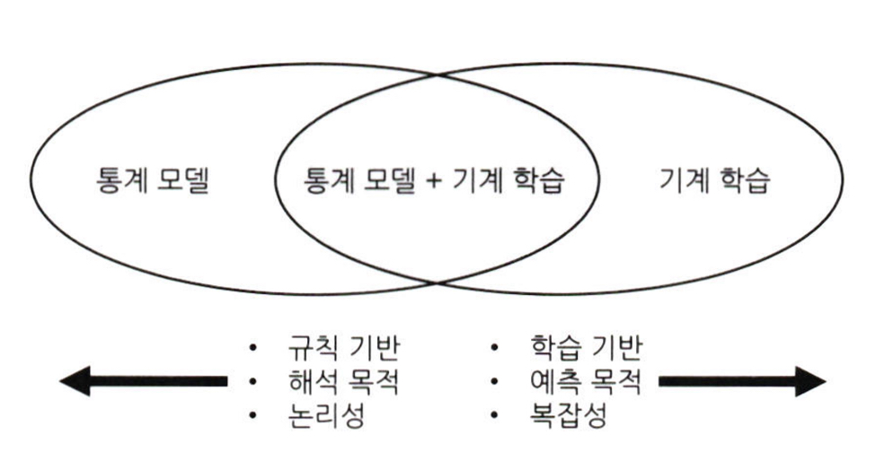
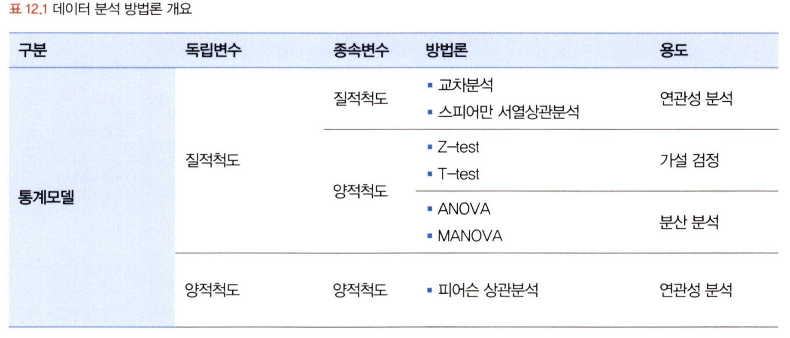
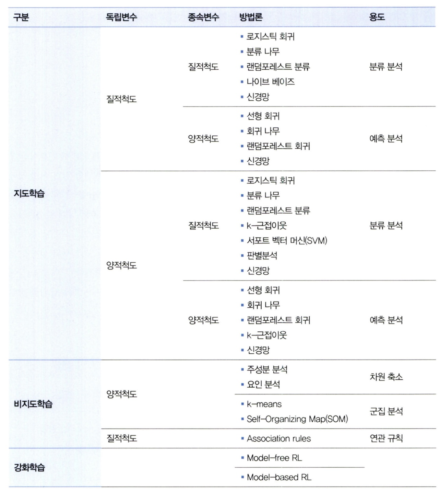
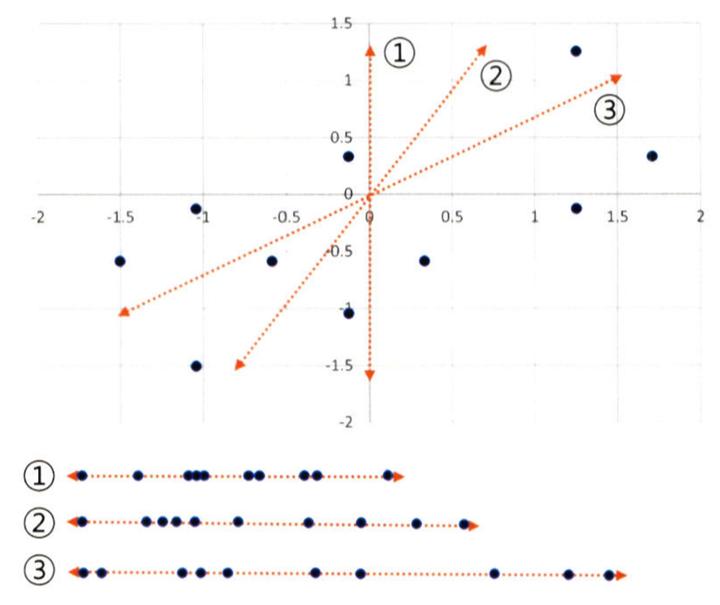
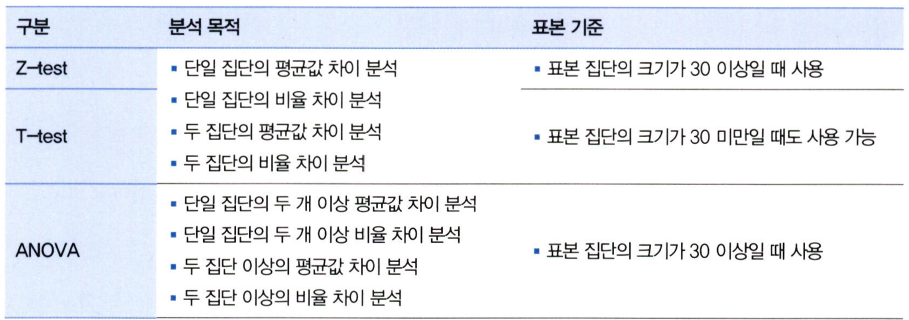

# 통계학 6주차 정규과제

📌통계학 정규과제는 매주 정해진 분량의 『*데이터 분석가가 반드시 알아야 할 모든 것*』 을 읽고 학습하는 것입니다. 이번 주는 아래의 **Statistics_6th_TIL**에 나열된 분량을 읽고 `학습 목표`에 맞게 공부하시면 됩니다.

아래의 문제를 풀어보며 학습 내용을 점검하세요. 문제를 해결하는 과정에서 개념을 스스로 정리하고, 필요한 경우 추가자료와 교재를 다시 참고하여 보완하는 것이 좋습니다.

6주차는 `3부. 데이터 분석하기`를 읽고 새롭게 배운 내용을 정리해주시면 됩니다.


## Statistics_6th_TIL

### 3부. 데이터 분석하기
### 12.통계 기반 분석 방법론


## Study Schedule

|주차 | 공부 범위     | 완료 여부 |
|----|----------------|----------|
|1주차| 1부 p.2~56     | ✅      |
|2주차| 1부 p.57~79    | ✅      | 
|3주차| 2부 p.82~120   | ✅      | 
|4주차| 2부 p.121~202  | ✅      | 
|5주차| 2부 p.203~254  | ✅      | 
|6주차| 3부 p.300~356  | ✅      | 
|7주차| 3부 p.357~615  | 🍽️      |

<!-- 여기까진 그대로 둬 주세요-->

# 12.통계 기반 분석 방법론

```
✅ 학습 목표 :
* 주성분 분석(PCA)의 개념을 설명할 수 있다.
* 다중공선성을 진단할 수 있다.
* Z-TEST와 T-TEST의 개념을 비교하고, 적절한 상황에서 검정을 설계하고 수행할 수 있다.
* ANOVA TEST를 활용하여 세 개 이상의 그룹 간 평균 차이를 검정하고, 사후검정을 수행할 수 있다.
* 카이제곱 검정을 통해 범주형 변수 간의 독립성과 연관성을 분석하는 방법을 설명할 수 있다.
```

## 12.1. 분석 모델 개요
<!-- 새롭게 배운 내용을 자유롭게 정리해주세요.-->
```
방법론은 크게 두 축으로 나눠짐

-> 통계학에 기반한 통계 모델 / 인공지능에서 파생된 기계 학습

ㅇ 통계 모델 : 모형과 해석, 오차와 불확정성 강조
ㅇ 기계 학습 : 대용량 데이터 활용, 장확도 강조
```




## 12.2. 주성분 분석(PCA)
<!-- 새롭게 배운 내용을 자유롭게 정리해주세요.-->
```
주성분 분석 : 여러 개의 독립변수들을 잘 설명해 줄 수 있는 주된 성분을 추출하는 기법

ㅇ 차원의 저주 방지
ㅇ 모형을 간단하게 만듦
ㅇ 사용되는 변수들이 모두 양적변수여야 하고, 서로 독립적, 정규성을 띄어야함
```
```
PCA : 변수의 수를 축약하면서 정보의 손실을 최소화하고자 할 때 사용
CFA : 변수들 사이에 존재하는 차원을 규명함으로써 변수들 간의 구조를 파악하는데 사용
```

3번이 가장 큰 분산 -> 주성분

설명력

만약 1주성분의 분산이 15이고, 제 2주성분의 분산이 5라고 가정하면,

전체 분산인 20 중 15인 1주성분의 설명력은 75%, 2주성분은 25%

## 12.4. 다중공선성 해결과 섀플리 밸류 분석
<!-- 새롭게 배운 내용을 자유롭게 정리해주세요.-->

다중공선성 : 독립변수들 간의 상관관계가 높은 현상

다중공선성을 판별하는 기준

1. 상관분석 -> 상관계수 0.7이상이면 다중공선성 의심
2. 회귀분석 -> 결정계수 값은 크지만, 회귀계수에 대한 t값이 낮다면 다중공선성을 의심
3. VIF -> 분산팽창계수를 통해 판단, 5이상이면 의심, 10이상이면 있다고 판단
## 12.6. Z-test와 T-test
<!-- 새롭게 배운 내용을 자유롭게 정리해주세요.-->

단일 표본 집단의 평균 변화를 분석하거나 두 집단의 평균값 혹은 비율 차이를 분석할때 사용
```
전제 : 양적 변수, 정규분포, 등분산

등분산 -> bartlett 등분산성 검정을 통해 확인

등분산 만족 -> equal variance t-test
불만족 -> Welch's t-test

n > 30 -> z-test
```


## 12.7. ANOVA
<!-- 새롭게 배운 내용을 자유롭게 정리해주세요.-->
세 집단 이상의 평균 차이를 검정할 때 ANOVA 사용

```
F 분포 사용

독립변수 하나 -> one-way ANOVA
두개 -> two-way ANOVA
그 이상 -> N-way ANOVA
```


## 12.8. 카이제곱 검정(교차분석)
<!-- 새롭게 배운 내용을 자유롭게 정리해주세요.-->
교차분석이라고 불리며, 명목 혹은 서열척도와 같은 범주형 변수들 간의 연관성을 분석하기 위해 결합분포를 활용하는 방법

(실제빈도ij-기대빈도ij)^2 / 기대빈도ij


<br>
<br>

# 확인 문제

### **문제 1.**
> **🧚 경희는 다트비 교육 연구소의 연구원이다. 경희는 이번에 새롭게 개발한 교육 프로그램이 기존 프로그램보다 학습 성취도 향상에 효과적인지 검증하고자 100명의 학생을 무작위로 두 그룹으로 나누어 한 그룹(A)은 새로운 교육 프로그램을, 다른 그룹(B)은 기존 교육 프로그램을 수강하도록 하였다. 실험을 시작하기 전, 두 그룹(A, B)의 초기 시험 점수 평균을 비교한 결과, 유의미한 차이가 없었다. 8주 후, 학생들의 최종 시험 점수를 수집하여 두 그룹 간 평균 점수를 비교하려고 한다.**   

> **🔍 Q1. 이 실험에서 사용할 적절한 검정 방법은 무엇인가요?**

```
z-test
```

> **🔍 Q2. 이 실험에서 설정해야 할 귀무가설과 대립가설을 각각 작성하세요.**

```
H0 : 두 그룹의 최종 시험 점수는 차이가 없을 것이다
H1 : 두 그룹의 최종 시험 점수는 차이가 있을 것이다
```

> **🔍 Q3. 검정을 수행하기 위한 절차를 순서대로 서술하세요.**

<!--P.337의 실습 코드 흐름을 확인하여 데이터를 불러온 후부터 어떤 절차로 검정을 수행해야 하는지 고민해보세요.-->

```
정규성 검정
등분산성 검정
z-test
```

> **🔍 Q4. 이 검정을 수행할 때 가정해야 하는 통계적 조건을 설명하세요.**

```
양적 변수, 정규성, 등분산성
```

> **🔍 Q5. 추가적으로 최신 AI 기반 교육 프로그램(C)도 도입하여 기존 프로그램(B) 및 새로운 프로그램(A)과 비교하여 성취도 차이가 있는지 평가하고자 한다면 어떤 검정 방법을 사용해야 하나요? 단, 실험을 시작하기 전, C 그룹의 초기 점수 평균도 A, B 그룹과 유의미한 차이가 없었다고 가정한다.**

```
ANOVA
```

> **🔍 Q6. 5번에서 답한 검정을 수행한 결과, 유의미한 차이가 나타났다면 추가적으로 어떤 검정을 수행해 볼 수 있을까요?**

```
Scheffe 검증
```

---

### **문제 2. 카이제곱 검정**  
> **🧚 다음 중 어떠한 경우에 카이제곱 검정을 사용해야 하나요?   
1️⃣ 제품 A, B, C의 평균 매출 차이를 비교하고자 한다.  
2️⃣ 남성과 여성의 신체 건강 점수 평균 차이를 분석한다.  
3️⃣ 제품 구매 여부(구매/미구매)와 고객의 연령대(10대, 20대, 30대…) 간의 연관성을 분석한다.  
4️⃣ 특정 치료법이 환자의 혈압을 감소시키는 효과가 있는지 확인한다.**  

```
3번
```

### 🎉 수고하셨습니다.