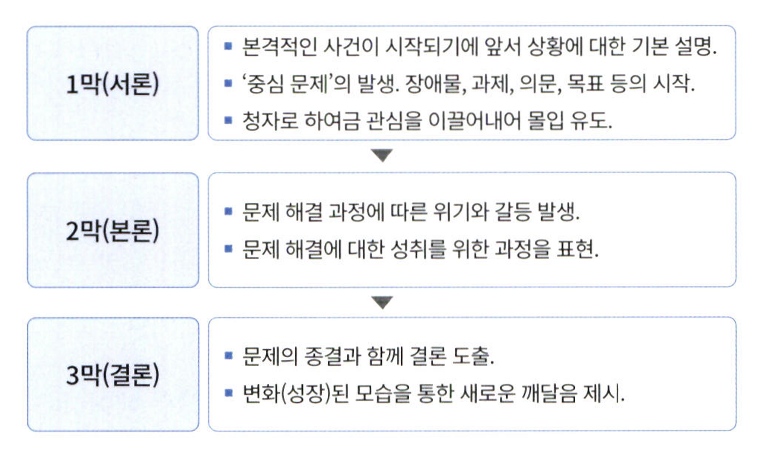

# 통계학 7주차 정규과제

📌통계학 정규과제는 매주 정해진 분량의 『*데이터 분석가가 반드시 알아야 할 모든 것*』 을 읽고 학습하는 것입니다. 이번 주는 아래의 **Statistics_7th_TIL**에 나열된 분량을 읽고 `학습 목표`에 맞게 공부하시면 됩니다.

아래의 문제를 풀어보며 학습 내용을 점검하세요. 문제를 해결하는 과정에서 개념을 스스로 정리하고, 필요한 경우 추가자료와 교재를 다시 참고하여 보완하는 것이 좋습니다.

7주차는 `3부. 데이터 분석하기`를 읽고 새롭게 배운 내용을 정리해주시면 됩니다.


## Statistics_7th_TIL

### 3부. 데이터 분석하기
### 13.머신러닝 분석 방법론
### 14.모델 평가


## Study Schedule

|주차 | 공부 범위     | 완료 여부 |
|----|----------------|----------|
|1주차| 1부 p.2~56     | ✅      |
|2주차| 1부 p.57~79    | ✅      | 
|3주차| 2부 p.82~120   | ✅      | 
|4주차| 2부 p.121~202  | ✅      | 
|5주차| 2부 p.203~254  | ✅      | 
|6주차| 3부 p.300~356  | ✅      | 
|7주차| 3부 p.357~615  | ✅      | 

<!-- 여기까진 그대로 둬 주세요-->

# 13.머신러닝 분석 방법론

```
✅ 학습 목표 :
* 선형 회귀와 다항 회귀를 비교하고, 데이터를 활용하여 적절한 회귀 모델을 구축할 수 있다. 
* 로지스틱 회귀 분석의 개념과 오즈(Odds)의 의미를 설명하고, 분류 문제에 적용할 수 있다.
* k-means 알고리즘의 원리를 설명하고, 적절한 군집 개수를 결정하여 데이터를 군집화할 수 있다.
```

## 13.1. 선형 회귀분석과 Elastic Net(예측모델)
<!-- 새롭게 배운 내용을 자유롭게 정리해주세요.-->
<!-- `13.1.3. Ridge와 Lasso 그리고 Elastic Net` 부분은 제외하고 학습하셔도 무방합니다.-->
```
회귀 분석이란?

ㅇ 종속변수 Y의 값에 영향을 주는 독립변수 X들의 조건을 고려하여 구한 평균값
ㅇ 독립변수 하나 -> 단순 회귀분석
ㅇ 두개 이상 -> 다중 회귀 분석
```
```
기본 조건

ㅇ 잔차의 정규성 -> QQ plot이 직선이면 만족
ㅇ 잔차의 등분산성
ㅇ 독립성
ㅇ 선형성
```
```
다항회귀

ㅇ 독립변수와 종속변수의 관계가 곡선형 관계일 때 변수에 각 특성의 제곱을 추가하여 회귀선을 곡선형으로 변환하는 모델
ㅇ 다만 과적합 문제있음
```
```
T-value

ㅇ 노이즈 대비 시그널의 강도
ㅇ 독립변수와 종속변수 간에 선형관계가 얼마나 강한지?
```

## 13.2. 로지스틱 회귀분석 (분류모델)
<!-- 새롭게 배운 내용을 자유롭게 정리해주세요.-->
```
로지스틱 회귀분석

ㅇ 종속변수가 양적척도가 아닌 질적척도
ㅇ 어떤 카테고리에 들어갈지 분류를 하는 모델
ㅇ 기본 모형 -> 0혹은 1이라는 이항으로 이루어짐
ㅇ 종속변수의 범주가 3개 이상일 경우에는 다항 로지스틱 회귀분석으로 예측
```


## 13.8. k-means 클러스터링(군집모델)
<!-- 새롭게 배운 내용을 자유롭게 정리해주세요.-->
```
k-means 클러스터링

ㅇ 미리 가지고 있는 정답없이 데이터의 특성과 구조를 발견해 내는 방식
ㅇ 이외에도 DBSCAN, hierarchical clustering 등이 있음
ㅇ 중심점과 군집 내 관측치 간의 거리를 비용함수로 하여,
    이 함수 값이 최소화되도록 중심점과 군집을 반복적으로 재정의해 줌
```

```
최적의 k

ㅇ 엘보우 메소드
ㅇ 실루엣 계수 : 군집 안의 관측치들이 다른 군집과 비교해서 얼마나 비슷한지를 나타내는 수치
```
```
DBSCAN

ㅇ 밀도 기반
ㅇ k 지정 x
```
# 14. 모델 평가

```
✅ 학습 목표 :
* 유의확률(p-value)을 해석할 때 주의할 점을 설명할 수 있다.
* 분석가가 올바른 주관적 판단을 위한 필수 요소를 식별할 수 있다.
```

## 14.3. 회귀성능 평가지표
<!-- 새롭게 배운 내용을 자유롭게 정리해주세요.-->
```
R-square

SSR/SST = 1 - SSE/SST
실젯값과 예측값의 차이인 오차와, 실젯값과 실젯값 평균의 차이인 편차와 관련

adjusted R-square

SSE와 SST를 자유도로 나눔
```
```
RMSE / MAE

실젯값과 예측값의 표준편차를 구하는 것
```

## 14.6. 유의확률의 함정
<!-- 새롭게 배운 내용을 자유롭게 정리해주세요.-->
```
표본이 늘면 유의확률이 조정됨

p값 0.05는 관행 -> p값 0.005로 줄이자는 주장도 있음
```

## 14.7. 분석가의 주관적 판단과 스토리텔링
<!-- 새롭게 배운 내용을 자유롭게 정리해주세요.-->
```
분석가의 역할이 중요
데이터에는 나타나지 않은 사람들의 심리적 요소가 있기 때문

ex) 부모가 자식의 차를 대신 구매
```
```
데이터가 무조건 객관적인 진실만을 나타낸다고 생각하면 안됨

분석가는
도메인 지식이 수반되어야 함
EDA, 전처리에 충실해야함
적극적인 커뮤니테이션과 검증 과정이 필요
```


<br>
<br>

# 확인 문제

## **문제 1. 선형 회귀**

> **🧚 칼 피어슨의 아버지와 아들의 키 연구 결과를 바탕으로, 다음 선형 회귀식을 해석하세요.**  
> 칼 피어슨(Karl Pearson)은 아버지(X)와 아들(Y)의 키를 조사한 결과를 바탕으로 아래와 같은 선형 회귀식을 도출하였습니다. 아래의 선형 회귀식을 보고 기울기의 의미를 설명하세요. 
>  
> **ŷ = 33.73 + 0.516X**  
>   
> - **X**: 아버지의 키 (cm)  
> - **ŷ**: 아들의 예상 키 (cm)  

```
아버지의 키가 1 커지면, 회귀식 기준 아들의 예상 키는 0.516 커짐
```
---

## **문제 2. 로지스틱 회귀**  

> **🧚 다트비에서는 학생의 학업 성취도를 예측하기 위해 다항 로지스틱 회귀 분석을 수행하였습니다. 학업 성취도(Y)는 ‘낮음’, ‘보통’, ‘높음’ 3가지 범주로 구분되며, 독립 변수는 주당 공부 시간(Study Hours)과 출석률(Attendance Rate)입니다. 단, 기준범주는 '낮음' 입니다.**   

| 변수 | Odds Ratio Estimates | 95% Wald Confidence Limits |  
|------|----------------------|--------------------------|  
| Study Hours | **2.34** | (1.89, 2.88) |  
| Attendance Rate | **3.87** | (2.92, 5.13) |  

> 🔍 Q1. Odds Ratio Estimates(오즈비, OR)의 의미를 해석하세요.

<!--변수 Study Hours의 오즈비 값이 2.34라는 것과 Attendance Rate의 오즈비 값이 3.87이라는 것이 각각 무엇을 의미하는지 구체적으로 생각해보세요.-->

```
여기에 답을 작성해주세요!
```

> 🔍 Q2. 95% Wald Confidence Limits의 의미를 설명하세요.
<!--각 변수의 신뢰구간에 제시된 수치가 의미하는 바를 생각해보세요.-->

```
여기에 답을 작성해주세요!
```

> 🔍 Q3. 이 분석을 기반으로 학업 성취도를 향상시키기 위한 전략을 제안하세요.
<!--Study Hours와 Attendance Rate 중 어느 변수가 학업 성취도에 더 큰 영향을 미치는지를 고려하여, 학업 성취도를 향상시키기 위한 효과적인 전략을 구체적으로 제시해보세요.-->

```
여기에 답을 작성해주세요!
```

---


## **문제 3. k-means 클러스터링**

> **🧚 선교는 고객을 유사한 그룹으로 분류하기 위해 k-means 클러스터링을 적용했습니다. 초기에는 3개의 군집으로 설정했지만, 결과가 만족스럽지 않았습니다. 선교가 최적의 군집 수를 찾기 위해 사용할 수 있는 방법을 한 가지 이상 제시하고 설명하세요.**

```
엘보우 포인트

k를 늘려가면서, 관측치 거리 합의 감소 분이 크지 않은, 엘보우 포인트를 찾는 기법
```

### 🎉 수고하셨습니다.