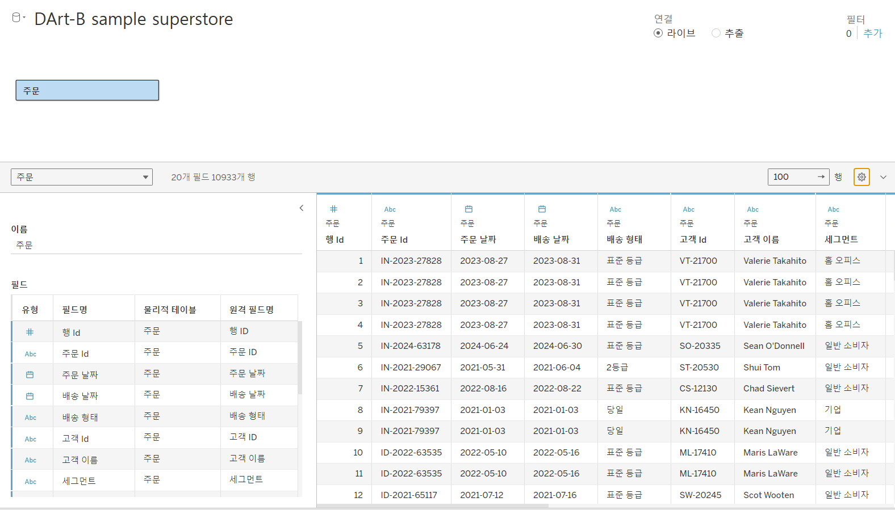
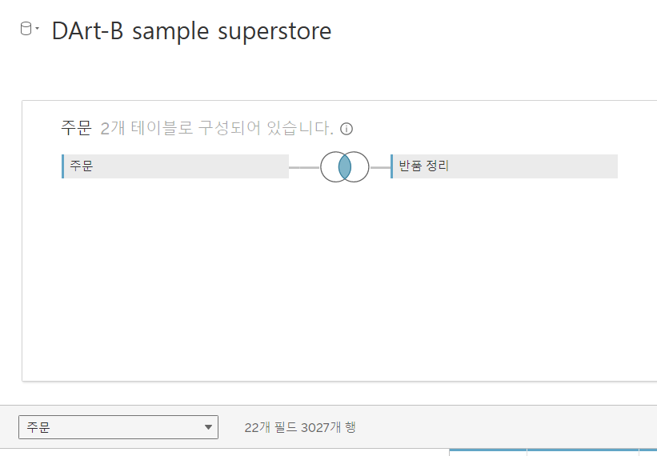

# First Study Week

- 1강: [태블로설치](#1강-태블로설치)

- 2강: [데이터연결](#2강-데이터연결)

- 3강: [데이터연결과 데이터유형](#3강-데이터연결과-데이터유형)

- 4강: [데이터결합과 관계](#4강-데이터결합과-관계)

- 5강 : [데이터결합과 조인](#5-데이터결합과-조인)

- 6강: [데이터결합 혼합](#6강-데이터결합-혼합)

- 7강: [데이터결합과 유니온](#7강-데이터-결합과-유니온)

- 8강: [라이브 및 추출](#8강-라이브-및-추출)

- 9강: [데이터형식](#9강-데이터형식)

- 문제1 : [문제1](#문제-1)

- 문제2 : [문제2](#문제-2)

- 참고자료 : [참고자료](#참고-자료)


## Study Schedule

| 강의 범위     | 강의 이수 여부 | 링크                                                                                                        |
|--------------|---------|-----------------------------------------------------------------------------------------------------------|
| 1~9강        |  ✅      | [링크](https://youtu.be/3ovkUe-TP1w?si=CRjj99Qm300unSWt)       |
| 10~19강      | 🍽️      | [링크](https://www.youtube.com/watch?v=AXkaUrJs-Ko&list=PL87tgIIryGsa5vdz6MsaOEF8PK-YqK3fz&index=75)       |
| 20~29강      | 🍽️      | [링크](https://www.youtube.com/watch?v=AXkaUrJs-Ko&list=PL87tgIIryGsa5vdz6MsaOEF8PK-YqK3fz&index=65)       |
| 30~39강      | 🍽️      | [링크](https://www.youtube.com/watch?v=e6J0Ljd6h44&list=PL87tgIIryGsa5vdz6MsaOEF8PK-YqK3fz&index=55)       |
| 40~49강      | 🍽️      | [링크](https://www.youtube.com/watch?v=AXkaUrJs-Ko&list=PL87tgIIryGsa5vdz6MsaOEF8PK-YqK3fz&index=45)       |
| 50~59강      | 🍽️      | [링크](https://www.youtube.com/watch?v=AXkaUrJs-Ko&list=PL87tgIIryGsa5vdz6MsaOEF8PK-YqK3fz&index=35)       |
| 60~69강      | 🍽️      | [링크](https://www.youtube.com/watch?v=AXkaUrJs-Ko&list=PL87tgIIryGsa5vdz6MsaOEF8PK-YqK3fz&index=25)       |
| 70~79강      | 🍽️      | [링크](https://www.youtube.com/watch?v=AXkaUrJs-Ko&list=PL87tgIIryGsa5vdz6MsaOEF8PK-YqK3fz&index=15)       |
| 80~89강      | 🍽️      | [링크](https://www.youtube.com/watch?v=AXkaUrJs-Ko&list=PL87tgIIryGsa5vdz6MsaOEF8PK-YqK3fz&index=5)        |


<!-- 여기까진 그대로 둬 주세요-->


## 1강. 태블로설치


<!-- 태블로 Desktop은 유료 혹은 사용자 인증이 되어야 하므로, 사용 경험이 없으시다면 우선 Tableau Public으로 학습하는 것을 권장드립니다. -->


## 2강. 태블로연결


> **🧞‍♀️ 데이터 해석기는 어떤 경우 사용하나요?**

```
데이터 해석기를 지원하는 커넥터에서 병합된 셀, 메모, 바닥글, 빈 셀 등을 감지하고 이를 무시하여 데이터 집합의 실제 필드와 값을 식별할 수 있게 하는 기능
데이터 관리시 태블로가 읽기 쉽도록 해야하나 그렇지 않은 경우 활용 가능
```


> **🧞‍♀️ 깃허브 assignment 폴더의 DArt-B Sample Store.xls 파일을 다운받고 시트 중 '주문' 시트를 불러와주세요.**


<!-- 캡쳐 파일을 첨부해주세요! 캡쳐하는 법은 깃허브 강의 영상에 있습니다 (폴더 생성 후 폴더 안에 이미지 넣기 + 불러오기) -->



<!-- 문제와 문제 풀이가 모두 위 DArt-B Sample Store.xls 파일을 기반으로 제시되므로, 해당 엑셀파일을 사용하셔야 혼동이 없습니다. -->


## 3강. 데이터연결과 데이터 유형


> **🧞‍♀️ 라이브와 추출의 차이가 무엇인가요? 어떤 경우 사용하나요?**


```
라이브: 태블로가 직접 연결하는 형태, 원본에 변화가 생기면 작업한 내용에 바로 영향을 미침, 양이 많아지면 처리속도 및 성능 저하 위험

추출: 데이터 원본의 상태를 hyper형태로 저장, 이 추출된 파일로 작업, 크거나 복잡한 데이터 집합에 대한 빠른 데이터 수집 및 분석 쿼리 처리를 위해 설계, 원본이 변경된 경우 새로고침을 통해 최신화 가능, 오프라인에서도 작업 가능

사용하고자 하는 데이터 원본의 저장위치 및 데이터 크기, 온오프라인과 같은 환경 고려하여 라이브/추출 선택해야함
```


## 4강. 데이터결합과 관계

<!-- 데이터 결합과 관계에 대해 알게 된 점을 자유로이 적어보세요.-->

> **🧞‍♀️ 어떤 경우에 관계를, 어떤 경우에 조인을 사용하나요?**

```
관계와 조인 모두 데이터 간의 결합이라는 점에서는 동일하다. 그러나 관계로 결합된 데이터가 동적이고 유연하다. 이는 관계로 결합할 시에 원본 데이터를 더 독립적으로 활용할 수 있다는 의미이다. 또한 조인에 발생할 수 있는 데이터 중복 및 필터링 문제를 방지하고 유연하게 데이터를 결합할 수 있게 한다. 태블로에서는 관계로 결합하는 것을 권장한다.
```


## 5강. 데이터결합과 조인

<!-- 데이터 결합과 조인에 대해 알게 된 점을 적고, 아래 질문에 답해보세요 :) -->
```
태블로에서는 관계를 이용한 결합을 권장하나 제어 혹은 의도적인 필터링, 복제를 위해 조인을 사용할 수 있다. 조인은 inner조인, left조인, right조인, outer조인이 있다. inner는 두 테이블 모두의 일치하는 항목만 포함한다. left, right는 한쪽 테이블의 모든 값과 다른 테이블의 일치 항목을 포함한다. outer는 두 테이블의 모든 값을 포함한다. 
```

주문 중 '반품된' 주문만을 가지고 분석을 진행하려고 합니다.

> **🧞‍♀️ 해당 목적 달성을 위해서 Sample store 데이터셋의 어떤 시트를 조인(혹은 릴레이션)해야 할까요? 조인키는 무엇인지, (inner, outer, left, right) 조인 유형은 무엇일지 논의해주세요.**


데이터를 조인한 데이터 원본 창의 캡쳐를 첨부해주세요.
몇 개의 주문이 반품되었다고 표시되나요?

```
주문이 들어갔으면서 동시에 반품된 제품만을 대상으로 하기에 조인의 inner유형을 사용해야 한다. 반품된 주문은 3027개임을 알 수 있다.
```



<!-- 캡쳐 이미지를 첨부해주세요 -->

## 6강. 데이터결합 혼합

<!-- 데이터결합 및 혼합에 대해 알게 된 점을 적어주세요 -->
```
결합은 서로 다른 테이블의 상관관계를 파악하기 위해 사용
혼합은 실제로 결합하지는 않고 원본을 독립적으로 결과를 집계한 후, 한 시트에서 시각화하기 위해 사용
```

## 7강. 데이터 결합과 유니온

<!-- 유니온에 대해 알게 된 점을 적어주세요 -->
```
유니온은 한 테이블의 행을 다른 테이블에 추가하여 데이터를 결합하는 방법
새 유니온을 통해 결합 가능 혹은 두 테이블을 붙여서 결합
```
> **🧞‍♀️ 유니온을 사용하기 위한 전제 조건은 무엇인가요?**

```
유니온을 하기 위해서는 데이터의 테이블 구조가 동일해야 함. 테이블의 필드 수, 관련 필드의 필드 이름, 데이터 유형이 같아야함
```

## 8강. 라이브와 추출

<!-- 라이브와 추출에 대해 알게 된 점을 적어주세요 -->
```
실제로 태블로를 사용하게 되면 desktop뿐만 아니라 서버에 올리고 작업을 함.
```

> **🧞‍♀️ 라이브와 추출 방법의 차이가 무엇인가요? 어떤 경우에 추출을 사용하면 좋을까요?**
```
라이브와 추출의 차이점은 데이터의 실시간 업데이트. 라이브 연결은 데이터 원본의 변경사항이 실시간으로 업데이트. 반면 추출은 매번 추출을 해줘야함.
라이브는 데이터베이스에서 모든 과정이 처리되기에 데이터베이스의 성능에 따라 속도가 달라짐. 추출은 태블로 서버로 복사되기에 시각화에 영향을 주지 않음. 그렇기에 보다 복잡한 시각화에 장점이 있음.
```


**참고자료 : 온프레미스 데이터란?**

기업이나 조직이 자체적으로 보유한 물리적 서버나 데이터 센터 내에서 직접 관리하는 데이터로, 조직 내의 하나 이상 서버에서 통제됩니다. 본 서버들은 기업의 데이터센터나 물리적 위치에 설치되어 있으며, 네트워크를 통해 해당 데이터에 접근하고 관리할 수 있습니다.


## 9강. 데이터형식

<!-- 데이터형식에 대해 알게 된 점을 적어주세요 -->
```
각 필드에는 특정한 데이터형식이 지정되어있음. 데이터형식에는 문자열, 날짜 등이 있고 각 필드가 어떤 형식인지 열람 가능. 태블로에서는 지리적 역할을 부여한 데이터 형식이 있어서 위도와 경도를 통해 맵을 표현할 수 있음. 데이터 형식을 변경하게 하는 이유는 태블로가 데이터 형식을 잘못 인식할 때가 있기 때문
```

## 문제 1.

용웅이는 아래 사진과 같이 2024년 3월부터 7월까지의 지하철 승하차 이용객 데이터를 가지고 있습니다. 월별로 데이터셋이 나누어진 상태며, 용웅이는 해당 데이터셋 5개 모두를 한 번에 시각화하려 합니다. 필드 값(컬럼)의 이름, 데이터 유형, 개수는 모두 같습니다.


 이때, '조인, 관계, 혼합, 유니온' 중 본 목적에 적합한 결합 방법은 무엇인가요? 하나씩 드래그하지 않고, 와일드카드를 이용해 모든 데이터를 빠르게 결합해보세요.

<!-- 텍스트 및 이미지로 문제 풀이 과정을 기술해주세요 -->
```
유니온이 가장 적합하다. 유니온은 데이터의 테이블 구조가 동일할 때 사용할 수 있는 결합 방식이다. 아래의 데이터 셋은 월별로 동일한 테이블을 보여주기에 유니온을 이용할 수 있다.

와일드카드를 사용하면 자동으로 유니온을 생성해준다. 이때 각종 조건들을 걸어 조건을 만족하는 값들만 유니온을 할 수도 있다.
```

## 문제 2.

상원이는 태블로를 사용하여 회사의 매출 데이터를 시각화하려고 합니다. 태블로에서는 데이터를 연결하는 두 가지 방식인 **라이브 연결과 추출 연결**이 있습니다. 두 방식 중 어떤 것을 사용할지 고민 중입니다.

다음의 일상생활 사례를 바탕으로, 어떤 상황에서 라이브 연결이 적합하고, 어떤 상황에서 추출 연결이 더 적합한지 설명하세요.

1. 사례 1: 실시간 주식 시세 확인
주식 거래를 하고 있는 수금의왕 상원이는 주식 시세가 매 순간 변동하는 실시간 데이터를 필요로 합니다. 이 데이터를 기반으로 빠르게 결정을 내려야 합니다.


```
라이브는 추출과 달리 실시간 업데이트가 가능하다. 주식 시세는 매번 업데이트되고, 변화에 대한 신속한 결정이 필요하기에 추출보다는 라이브가 더 적합하다고 할 수 있다.
```


2. 사례 2: 상원이는 저번 주 제주도로 여행을 갔었어요. 비행 중에 예산 계획을 세우려 하는데, 인터넷 연결이 불안정할 것 같아요. 여행 전 미리 예산 데이터를 다운로드해서 오프라인에서도 사용할 수 있으면 좋겠습니다.

```
추출이 더 적합하다고 생각한다. 보다 복잡한 시각화에서 추출이 라이브보다 구조적으로 더 좋은 성능을 보이기 때문이다.
```

## 참고 자료

데이터 분석을 하다보면 지역별로 경향을 알아보고자 할 때가 많습니다.

태블로에서는 시/도, 시군구명을 칼럼으로 가지고 있고, 그걸 지리적 위치로 바꿔주면 지도에서 위치를 인식하는데요.
하지만 읍면동(행정동) 단위까지 인식하지는 못합니다.

그럼 어떻게 읍면동 단위까지 세분화하여 표기할 수 있을까요?

이때 방금 배운 데이터 릴레이션 혹은 조인을 사용합니다.
맵 그래프는 지금 배울 부분은 아니지만, 데이터 병합에 관련된 부분이기에 필요하신 분들을 위해 아래 링크를 걸어두겠습니다.


바로 읍면동의 경계를 가지고 있는 shp, geojson 등 공간파일을 원본데이터와 머지하는 것입니다.

링크: https://subinze.tistory.com/m/2

[def]: ..
[def2]: ./