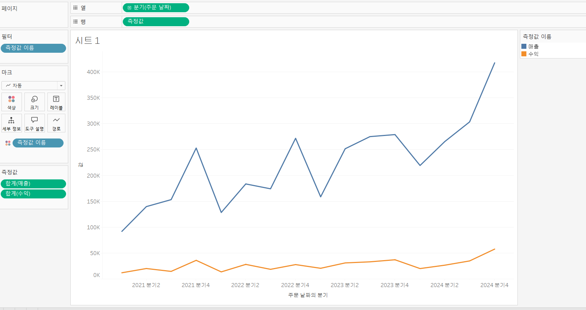

# Third Study Week

- 20강: [파이와 도넛차트](#20강-파이와-도넛차트)

- 21강: [워드와 버블차트](#21강-워드와-버블차트)

- 22강: [이중축과 결합축](#22강-이중축과-결합축)

- 23강: [분산형 차트](#23강-분산형-차트)

- 24강: [히스토그램](#24강-히스토그램)

- 25강: [박스플롯](#25강-박스플롯)

- 26강: [영역차트](#26강-영역차트)

- 27강: [간트차트](#27강-간트차트)

- 28강: [필터](#28강-필터)

- 29강: [그룹](#29강-그룹)


- 문제1 : [문제1](#문제1)

- 문제2 : [문제2](#문제2)

- 참고자료 : [참고자료](#참고-자료)


## Study Schedule

| 강의 범위     | 강의 이수 여부 | 링크                                                                                                        |
|--------------|---------|-----------------------------------------------------------------------------------------------------------|
| 1~9강        |  ✅      | [링크](https://youtu.be/3ovkUe-TP1w?si=CRjj99Qm300unSWt)       |
| 10~19강      | ✅      | [링크](https://www.youtube.com/watch?v=AXkaUrJs-Ko&list=PL87tgIIryGsa5vdz6MsaOEF8PK-YqK3fz&index=75)       |
| 20~29강      | ✅      | [링크](https://www.youtube.com/watch?v=Qcl4l6p-gHM)      |
| 30~39강      | 🍽️      | [링크](https://www.youtube.com/watch?v=e6J0Ljd6h44&list=PL87tgIIryGsa5vdz6MsaOEF8PK-YqK3fz&index=55)       |
| 40~49강      | 🍽️      | [링크](https://www.youtube.com/watch?v=AXkaUrJs-Ko&list=PL87tgIIryGsa5vdz6MsaOEF8PK-YqK3fz&index=45)       |
| 50~59강      | 🍽️      | [링크](https://www.youtube.com/watch?v=AXkaUrJs-Ko&list=PL87tgIIryGsa5vdz6MsaOEF8PK-YqK3fz&index=35)       |
| 60~69강      | 🍽️      | [링크](https://www.youtube.com/watch?v=AXkaUrJs-Ko&list=PL87tgIIryGsa5vdz6MsaOEF8PK-YqK3fz&index=25)       |
| 70~79강      | 🍽️      | [링크](https://www.youtube.com/watch?v=AXkaUrJs-Ko&list=PL87tgIIryGsa5vdz6MsaOEF8PK-YqK3fz&index=15)       |
| 80~89강      | 🍽️      | [링크](https://www.youtube.com/watch?v=AXkaUrJs-Ko&list=PL87tgIIryGsa5vdz6MsaOEF8PK-YqK3fz&index=5)        |


<!-- 여기까진 그대로 둬 주세요-->
<!-- 이 안에 들어오는 텍스트는 주석입니다. -->

# Third Study Week

## 20강: 파이와 도넛차트
<!-- 파이와 도넛차트에 관해 배우게 된 점을 적어주세요 -->
```
파이차트는 값들 간의 구성비율을 살펴볼때 유용함. 매출의 레이블을 통해 매출비율 시각화
```

> **🧞‍♀️ 도넛차트를 생성하는 법을 기록해주세요.**
```
도넛차트 만드는법
행열란에 더블 클릭후 0 입력 -> 임의의 축 생성 -> 컨트롤 드래그(복사) -> 두개의 원 생성 -> 하나의 원으로 다른 정보 시각화 가능 -> 크기조정 후 이중축 적용 -> 축 제거, 테두리 색상 변경 등 마무리 작업
```


## 21강: 워드와 버블차트
<!-- 워드와 버블차트에 관해 배우게 된 점을 적어주세요 -->
```
버블차트는 수치적데이터를 원의 크기로 표현하는 차트
국가/지역, 매출을 가져와 버블차트 표시
```

```
워드 클라우드는 문서 내에서 등장하는 키워드가 얼마나 자주 등장하는지를 텍스트 크기로 표현하여 직관적으로 시각화할 수 있는 차트

국가/지역 우클릭으로 크기에 드래그 -> 카운트(국가/지역) -> 국가/지역 하나 더 레이블로 드래그 -> 마크 텍스트로 변경 -> 매출 색상으로 끌기
```


## 22강: 이중축과 결합축
<!-- 이중축과 결합축에 관해 배우게 된 점을 적어주세요 -->
```
이중축은 하나의 뷰어안에서 축을 이중으로 사용하는 차트

두 필드 중 뒤에 것에 이중축 설정

두 선그래프에서 이중축을 설정하면 두 그래프가 겹쳐서 표현 (필드별로 각각의 세로축을 사용)

마크창에서 독립적으로 수정 가능
```

```
결합된 축
하나의 세로축을 이용하여 두 그래프를 나타냄. 사용할 값을 기존의 왼쪽 세로축에 끌어서 표현
```


## 23강: 분산형 차트
<!-- 분산형 차트에 관해 배우게 된 점을 적어주세요 -->
```
분산형 차트는 파라미터 간의 상관관계를 파악하는데 유용

분산차트=산점도?

분석의 추세선 이용하여 범주별 추세선 삽입 가능
-> 모든 추세선 편집을 통해 범주 해제, 전체 추세선 나타낼 수 있음

전체, 범주별 추체선 모두 삽입 -> 이중축 사용
열 필드 컨트롤,드래그 -> 하나의 그래프에 추체선에 범주 클릭 -> 이중축 선택 -> 머리글 표시 해제

우측 상단의 범주를 이용해 보고싶은 추세선 하이라이트 가능
```


## 24강: 히스토그램
<!-- 히스토그램에 관해 배우게 된 점을 적어주세요 -->
```
히스토그램은 연속형 측정값을 범위 혹은 구간차원으로 그룹화, 차원필드 없이 측정값만으로 그래프를 그릴때 주로 사용

필드 우클릭 -> 만들기 -> 구간차원 -> 열로 드래그 -> 연속형 변환 -> 동일 필드 행으로 그래그 -> 합계에서 카운트로 변경 (중복값 제외-> 카운트(고유))

구간 차원 생성하지 않고 만들기
필드 열로 드래그 -> 표현방식 히스토그램
필드 편집을 통해 구간차원 편집
범주를 색상으로 드래그해서 범주별 비중 표현
극단적인 모양일 경우 축 우클릭 축편집 -> 로그 -> 양수/대칭 선택

히스토그램 vs 막대그래프
히스토그램: 연속형 측정값을 통해 수치 데이터의 빈도를 표시하는 양적 데이터, 막대와 막대가 붙어 있음

막대그래프: 불연속형 데이터들을 비교하는데 사용 막대와 막대 사이의 공백 존재
```


## 25강: 박스플롯
<!-- 박스플롯에 관해 배우게 된 점을 적어주세요 -->
```
박스플롯은 데이터 분포를 파악하는데 사용, 5개의 구간을 통해 분포와 이상치를 한눈에 볼 수 있음

IQR=Q3-Q1
울타리 범위 : Q1-IQR*1.5 ~ Q3+IQR*1.5
그 밖 : 이상치, 아웃라이어

표현방식을 통해 박스플롯 생성, 세부정보 이용(이용하지 않으면 자동으로 합계치가 적용되어 정상적인 박스플롯 사용 불가)
```

## 26강: 영역차트
<!-- 영역차트에 관해 배우게 된 점을 적어주세요 -->
```
영역차트는 차인과 축사이에 공간이 색상으로 채워진 라인차트, 연속형 데이터의 누계를 표현하는데 사용

표현방식에 영역 차트 연속형으로 사용
우측상단 범주로 순서 변경 가능

구성비율 표시
필드 세부 내용으로 드래그 -> 우클릭 퀵테이블 계산 -> 구성비율 -> 우클릭 다음을 사용하여 계산 -> 테이블 아래로
```

## 27강: 간트차트
<!-- 간트차트에 관해 배우게 된 점을 적어주세요 -->
```
간트차트는 시간 경과에 따른 기간을 시각화하는데 사용

계산 필드 만들기
분석 -> 계산된 필드 만들기 -> 이름설정 -> ex) datediff('day',[주문 날짜],[배송 날짜])

계산 필드 크기로 드래그 -> 측정값 평균 -> 간트차트 설정 -> 행의 범주 필드 플러스로 하위 범주 생성

필서사용 -> 개인별로 필터링
```


## 28강: 필터
<!-- 필터에 관해 배우게 된 점을 적어주세요 -->
```
필터링은 뷰, 쿼리 속도, 데이터 용량 측면에서 성능 차이에 유의미한 영향을 미침

필터를 실행하는 순서
추출 -> 데이터 원본 -> 컨텍스트 -> 차원 -> 측정값 -> 필터

추출 필터
데이터 원본의 연결 추출로 전환, 편집 생성 -> 이곳에서 추출 필터 추가 -> 추출된 데이터만 따로 로컬저장

데이터 원본 필터
데이터 원본의 필터에 추가를 이용해서 필터링

컨텍스트 필터
여러가지 필터를 설정했을 때 컨텍스트 필터로 지정해주면 다른 필터가 컨텍스트 필터에 종속되어 작동
->  시트에 필터로 드래그
    여러 필터 중 더 상위 필터를 지정, 기술 범주중 매출 상위 10개 vs 매출 상위 10개 중 기술 범주는 차이가 있음

차원 필터
->  시트에 필터로 드래그
    수작업으로 제외 혹은 조건 설정, 와일드카드 등 상황에 따라 사용
```
## 29강: 그룹
<!-- 그룹에 관해 배우게 된 점을 적어주세요 -->
```
데이터를 표시하는 방법: 그룹, 계층, 집합
그룹을 이용해 수동으로 필드에 있는 항목들을 묶을 수 있고 사용자 지정 필드를 만들 수 있음

열이 너무 많을때 그룹화 (특정 규칙으로)
1. 묶을 것들 끼리 드래그 -> 우클릭 그룹
2. 항목별로 묶을 필드를 선택, 필드 우클릭 -> 그룹만들기 -> 시프트누른채 선택해서 그룹설정 -> 그룹화 한 필드 마크 색상으로 드래그 -> 그룹화된 필드로 열 교체
만약 기타가 너무 크면 열 우클릭 -> 필터 편집 -> 기타 해제
```

## 문제 1.

```js
유정이는 superstore 데이터셋에서 '주문' 테이블을 보고 있습니다.
1) 국가/지역 - 시/도- 도시 의 계층을 생성했습니다. 계층 이름은 '위치'로 설정하겠습니다.
2) 날짜의 데이터 타입을 '날짜'로 바꾸었습니다.

코로나 시기의 도시별 매출 top10을 확인하고자
1) 배송 날짜가 코로나시기인 2021년, 2022년에 해당하는 데이터를 필터링했고
2) 위치 계층을 행으로 설정해 펼쳐두었습니다.
이때, 매출의 합계가 TOP 10인 도시들만을 보았습니다.
```


```
겉보기에는 전체 10개로, 잘 나온 결과처럼 보입니다. 그러나 유정이는 치명적인 실수를 저질렀습니다.
오늘 배운 '컨텍스트 필터'의 내용을 고려하여 올바른 풀이 및 결과를 구해주세요.
```

<!-- DArt-B superstore가 아닌 개인 superstore 파일을 사용했다면 값이 다르게 표시될 수 있습니다.-->

## 문제 2.

```js
태영이는 관심이 있는 제품사들이 있습니다. '제품 이름' 필드에서 '삼성'으로 시작하는 제품들을 'Samsung group'으로, 'Apple'으로 시작하는 제품들을 'Apple group'으로, 'Canon'으로 시작하는 제품들을 'Canon group'으로, 'HP'로 시작하는 제품들을 'HP group', 'Logitech'으로 시작하는 제품들을 'Logitech group'으로 그룹화해서 보려고 합니다. 나머지는 기타로 설정해주세요. 이 그룹화를 명명하는 필드는 'Product Name Group'으로 설정해주세요.

(이때, 드래그보다는 멤버 찾기 > 시작 문자 설정하여 모두 찾아 한번에 그룹화해 확인해보세요.)
```


```js
해당 그룹별로 어떤 국가/지역이 주문을 많이 차지하는지를 보고자 합니다. 매출액보다는 주문량을 보고 싶으므로, 주문Id의 카운트로 계산하겠습니다.

기타를 제외하고 지정한 5개의 그룹 하위 목들만을 이용해 아래와 같이 지역별 누적 막대그래프를 그려봐주세요.
```

