# Fourth Study Week

- 30강: [계층](#30-계층)

- 31강: [집합](#31-집합)

- 32강: [결합집합](#32-결합집합)

- 33강: [계산된 필드](#33-계산된-필드)

- 34강: [행수준계산](#34-행수준계산)

- 35강: [집계계산](#35-집계계산)

- 36강: [테이블계산](#36-테이블계산)

- 37강: [퀵테이블계산(1)](#37-퀵테이블계산1)

- 38강: [퀵테이블계산(2)](#38-퀵테이블계산2)

- [문제1](#문제-1)

- [문제2](#문제-2)

- [문제3](#문제-3)

## Study Schedule

| 강의 범위     | 강의 이수 여부 | 링크                                                                                                        |
|--------------|---------|-----------------------------------------------------------------------------------------------------------|
| 1~9강        |  ✅      | [링크](https://www.youtube.com/watch?v=AXkaUrJs-Ko&list=PL87tgIIryGsa5vdz6MsaOEF8PK-YqK3fz&index=84)       |
| 10~19강      | ✅      | [링크](https://www.youtube.com/watch?v=AXkaUrJs-Ko&list=PL87tgIIryGsa5vdz6MsaOEF8PK-YqK3fz&index=75)       |
| 20~29강      | ✅      | [링크](https://www.youtube.com/watch?v=AXkaUrJs-Ko&list=PL87tgIIryGsa5vdz6MsaOEF8PK-YqK3fz&index=65)       |
| 30~38강      | ✅      | [링크](https://youtu.be/e6J0Ljd6h44?si=nhGbB7GsdOCqj15f)       |
| 39~49강      | 🍽️      | [링크](https://www.youtube.com/watch?v=AXkaUrJs-Ko&list=PL87tgIIryGsa5vdz6MsaOEF8PK-YqK3fz&index=45)       |
| 50~59강      | 🍽️      | [링크](https://www.youtube.com/watch?v=AXkaUrJs-Ko&list=PL87tgIIryGsa5vdz6MsaOEF8PK-YqK3fz&index=35)       |
| 60~69강      | 🍽️      | [링크](https://www.youtube.com/watch?v=AXkaUrJs-Ko&list=PL87tgIIryGsa5vdz6MsaOEF8PK-YqK3fz&index=25)       |
| 70~79강      | 🍽️      | [링크](https://www.youtube.com/watch?v=AXkaUrJs-Ko&list=PL87tgIIryGsa5vdz6MsaOEF8PK-YqK3fz&index=15)       |
| 80~89강      | 🍽️      | [링크](https://www.youtube.com/watch?v=AXkaUrJs-Ko&list=PL87tgIIryGsa5vdz6MsaOEF8PK-YqK3fz&index=5)        |

<!-- 여기까진 그대로 둬 주세요-->

> **🧞‍♀️ 오늘의 스터디는 지니와 함께합니다.**


## 30. 계층

<!-- 계층 구조와 관련된 개념, 사용 방법 등을 적어주세요. -->
```
 계층은 뷰에서 데이터를 drill down해 값을 세부적으로 찾을때 유용
계층을 만들고자하는 필드 둘을 동시 우클릭 -> 계층, 계층 만들기 -> 나머지 필드들 끌어오기

계층을 설정하면 드릴다운 (왼쪽 아이콘)을 통해 간단하게 관련값을 세부적으로 찾음
```
## 31. 집합

<!-- 집합의 정의 및 활용 방법에 대해 알게 된 점을 적어주세요. -->
```
집합은 사용자가 직접 조건을 설정하고 그 조건을 기반으로 데이터를 구분하는 방법

필드 우클릭 -> 만들기, 집합
집합 만들기 중
일반 : 그룹과 비슷, 수동으로 데이터 선택
조건 : 사용자가 설정한 조건에 충족하면 데이터 묶음
상위 : 필드 기준으로 상위 혹은 하위 데이터 묶음
```
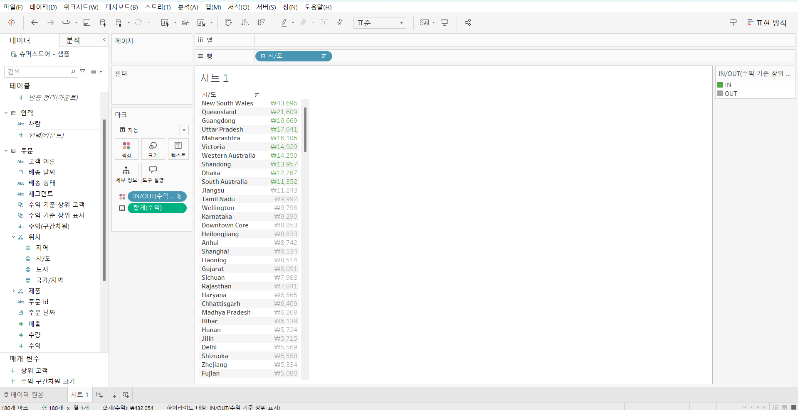
## 32. 결합집합

<!-- 결합집합의 개념 및 사용 사례를 적어주세요. -->
```
결합집합은 집합에 두가지 조건을 적용하고 싶을때 사용가능하다.
ex) 매출이 5만원 이상이거나 수익률이 10%이상인 도시

앞에서 배운 방식으로 똑같이 두 집합 생성 -> 집합 우클릭 -> 결합된 집합 만들기 -> 두 집합 선택 -> 결합 방식 선택

결합 방식 4가지 구분 필수
A 교집합 B
A - B
B - A
A 합집합 B

결합된 집합을 통해 여러 조건을 지정하여 데이터들을 구분할 수 있음
```

## 33. 계산된 필드

<!-- 계산된 필드를 사용하는 방법과 예시를 적어주세요. -->
```
계산된 필드는 데이터 원본에 있는 필드를 활용하여 새로운 필드를 만드는 기능
기존데이터 이외에 계산된 데이터가 추가로 필요할 때 사용

계산된 필드 만드는법
1. 데이터 패널을 통해 생성
2. 분석 탭을 활용해 생성
3. 사용하고자 하는 필드에 우클릭

ex) 제품별로 어느정도 수익을 냈는지 백분율로 나타냄

```
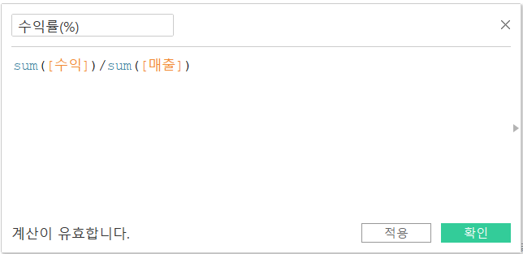
```
계산된 필드 우클릭 -> 기본속성 -> 숫자형식 -> 표현형식 선택
```
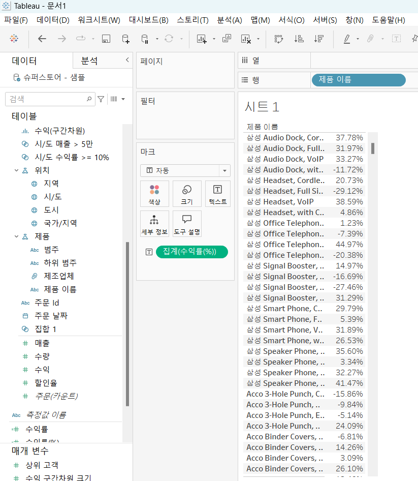
## 34. 행수준계산

<!-- 행수준 계산의 의미와 적용 방법을 적어주세요. -->
```
계산된 필드는 크게 3가지로 나눔
1. 기본계산
2. 테이블계산
3. LOD표현식

1. 기본계산 : 데이터 원본에 대한 행 수준 계산 또는 집계 계산
행수준 계산 vs 집계수준 계산

ex) 고객 성 이름 분리?
```
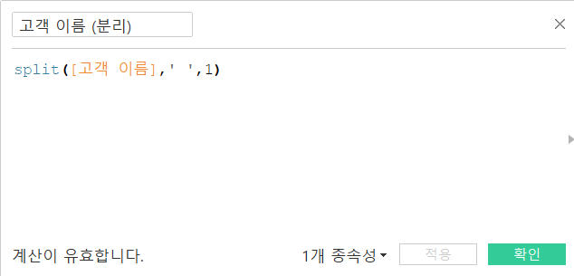
```
성을 빼낼라면 1대신 2입력 (이름이 먼저, 성이 다음이기 때문)
```
```
ex) 수익성 판단 유무
```
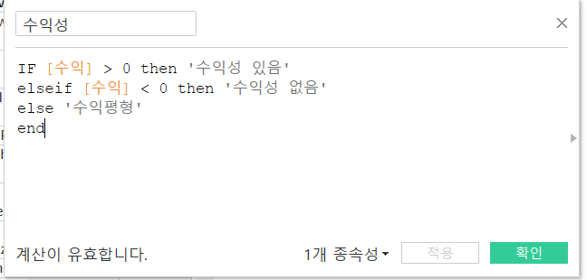
```
ex) 두 날짜 사이의 일수를 찾기
```
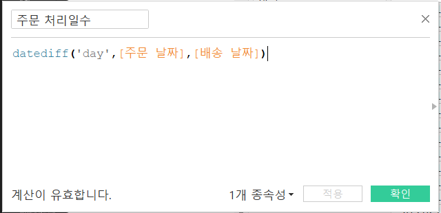
```
배송일자 주문일자 모두 년월일로 변경
필드 차원값으로 변경
->어떤 주문 ID들이 여러 제품 레코드를 가지고 있어서 전부 일수를 합계하기에 이를 방지하는 차원 (차원값 측정값에 대한 추가 공부 필요할듯)
```
## 35. 집계계산

<!-- 집계계산의 정의 및 활용 사례에 대해 알게 된 점을 적어주세요. -->
```
집계계산 : 현재 뷰에서 보이는 기준으로 계산하는 방식
태블로는 행에 드래그하면 자동으로 SUM함수로 보여줌
그러나 변경가능
필드 우클릭 -> 기본속성 -> 집계 -> 원하는 걸로 변경
혹은
계산된 필드 시 계산된 필드 창에서 드롭다운을 통해 사용할 집계함수 사용가능

이 둘은 계산 수단 옵션 유무에 차이가 있음
```
## 36. 테이블계산

<!-- 테이블 계산의 개념 및 사용 방법을 적어주세요. -->
```
테이블 계산은 뷰에 보이는 내용을 바탕으로 계산
계산된 필드 만들기 -> 드롭다운메뉴에 테이블 계산 선택
월마다 연도따라 누적 매출 계산?
```
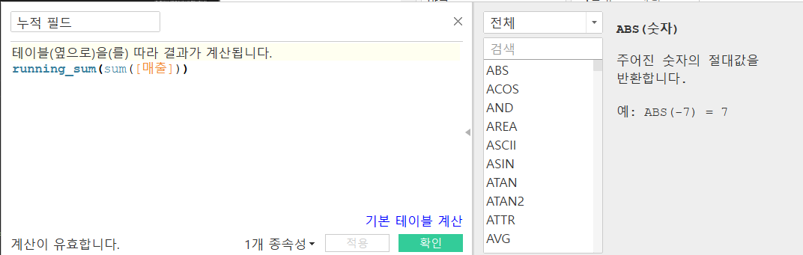
```
계산 방향 항상 유의 (옆으로, 아래로 등)
```
## 37. 퀵테이블계산(1)

<!-- 퀵테이블 계산의 원리 및 예제에 대해 알게 된 점을 적어주세요. -->
```
테이블계산에서 자주 쓰이는 유형들만을 퀵으로 가능하게 만든 것
필드 우클릭 -> 퀵테이블 계산

누계 : 집계한 값을 누적한 값으로 한번 더 집계
-> 매출을 누적한 값으로 보여주는 등으로 사용 가능

차이 : 측정값과 기준값의 차이를 구함
-> 여러 기준값 적용 가능

비율 차이 : 측정값들 사이의 성장률 또는 %차이 표현

구성비율 : 전체에서 각 항목들의 비중을 확인할 때 활용

매출필드에 다음을 사용해서 계산이 안뜨는데 버전차이인가?
```
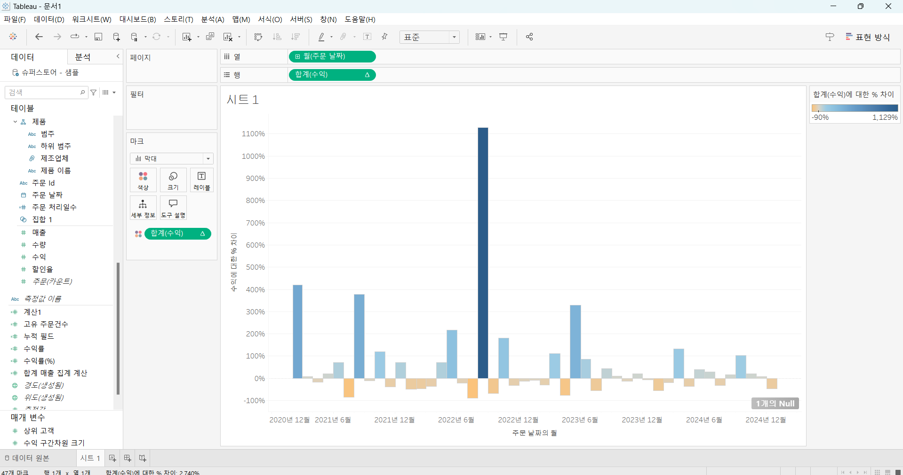
## 38. 퀵테이블계산(2)

<!-- 이동평균, YTD 총계, 전년 대비 성장률, YTD 성장률 등 본 강의에서 알게 된 점을 적어주세요. -->
```
이동평균 : 이전의 값부터 현재까지 값에 대한 평균을 낼때 사용
```
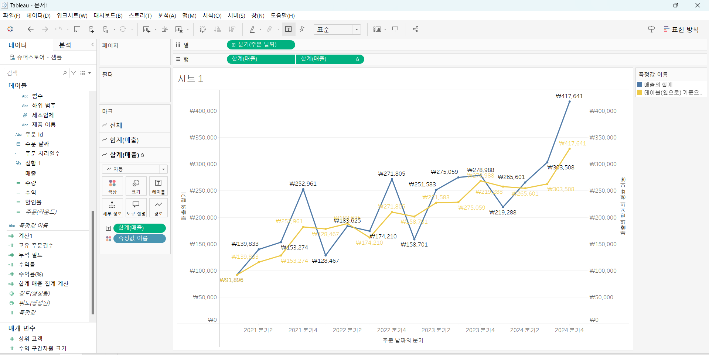
```
YTD : 특점 시점을 기준으로 해당 연도붜 그 시점까지의 총계
분기 혹은 월이 있어야 사용가능
```
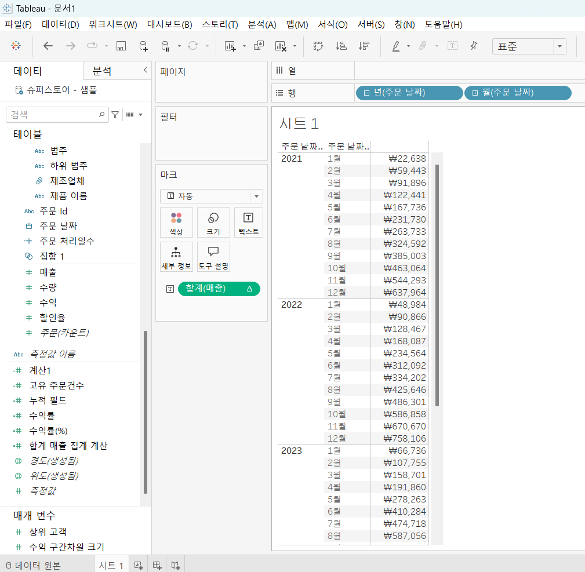
```
통합 성장률 : 통합한 성장률 앞의 기간에 비교하여 얼마나 성장했는지?
전년 대비 성장률 : 전년의 동월과 비교
```
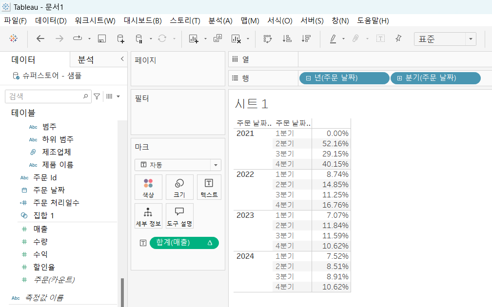
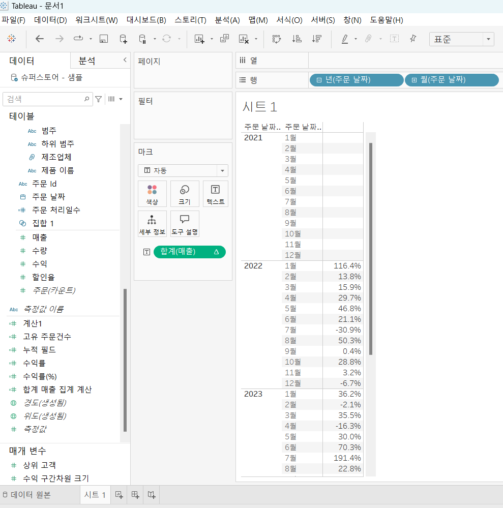
```
YTD 성장률? 먼가 아직 이해 X
아마 전년 동월 대비 얼마나 성장했는지를 비율로 표현한 것?
누적과 전년 비교가 동시에 들어가 헷갈리는 것 같음
24년 YTD 성장률 :
24년 5월까지 누적치와 23년 5월까지의 누적치를 비교하여 증감비율을 구함
```
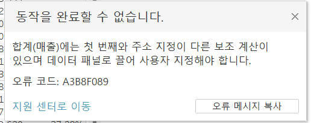
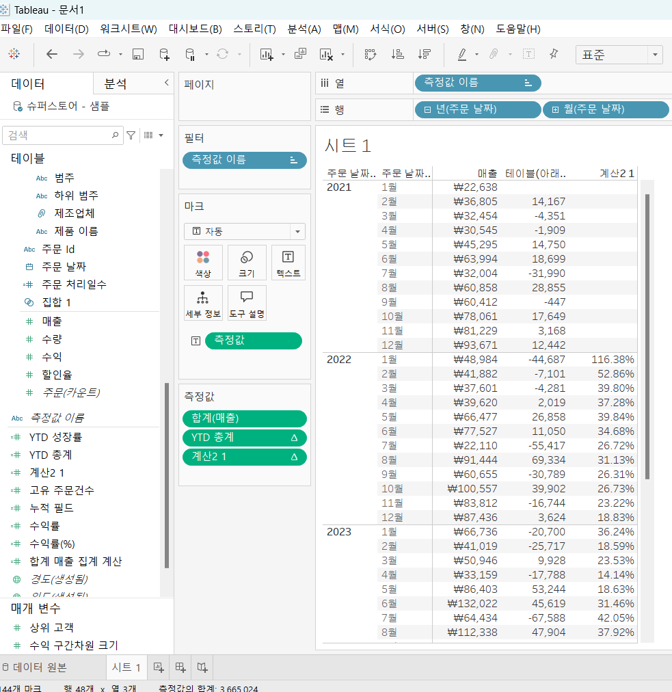
## 문제 1.

규석이는 이제껏 매출을 올리는 데에 힘썼었지만, 왠지 모르게 주머니에 들어오는 돈이 없어 속상합니다. 

그래서 매출이 상위 20곳에 속하지만, 수익률(%)이 마이너스인 시/도를 확인하려고 합니다.

> 수익률은 SUM([수익]) / SUM([매출])로 정의합니다.

어떤 집합을 만들었고, 어떤 결합을 하였는지를 중심으로 기술하고, 결과 자료를 첨부해주세요. 

(텍스트 표 형태이며, 색상으로 위 집합을 구분할 수 있게 만들어주세요.)

<!-- 아래 예시 이미지를 삭제하고, 직접 만든 시트 사진을 올려주세요. 시트의 이름은 본인 이름으로 기입해주세요-->


```
우선 그림처럼 열/행을 구성하고, 매출과 수익을 측정값으로 두었다.
이후 계산된 필드를 이용해 수익률을 나타내는 필드를 만들어야 한다.
앞서 설명한 것 처럼 sum([수익])/sum([매출])이 수익률이기에 이를 이용하여 계산된 필드를 만든다.
처음 만들었을 때는 자동으로 반올림되어 의미있는 값을 보여주지 못하였는데 필드 계산 식에 100을 곱하여 백분율로 나타내었다.

이후 집합을 만들었다 시/도 우클릭, 만들기에 집합에 들어간다
첫번째는 상위를 이용하여 매출(합계) 상위 20을 설정한다.
그 이후 조건을 통해 수익률이 0보다 작은 값을 설정한다.
이렇게 두 집합을 만든 후 하나를 클릭, 결합된 집합을 만든다.
이 경우 두 조건의 교집합으로 설정해야 한다.
이렇게 만든 결합 집합을 마크의 색상으로 가져간다.
마지막으로 in과 out에 적절한 색상을 입힌다.
```
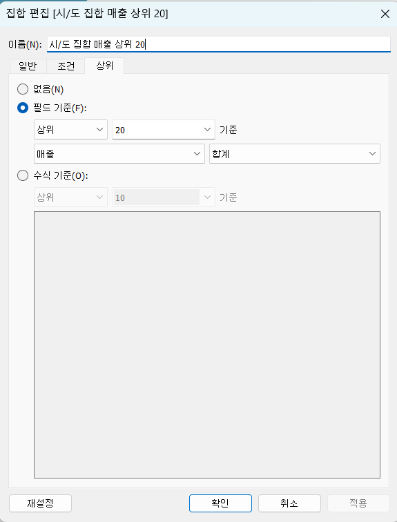
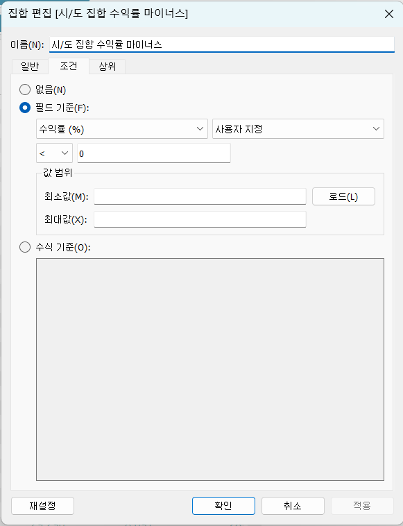
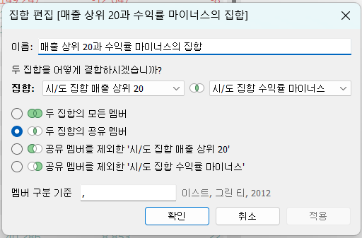
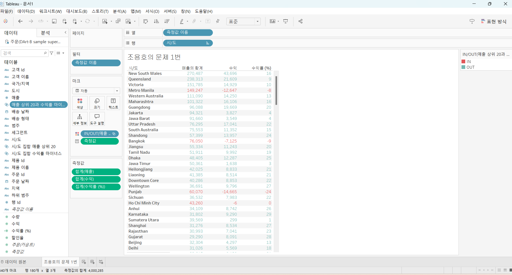


## 문제 2.
선희는 주문 Id별로 주문에서 배송까지에 걸리는 날짜 일수가 궁금했습니다. 
그래서 주문 ID별로 주문에서 배송까지 걸리는 일자를 '배송까지 걸린 일수'라는 계산된 필드로 만들고, 이를 마크에 올린 후 확인해보았습니다. 
이때, 계산된 필드의 식은 'DATEDIFF' 함수를 이용하였습니다.

배송까지 걸린 일수 계산을 위한 DATEDIFF 함수 수식을 적어주세요.

```
datediff('day',[주문 날짜],[배송 날짜])
```
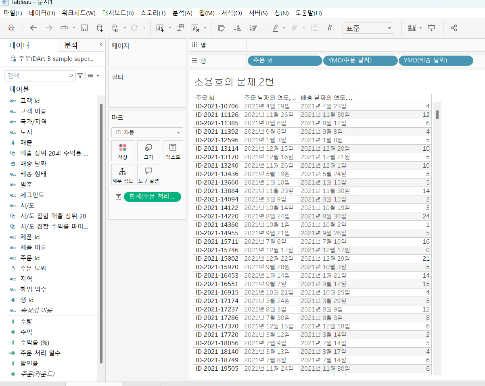
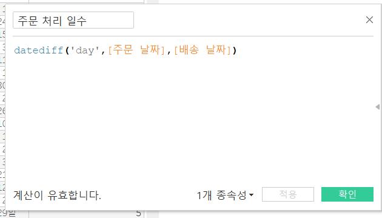


그런데 위 그림처럼 '주문 날짜'와 '배송 날짜'를 함께 행에 올려 확인해보니, 주문날짜와 배송날짜의 차이가 '배송까지 걸린 일수'와 다릅니다.

ID-2021-11126을 보니, 11월 26일 배송에 11월 30일 배송이면 4일 차이인데, 12일이 걸렸다고 하네요. 왜 이런 문제가 생긴걸까요?

```
어떤 주문 ID들이 여러 개의 제품 레코드를 가지고 있어서 이런 현상이 발생한다.
```

그리고 이를 해결하기 위해서는 어떻게 해야 할까요?

```
해당 필드(주문 처리 일수)를 측정값에서 차원값으로 변경해야 한다.
```
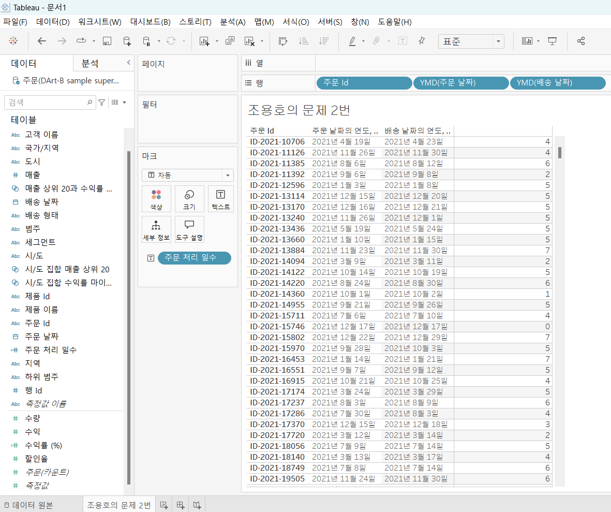


## 문제 3.

다음은 Tableau의 다양한 계산을 사용할 수 있는 경우를 빈칸으로 두고 문제를 작성한 것입니다. 각 빈칸에 적합한 계산 유형을 채워보세요.

보기
> **누계, 차이, 비율 차이, 구성 비율, 순위, 백분위수, 이동 평균, YTD 총계, 통합 성장률, 전년 대비 성장률, YTD 성장률**

| 계산 유형               | 설명                                                                 | 사용 예시                                                                                          |
|-------------------------|----------------------------------------------------------------------|-----------------------------------------------------------------------------------------------------|
| 누계          | 데이터의 누적 합계를 계산                                             | 한 기업이 월별 매출 데이터를 누적하여 연간 매출 추이를 보고 싶을 때 사용                                      |
| 차이            | 연속 데이터 포인트 간의 차이를 계산                                    | 한 기업이 월별 매출 데이터에서 전월 대비 매출 증감량을 분석하고 싶은 경우                                        |
| 비율차이         | 연속 데이터 포인트 간의 비율 변화를 계산                               | 한 기업이 월별 매출 데이터에서 전월 대비 매출 증감률(%)을 분석하고 싶은 경우                                      |
|구성비율           | 전체에서 각 데이터 포인트의 비율을 계산                                | 한 기업이 전체 매출에서 각 제품군이 차지하는 비율을 보고 싶을 때 사용                                           |
| 순위            | 데이터의 순위를 매깁니다                                              | 한 기업이 제품별 매출 데이터를 순위별로 정렬하여 상위 10개 제품을 분석하고 싶은 경우                              |
| 백분위수            | 데이터의 백분위를 계산                                               | 한 기업이 고객별 구매 금액 데이터를 백분위수로 나누어 상위 25% 고객을 분석하고 싶은 경우                          |
| 이동평균            | 일정 기간의 평균을 계산                                               | 한 기업이 주간 매출 데이터에서 4주 이동 평균을 계산하여 트렌드를 분석하고 싶은 경우                              |
|YTD            | 연초부터 현재까지의 총계를 계산                                      | 한 기업이 월별 매출 데이터를 연초부터 현재까지 누적하여 연간 매출 목표 달성 여부를 분석하고 싶은 경우             |
| 통합성장률            | 일정 기간 동안의 연평균 성장률을 계산                                  | 한 기업이 5년 간 매출 데이터를 바탕으로 연평균 성장률(CAGR)을 계산하고 싶은 경우                                  |
| 전년 대비 성장률            | 전년 동기간 대비 성장률을 계산                                        | 한 기업이 월별 매출 데이터에서 전년 동월 대비 매출 성장률을 분석하고 싶은 경우                                    |
|YTD 성장률            | 연초부터 현재까지의 성장률을 계산                                     | 한 기업이 올해 연초부터 현재까지의 매출이 전년 동기 대비 얼마나 성장했는지 분석하고 싶은 경우                     |

> 사용 예시를 참고하여 실제 경우처럼 생각하며 고민해보아요!