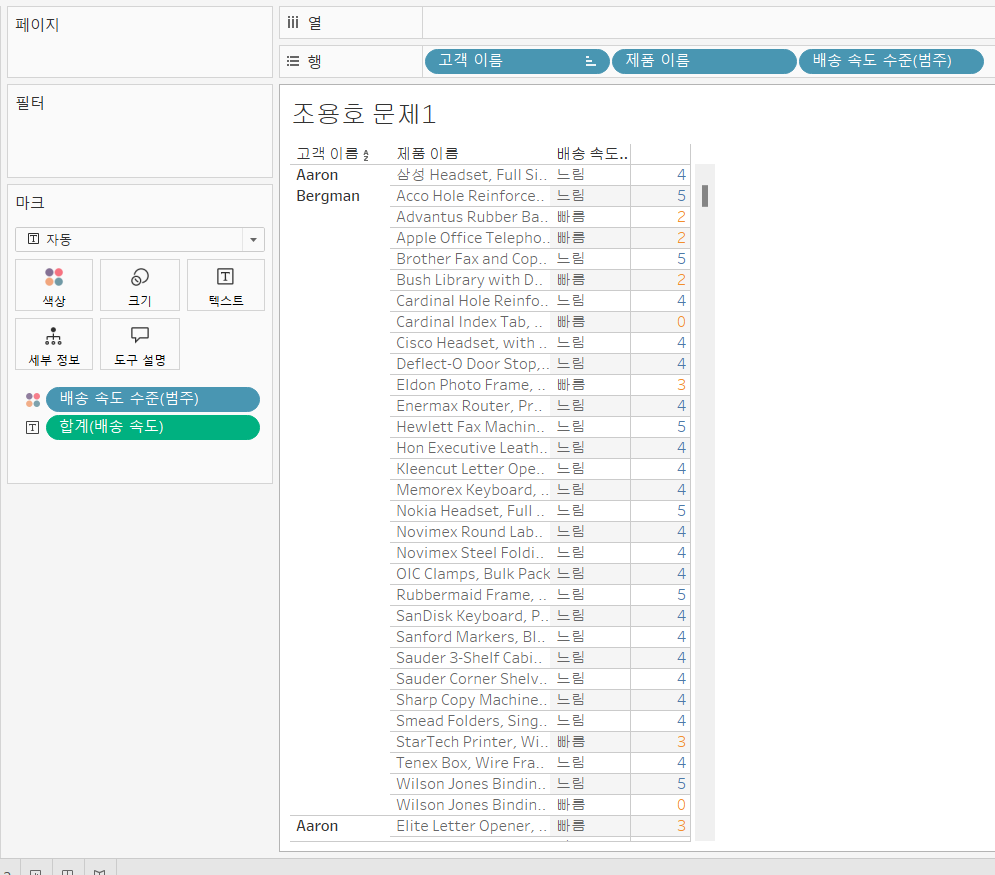

# Fifth Study Week

- 39강: [LOD](#39강-lod)

- 40강: [EXCLUDE](#40-lod-exclude)

- 41강: [INCLUDE](#41-lod-include)

- 42강 : [매개변수](#42-매개변수)

- 43강 : [매개변수 실습](#43-매개변수-실습) 


- 44강: [매개변수 실습](#44-매개변수-실습)

- 45강: [마크카드](#45-워크시트-마크카드)

- 46강: [서식계층](#46-서식-계층)

- 47강: [워크시트](#47-워크시트-서식)

- [문제1](#문제-1)

- [문제2](#문제-2)

## Study Schedule

| 강의 범위     | 강의 이수 여부 | 링크                                                                                                        |
|--------------|---------|-----------------------------------------------------------------------------------------------------------|
| 1~9강        |  ✅      | [링크](https://www.youtube.com/watch?v=AXkaUrJs-Ko&list=PL87tgIIryGsa5vdz6MsaOEF8PK-YqK3fz&index=84)       |
| 10~19강      | ✅      | [링크](https://www.youtube.com/watch?v=AXkaUrJs-Ko&list=PL87tgIIryGsa5vdz6MsaOEF8PK-YqK3fz&index=75)       |
| 20~29강      | ✅      | [링크](https://www.youtube.com/watch?v=AXkaUrJs-Ko&list=PL87tgIIryGsa5vdz6MsaOEF8PK-YqK3fz&index=65)       |
| 30~38강      | ✅      | [링크](https://www.youtube.com/watch?v=e6J0Ljd6h44&list=PL87tgIIryGsa5vdz6MsaOEF8PK-YqK3fz&index=55)       |
| 39~47강      | ✅      | [링크](https://www.youtube.com/watch?v=AXkaUrJs-Ko&list=PL87tgIIryGsa5vdz6MsaOEF8PK-YqK3fz&index=45)       |
| 48~59강      | 🍽️      | [링크](https://www.youtube.com/watch?v=AXkaUrJs-Ko&list=PL87tgIIryGsa5vdz6MsaOEF8PK-YqK3fz&index=35)       |
| 60~69강      | 🍽️      | [링크](https://www.youtube.com/watch?v=AXkaUrJs-Ko&list=PL87tgIIryGsa5vdz6MsaOEF8PK-YqK3fz&index=25)       |
| 70~79강      | 🍽️      | [링크](https://www.youtube.com/watch?v=AXkaUrJs-Ko&list=PL87tgIIryGsa5vdz6MsaOEF8PK-YqK3fz&index=15)       |
| 80~89강      | 🍽️      | [링크](https://www.youtube.com/watch?v=AXkaUrJs-Ko&list=PL87tgIIryGsa5vdz6MsaOEF8PK-YqK3fz&index=5)        |


<!-- 여기까진 그대로 둬 주세요-->

> **🧞‍♀️ 오늘의 스터디는 지니와 함께합니다.**


## 39강. LOD

<!-- INCLUDE, EXCLUDE, FIXED 등 본 강의에서 알게 된 LOD 표현식에 대해 알게 된 점을 적어주세요. -->
```
LOD

-> level of detail, 계산할 수준을 세부적으로 제어
지금까지 해온 행에 플러스 버튼?

표현식 INCLUDE, EXCLUDE, FIXED 있음

FIXED -> 현재 뷰에 있는 차원과 상관없이 계산된 필드에서 원하는 차원을 따라 계산, 2가지 상황에서 적용

1. FIXED에서 설정한 차원이 뷰에 포함되어 있을때
    계산된 필드 만들기, ex) {FIXED[지역]:SUM(매출)}
2. FIXED에서 설정한 차원이 뷰에 포함되어 있지 않을때
    ex) {fixed[범주]:sum([매출])}

FIEXED를 이용하면 fix한 테이블을 기준으로 변동없이 값이 매겨짐

```


## 40. LOD EXCLUDE

<!-- INCLUDE, EXCLUDE, FIXED 등 본 강의에서 알게 된 LOD 표현식에 대해 알게 된 점을 적고, 아래 두 질문에 답해보세요 :) -->

```
EXCUDE LOD
    현재 뷰에서 특정 차원을 제외하여 계산할 때 사용

{FIXED[범주]:SUM([매출])} vs {EXCLUDE[하위 범주]:SUM([매출])} ?
-> 동일한 결과

둘의 차이?
-> 하위범주보다 더 세부 수준인 제조업체에서 확인 가능
-> 제조업체 차원이 하위 범주보다 더 세부 수준이 낮아서 EXCLUDE는 제조업체 수준에서 매출 합계 계산
-> 또한 하위범주에서 필터를 이용하면 EXCLUDE갑은 변경되지만 FIXED 사용한 값은 변경되지 않고 고정

FIXED는 현재 뷰와 상관없이 특정 차원을 사용해 계산
EXCLUDE는 뷰에 있는 차원에 따라 계산
```
```
액세서리 매출만 따로 보기?
if[하위 범주] = "액세서리" then [매출] END

exclude 하위 범주 매출
{exclude[하위 범주]:sum([액세서리 매출])}

각 제품별 매출과 악세서리 매출의 차이
sum([매출])-attr([exclude 하위 범주 매출])
```


> **🧞‍♀️ FIXED와 EXCLUDE을 사용하는 경우의 차이가 무엇인가요?**

```
FIXED 함수는 현재 뷰와 상관없이 특정 차원을 사용해 계산하나 EXCLUDE는 뷰에 있는 차원에 따라 계산한다.
```

> **🧞‍♀️ 왜 ATTR 함수를 사용하나요?**

```
{exclude[하위 범주]:sum([액세서리 매출])}이 여러 제품 행에 대해 동일한 값으로 계산되기에 ATTR 함수를 이용하여 단일 값으로 처리하기 위해서 사용한다.
```


## 41. LOD INCLUDE

<!-- INCLUDE, EXCLUDE, FIXED 등 본 강의에서 알게 된 LOD 표현식에 대해 알게 된 점을 적고, 아래 두 질문에 답해보세요 :) -->
```
INCLUDE LOD

주문 ID에 따른 평균 매출
    avg({include[주문 Id]:sum([매출])})
    주문 ID차원을 포함해서 합계한 매출에 평균을 반환한다는 의미

실제로 주문 ID를 표시하지 않아도 INCLUDE LOD 표현식을 통해 해당 차원을 계산에 추가
```
```
뷰에 표시되는 차원이면 FIXED만 사용
    차원과 측정값을 반환

INCLUDE와 EXCLUDE는 측정값만 반환

반환 값을 차원 필터의 영향을 받게 되는 경우
    INCLUDE 또는 EXCLUDE 사용
```

> **🧞‍♀️ 그렇다면 어떤 경우에 각 표현식을 사용하나요? 예시와 함께 적어보아요**


```
뷰에 표시되는 차원 -> FIXED
반환 값을 차원 필터의 영향을 받게 되는 경우 -> INCLUDE, EXCLUDE
```

## 42. 매개변수

<!-- 매개변수에 대해 알게 된 점을 적어주세요 -->
```
매개변수란?
    고정된 상수값이 아닌 동적인 값으로 변경하기 위해서 활용하는 기능
    계산식, 필터, 참조선과 함께 사용됨

매출 상위 10개 표시?
    하위 범주 필터 사용

상위 개수를 변경할려 할때마다 매번 필터 설정 변경해야할까?

1. 필터 이용
    필터에서 새 매개변수 만들기

2. 필트 우클릭
    원하는 필드 위에 마우스 우클릭 -> 만들기 -> 매개변수

3. 데이터 패널

매개변수 설정하고 필터 하위범주에 할당하면 작동 (필터 등을 반드시 함께 사용해야함)
```

> **🧞‍♀️ 집합에도 매개변수를 적용할 수 있나요? 시도해봅시다**
```
적용할 수 있음
하위범주에 만들기, 집합을 이용하고, 필드기준에 매개변수를 할당하면 사용가능함
```


## 43. 매개변수 실습
<!-- 영상 묶음에 포함되지 않아 찾기 어려우실까 링크를 아래에 첨부하겠습니다. 수강 후 삭제해주세요-->

```
계산식 사용
매개변수로 심플한 차원변경?

행 선반 드래그 앤 드랍은 번거롭다

1. 매개변수 만들기 (목록 선택)
2. 매개변수 우클릭 매개 변수 만들기
3. 계산된 필드 만들기
    ex)
    case [차원 선택하기]
    when '국가' then [국가/지역]
    when '제품 제조사' then [제조업체]
    when '고객' then [고객 이름]
    when '세그먼트' then [세그먼트]
    end
4. 만든 차원 필드 행선반으로 드래그 앤 드랍
5. 시트 제목 변경

```


## 44. 매개변수 실습

<!-- 매개변수에 대해 알게 된 점을 적어주세요 -->
```
참조선 사용

1. 참조선 라인의 값을 매개변수로 설정
2. 이름 설정, 값 입력하면 참조선 변경
3. 계산된 필드로 참조선 전후 매출 색상 구분

시작날짜와 마지막날짜

1. 시작날짜와 마지막날짜 매개변수 설정
2. 참조구간 뷰로 드래그 (테이블)
3. 시작구간과 마지막구간에 값 할당
    해당 날짜 범위에 매출 합계를 제목에 나타내기
    4. total(sum(if[주문 날짜]>=[시작 날짜] and [주문 날짜] <= [마지막 날짜] then [매출] end))
    5. 세부정보로 드래그앤 드랍
    6. 시트이름 변경 <매개 변수.시작 날짜>부터<매개 변수.마지막 날짜> 까지 매출합계:<집계(날짜 범위에 매출 합계)>

```


## 45. 워크시트 마크카드

<!-- 마크카드에 대해 알게 된 점을 적어주세요 -->
```
헤당 시트 안에 있는 데이터들을 마크라고 하는데
이러한 마크들의 서식을 변경하기 위해 마크카드를 활용

마크의 드롭다운으로 서식을 변경해도 차트 유형은 변경되지 않음

색상의 후광옵션은 맵에서만 사용가능

색상의 범례는 연속형, 불연속형에 따라 다르게 나타남

크기로 크기 조절 가능

레이블을 통해 각 값들을 문자로 표시
    단위 등을 삽입 가능

세부 정보를 이용하여 하위 범주 구분

경로를 통해 라인 유형 변경 (연속형에서)
원으로 표현할 시에는 도형을 통해 변경
```


## 46. 서식 계층

<!-- 서식계층에 대해 알게 된 점을 적어주세요 -->
```
서식 계층 구조
more general
    워크 시트 서식
    행열 서식
    특정 필드
    필드 레이블
    도구설명/제목/마크
more specific

해당 서식계층에서 상위 계층에 서식을 설정했을 때
상위 계층보다 아래 계층인 경우에 서식을 변경하게 되면
해당 아래 계층에 설정한 서식이 적용됨

서식에 통합문서로 글꼴 일괄 적용

서식 탭에 5가지 서식 옵션이 있음
    글꼴 : 현재 워크 시트 서식 설정
    행열 : 행열은 워크시트 서식보다 아래이기에 시트탭에서 글꼴을 변경해도 행 서식은 변경되지 않음
    특정 필드 : 뷰에서 마우스 우클릭, 서식 선택
    필드 레이블 : 필드 레이블에서 우클릭, 서식 선택
    마크/제목 서식 : 마크의 텍스트에 우클릭, 서식 선택

    이전 설정 서식 지우고 싶은 경우 : 서식 -> 워크리트 서식 지우기
```


> **🧞‍♀️ 서식계층을 일반적인 것에서 구체적인 것 순서로 기입해보세요**


```
more general
    워크 시트 서식
    행열 서식
    특정 필드
    필드 레이블
    도구설명/제목/마크
more specific
```


## 47. 워크시트 서식

<!-- 워크시트 서식에 대해 알게 된 점을 적어주세요!-->
```
글꼴, 맞춤, 음영, 테두리, 라인 이용하여 직관적 디자인 가능

글꼴 이용하여 글꼴, 색상, 크기를 설정
기본값 설정 후 총계, 총합계 등 따로 설정 가능
맞춤 옵션으로 텍스트 정렬과 방향 설정 가능
음영으로 음영 적용
    행, 열 색상 교차로 데이터 셀의 구간을 설정하여 음영 줄 수 있음
    구간크기를 이용하여 음영 주기 조절

```


## 문제 리스트


## 문제 1.

```
가장 많이 주문한 사람들은 물건 배송을 빨리 받았을까요?
조건을 준수하여 아래 이미지를 만들어봆시다.
1) 국가/지역별(이하 '나라'로 통칭), 범주별로 배송일자가 다를 수 있으니 먼저, 나라별/범주별로 평균 배송일자를 설정한 뒤,
2) 각 나라에서 가장 많이 주문한 사람의 이름을 첫 번째 열,
3) 그 사람이 주문한 제품 이름을 2번째 열,
4) 각 상품이 배송까지 걸린 날 수를 표현하고
5) 그리고 만약 배송이 각 나라/범주별 평균보다 빨랐다면 '빠름', 같다면 '평균', 느리다면 '느림' 으로 print 해주세요. 
```


<!-- 여기까지 오는 과정 중 알게 된 점을 기입하고, 결과는 시트 명을 본인 이름으로 바꾸어 표시해주세요.-->


```
계산된 필드를 잘 사용해야 함을 알았다. 이 문제를 풀면서 나라별 배송 속도 평균, 범주별 배송 속도 평균 등을 구할때 전부 계산된 필드에서 fixed를 이용하여 풀었다.

이번 문제에서는 {fixed[국가/지역]:avg([배송 날짜]-[주문 날짜])}를 구하고,
이를 실제 배송 시간과 비교하였다.
```

## 문제 2.

```
채원이는 태블로를 쓰실 수 없는 상사분께 보고하기 위한 대시보드를 만들고 싶어요. 

제품 중분류별로 구분하되 매개변수로써 수익, 매출, 수량을 입력하면 저절로 각각 지표에 해당하는 그래프로 바뀌도록 설계하고자 해요.

 어떤 값이 각 지표의 평균보다 낮은 값을 갖고 있다면 색깔을 주황색으로, 그것보다 높다면 파란색으로 표시하고 싶어요. 그 평균값은 각 지표별로 달라야 해요.
```

```
매개변수와 계산 필드를 이용하였다. 
매개변수, 문자열, 목록에서 수익,매출,수량을 지정하고,
계산된 필드에서 case when을 이용하여 실제 필드와 매개변수를 연결했다.
이후 적절히 드래그 앤 드랍을 했는데,
그중 계산된 필드는 열과 색상 두 곳에 드래그 앤 드랍을 하였다.
마지막으로 내림차순 정렬, 시트명 변경을 하여 마무리 하였다.

계산된 필드를 이용하지 않고 매개변수를 바로 사용하니 제대로 작동하지 않았다.
이 문제로 매개변수는 홀로 쓰이지 못함을 경험했다.
```


<!-- 예시 사진은 지워주세요-->