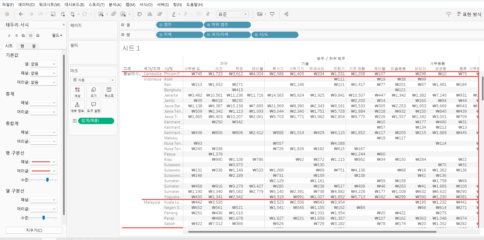
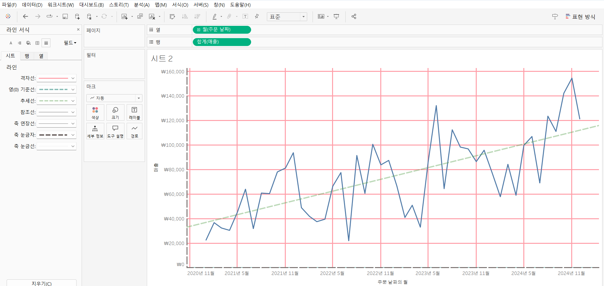
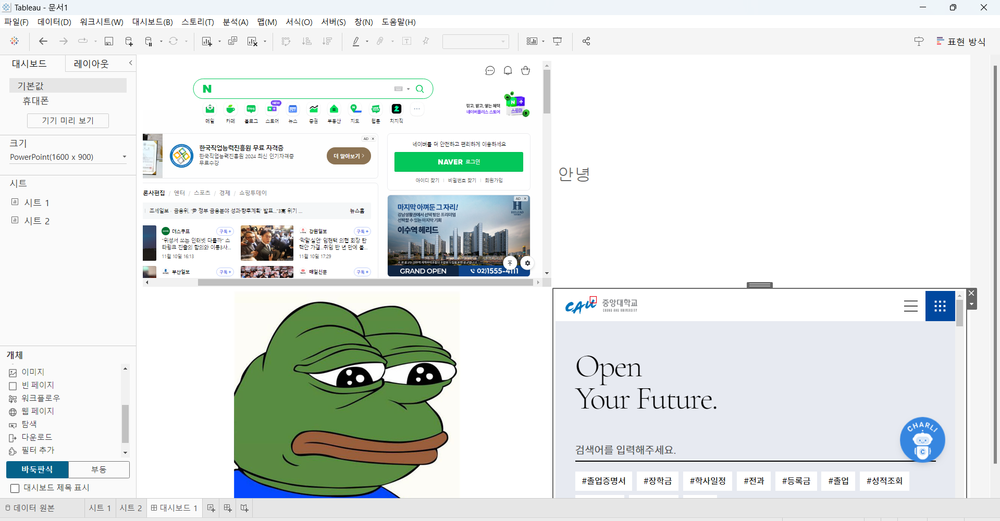
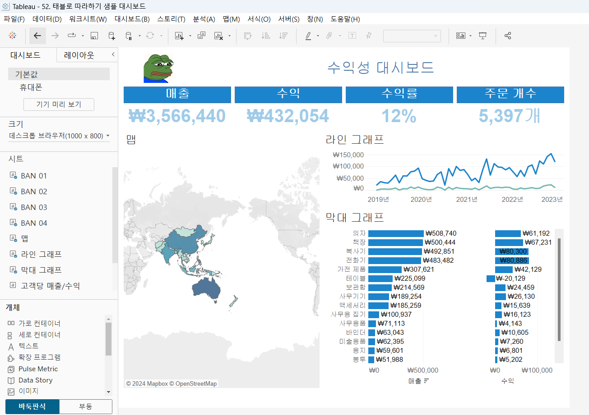
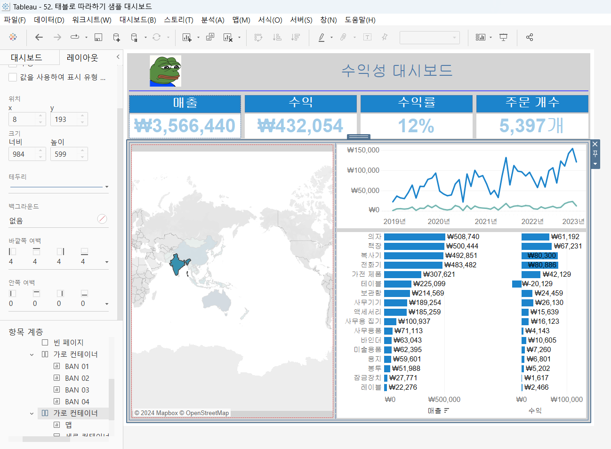
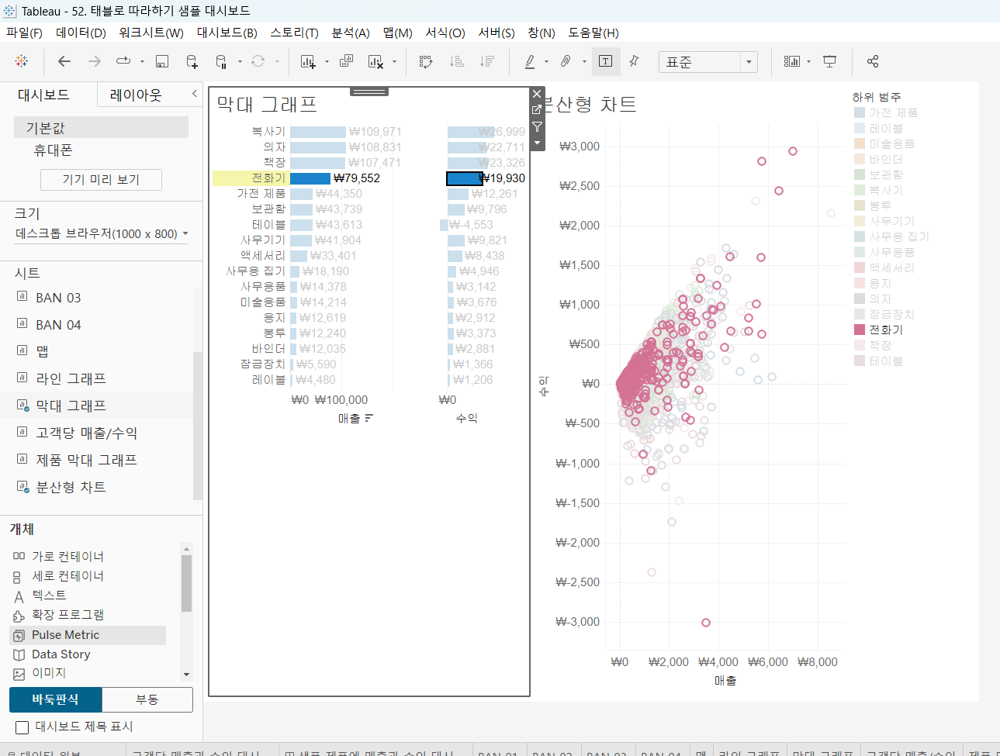
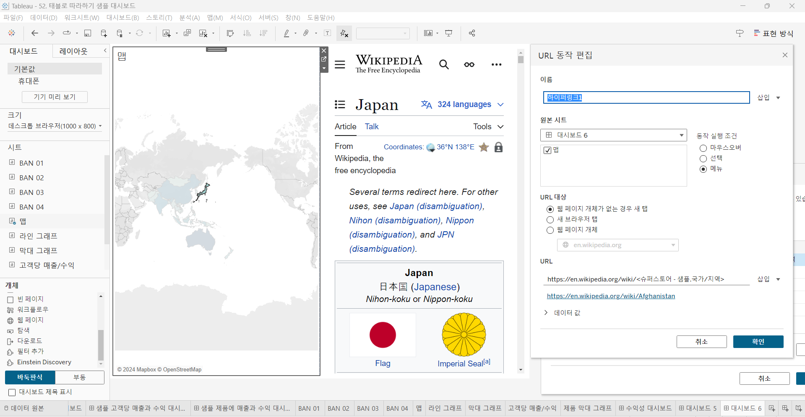
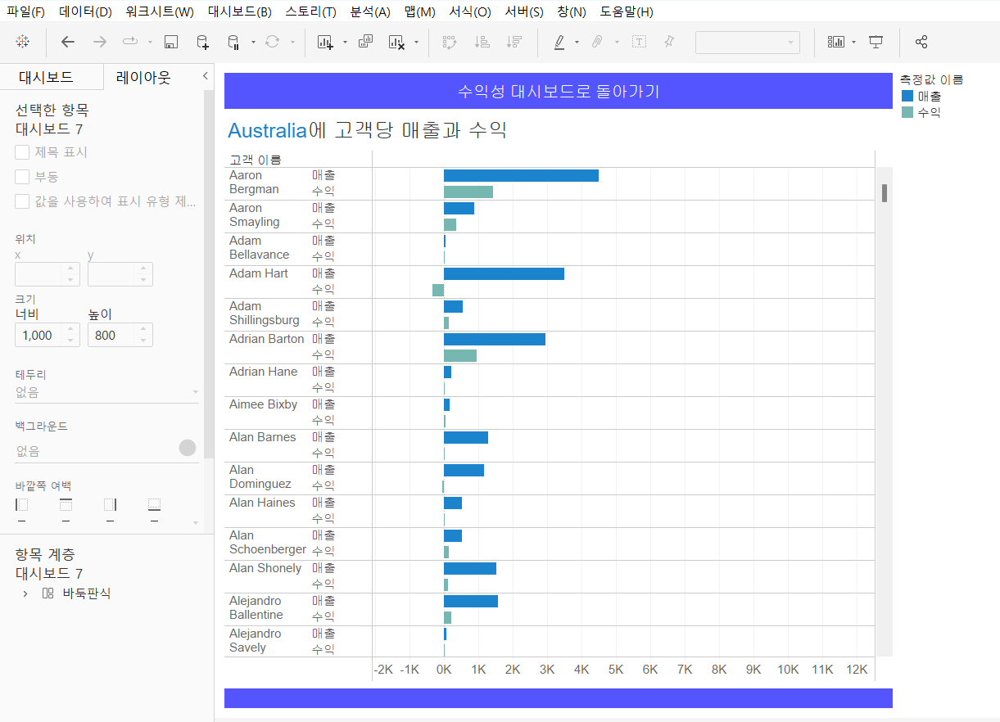

# Sixth Study Week


## Study Schedule
<br>

| 회차 | 강의 범위   | 강의 이수 여부 | 링크                                                                                                     |
|------|-------------|----------------|--------------------------------------------------------------------------------------------------------|
| 1    | 1~7강       | ✅              | [링크](https://www.youtube.com/watch?v=AXkaUrJs-Ko&list=PL87tgIIryGsa5vdz6MsaOEF8PK-YqK3fz&index=84)    |
| 2    | 8~17강      | ✅              | [링크](https://www.youtube.com/watch?v=AXkaUrJs-Ko&list=PL87tgIIryGsa5vdz6MsaOEF8PK-YqK3fz&index=75)    |
| 3    | 18~27강     | ✅              | [링크](https://www.youtube.com/watch?v=AXkaUrJs-Ko&list=PL87tgIIryGsa5vdz6MsaOEF8PK-YqK3fz&index=65)    |
| 4    | 28~37강     | ✅              | [링크](https://www.youtube.com/watch?v=e6J0Ljd6h44&list=PL87tgIIryGsa5vdz6MsaOEF8PK-YqK3fz&index=55)    |
| 5    | 38~47강     | ✅              | [링크](https://www.youtube.com/watch?v=AXkaUrJs-Ko&list=PL87tgIIryGsa5vdz6MsaOEF8PK-YqK3fz&index=45)    |
| 6    | 48~57강     | ✅              | [링크](https://www.youtube.com/watch?v=AXkaUrJs-Ko&list=PL87tgIIryGsa5vdz6MsaOEF8PK-YqK3fz&index=35)    |
| 7    | 58~67강     | 🍽️             | [링크](https://www.youtube.com/watch?v=AXkaUrJs-Ko&list=PL87tgIIryGsa5vdz6MsaOEF8PK-YqK3fz&index=25)    |
| 8    | 68~77강     | 🍽️             | [링크](https://www.youtube.com/watch?v=AXkaUrJs-Ko&list=PL87tgIIryGsa5vdz6MsaOEF8PK-YqK3fz&index=15)    |
| 9    | 78~85강     | 🍽️             | [링크](https://www.youtube.com/watch?v=AXkaUrJs-Ko&list=PL87tgIIryGsa5vdz6MsaOEF8PK-YqK3fz&index=5)     |
---

<br/>
<!-- 여기까진 그대로 둬 주세요-->

> **🧞‍♀️ 오늘은 강의보다 실습과 대시보드 직접 만들기가 더 중요하니, 기록보다는 사고하며 강의를 들어주세요.**

## 48. 워크시트 서식(2)

<!-- 워크시트에 관해 본 강의에서 알게 된 점을 적어주세요 -->
```
테두리

    행, 열 구분석 수준 설정 가능
        어느정도까지 구분선을 넣을 것인가?
        칼럼이 추가되면 수준이 세분화됨

라인
    라인과 테두리의 차이는 데이터 기준
    라인은 데이터의 축에 대한 라인의 모양을 설정

```



## 49강. 대시보드패널

<!-- 대시보드패널 강의에서 알게 된 점을 적어주세요. -->
```
새 워크시트 옆에 '새 대시보드' 클릭

대시보드 디자인 페이지?
    각 시트와 개체들을 배치할 수 있는 공간

크기
    대시보드 크기 설정

시트
    대시보드에서 사용할 수 있는 워크시드들을 확인
    드래그앤드랍으로 대시보드에 가져올 수 있음

대시보드에 이미지, 텍스트, 웹페이지 등을 가져올 수 있음

기기별 해상도 설정
```


## 50. 대시보드 구성방식

<!-- 알게 된 점을 적고, 아래 질문에 답해보세요 :) -->
```
태블로 내 개체를 추가하는 방식?
    1. 바둑판식 : 격자무뉘 구조
    2. 부동 : 자유롭게 배치
    본인 선호로 선택하면 됨

부동 개체는 대시보드 크기가 자주 변경되지 않을때 좋다
개체+shift 드래그앤드랍 -> 부동식

```

> **🧞‍♀️ 부동과 바둑판식 방식을 차이를 중점으로 기술해보세요**
```
바둑판식은 격자무뉘 구조를 보여주고
부동은 자유롭게 배치가 가능한 구조이다

대시보드 크기를 자주변경할 경우
바둑판식은 알아서 크기가 적합하게 들어가나
부동은 그렇지 않다
그렇기에 대시보드 크기를 자주 변경할려면
바둑판식이 편하다
```


## 51. 대시보드 컨테이너
```
컨테이너:
    대시보드 개체들과 워크시트들을 그룹화하고 구성할 수 있는 공간

가로 컨테이너 :
    내부의 개체들을 수평 공간으로 배열할 때

세로 컨테이너 :
    내부의 개체들을 수직 공간으로 배열할 때

항상 컨테이너를 드래그드랍하고 그 다음 놓고 싶은걸 놓기
```



## 52. 레이아웃 패널
```
레이아웃 탭
    대시보드의 개체 속성을 변경할 수 있음
    그래프 클릭, 레이아웃 클릭, 변경옵션 나타남

제목
    기본적으로 워크시트
    숨김 가능

부동 변경 가능 (해제한다고 이전으로 돌아가진 않음)

위치, 크기는 부동개체만 가능

테두리
    그래프 혹은 컨테이너의 테두리 지정

백그라운드
    컨테이너 색상 변경

여백
    정렬되어 있지 않을때 사용
    바깥쪽 : 컨테이너 모서리와 테두리 사이의 공간 변경
    안쪽 : 선택된 개체 모서리와 테두리 사이의 공간 변경
    모든 변이 동일 -> 동서남북 같은 값으로

항목 계층
    대시보드에 있는 컨테이너와 개체를 볼 수 있음

```


## 53. 필터 동작

<!-- 필터 동작에 대해 알게 된 점을 적어주세요 -->
```
필터 추가엔 두가지 방법
1. 차트 클릭, 드롭다운, 필터
2. 옵션이 많은 경우는 필터 드롭다운보다 차트 직접 클릭이 편함

연계? 대시보드 동작 추가

필터 동작 추가
실행 조건
    마우스오버: 차트에 마우스 놓기
    선택: 차트에 마크 클릭 -> 데이터 변경
    메뉴: 마크 클릭 -> 설명 텍스트 나타남

차트의 필터로 사용으로 간단하게 필터링 가능
```
## 54. 대시보드 하이라이터 동작

<!-- 하이라이터에 대해 알게 된 점을 적어주세요 -->
```
필터링 대신 하이라이트로 구분 가능
원하는 값을 다른 값가 구분할 때 사용

대시보드 하이라이트 동작이 작동하려면,
선택 기준으로 사용한 필드가 변경할 그래프에 포함되어 있어야함
```


## 55. 대시보드 URL

<!-- URL에 대해 알게 된 점을 적어주세요 -->
```
웹사이트 이동 가능

동작추가 -> URL로 이동

국가마다 다른 페이지로 이동시키는 것이 관건
국가이름 대신 삽입-><국가/지역>
ex)https://en.wikipedia.org/wiki/<국가/지역>

이름은 메뉴에 클릭할 텍스트가 되므로 잘 지어야함

웹페이지를 대시보드에서 보기
    웹페이지 개체를 배치
    동작에 URL 대상에 웹 페이지 개체가 없는 경우 새 탭 
```


## 56. 대시보드 시트에 이동 동작

<!-- 대시보드 시트에 이동에 대해 알게 된 점을 적어주세요!-->
```
하나의 대시보드에 모든 차트를 넣기 어려우니
링크를 통해 다른 시트로 이동하는 방법

동작에 시트로 이동 사용
두 번째 대시보드에 필터 배치 필수

탐색에 편집단추 이용해 원래 시트로 돌아가기 가능
```


## 57. 매개변수 변경 동작

<!-- 매개변수 변경 동작에 대해 알게 된 점을 적어주세요!-->
```
그래프에 특정 범위의 날짜만 보기?

동작추가의 매개변수 클릭
원본시트 -> 라인그래프, 선택
대상 매개 변수 -> 시작이면 시작, 끝이면 끝
날짜 설정

```

## 문제

오늘은 별도의 문제가 없습니다. 


여러 대시보드를 참고하시어, superstore 데이터를 사용해 나만의 대시보드를 제작해주세요.

**단, 워크시트 3개 이상의 그래프를 표시해야 하며 각 시트 간 상호작용성 필터 or 하이라이트 동작은 꼭 추가되어야 합니다**

어떤 부분에 가중을 두었는지, 어떤 사용자 편의성을 고려하였는지에 대한 설명이 필요합니다.
