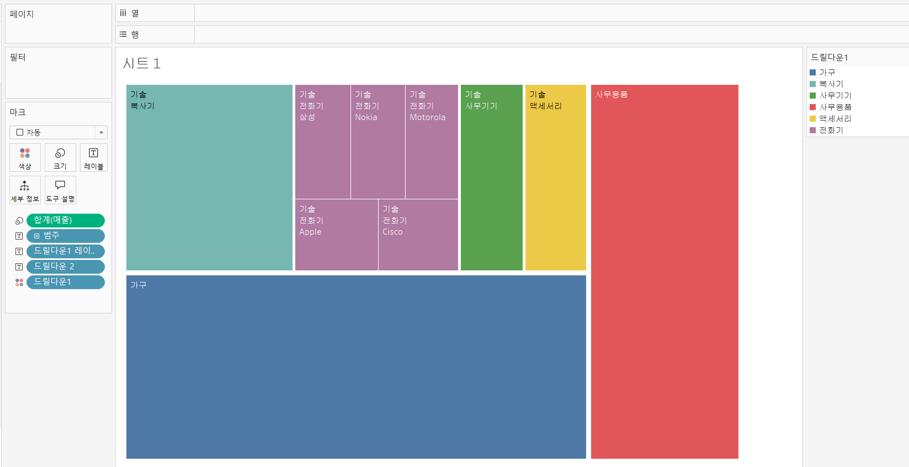

# 7th Study Week

## Study Schedule
<br>

| 회차 | 강의 범위   | 강의 이수 여부 | 링크                                                                                                     |
|------|-------------|----------------|--------------------------------------------------------------------------------------------------------|
| 1    | 1~7강       | ✅              | [링크](https://www.youtube.com/watch?v=AXkaUrJs-Ko&list=PL87tgIIryGsa5vdz6MsaOEF8PK-YqK3fz&index=84)    |
| 2    | 8~17강      | ✅              | [링크](https://www.youtube.com/watch?v=AXkaUrJs-Ko&list=PL87tgIIryGsa5vdz6MsaOEF8PK-YqK3fz&index=75)    |
| 3    | 18~27강     | ✅              | [링크](https://www.youtube.com/watch?v=AXkaUrJs-Ko&list=PL87tgIIryGsa5vdz6MsaOEF8PK-YqK3fz&index=65)    |
| 4    | 28~37강     | ✅              | [링크](https://www.youtube.com/watch?v=e6J0Ljd6h44&list=PL87tgIIryGsa5vdz6MsaOEF8PK-YqK3fz&index=55)    |
| 5    | 38~47강     | ✅              | [링크](https://www.youtube.com/watch?v=AXkaUrJs-Ko&list=PL87tgIIryGsa5vdz6MsaOEF8PK-YqK3fz&index=45)    |
| 6    | 48~57강     | ✅              | [링크](https://www.youtube.com/watch?v=AXkaUrJs-Ko&list=PL87tgIIryGsa5vdz6MsaOEF8PK-YqK3fz&index=35)    |
| 7    | 58~66강     | ✅             | [링크](https://www.youtube.com/watch?v=AXkaUrJs-Ko&list=PL87tgIIryGsa5vdz6MsaOEF8PK-YqK3fz&index=25)    |
| 8    | 67~77강     | 🍽️             | [링크](https://www.youtube.com/watch?v=AXkaUrJs-Ko&list=PL87tgIIryGsa5vdz6MsaOEF8PK-YqK3fz&index=15)    |
| 9    | 78~85강     | 🍽️             | [링크](https://www.youtube.com/watch?v=AXkaUrJs-Ko&list=PL87tgIIryGsa5vdz6MsaOEF8PK-YqK3fz&index=5)     |
---

<br/>

> **🧞‍♀️ 오늘은 강의보다 실습과 대시보드 직접 만들기가 더 중요하니, 기록보다는 사고하며 강의를 들어주세요.**
> **직접 실습파일을 다운로드하는 번거로움이 있어 assignment > 7th_files에 실습파일을 올려두었습니다. 활용해주세요!**


## 58. 집합값 변경

<!-- 집합값 변경 강의에서 알게 된 점을 적어주세요 -->
```
IF [하위 범주 집합] AND [제조 업체 집합] THEN [제품이름]
ELSE '+'
END

-> [하위 범주 집합]과 [제조 업체 집합]이 모두 있을때만
[제품이름]표시, 아니면 +

대시보드에 동작, 집합값 변경?

하위범주를 만드는 제조업체만 띄우는 법?
그래프에서 다른 시트로 이동하기?
```


## 59강. 스토리패널

<!-- 스토리패널 강의에서 알게 된 점을 적어주세요 -->
```
스토리 포인트
    스토리 각각의 개별 시트

새 스토리 포인트
    새 스토리 포인트를 추가하기 위한 옵션
    [빈 페이지]를 추가하여 추가
    혹은 [복제]를 선택하여 현재 스토리 포인트를
    다음 스토리 포인트의 시작점으로 사용가능

스토리 패널은 대시보드, 시트 및 텍스트 설명을 스토리 시트로 가져올 수 있음

스토리 메뉴로 스토리 서식 지정, 스토리 포인트 복사 및 이미지 사용가능

스토리 툴 바는 탐색기 영역을 마우스 오버할 때 나타나며
변경된 내용을 되돌리기, 스토리 포인트에 대하 업데이트 적용, 삭제, 생성 가능

탐색기는 스토리 포인트 편집, 구성 가능
```
## 60. 스토리

<!-- 알게 된 점을 적고, 아래 질문에 답해보세요 :) -->
```
스토리란
    생성한 워크시트와 대시보드에 설명을 덧붙여 데이터를 설명하거나
    정보를 전달하고 의사 결저에 도움을 주고
    설득력 있는 사례를 구성하는 등의 기능을 구현하는 작업이 가능함

툴바 업데이트?
    현재까지의 작업상태 저장

스토리 기능을 이용해서 스토리 포인트 간의 플로우를 잘 구성하고
자신만의 스토리텔링을 완성하여 내용을 분석하고 적절한 인사이트를 얻을 수 있음
```

## 61. 대시보드 탐색

<!-- 대시보드 탐색 강의에서 알게 된 점을 적어주세요 -->
```
탐색을 이용하여 대시보드 간 이동할 수 있음
탐색 개체 -> 편집 단추 -> 이동할 위치
적절한 디자인 변경으로 사용가능  
```

## 62. 태블로 단추

<!-- 태블로 단추 강의에서 알게 된 점을 적어주세요 -->
```
표시/숨기기 단추로 각각의 그래프 숨기기 가능

차트 표시/숨기기 단추 추가
단추 부동 해제
원하는 곳으로 놓기

단추에 이미지 삽입 가능
숨길때와 표시될때 각각 다른 이미지로

큰 컨테이너에 대해서 숨기기 적용하면,
그안에 속한 모든 그래프들 전부 숨겨짐
```

## 63. 막대그래프 드릴다운

<!-- 막대그래프 드릴다운에 대해 알게 된 점을 적어주세요 -->
```
드릴다운?
    막대그래프를 클릭하면 범주로 분리되어 보여줌
    1. 매개변수 생성 (문자열)
    2. 계산된 필드 생성
        ex) IF [배송 형태] = [매개 변수 level1] then [범주]
        else [배송 형태]
        end
    3. 동작, 동작추가
        매개 변수 변경
        선택, 매개 변수 level1, 슈퍼스토어 샘플, 다음값으로 설정(공백)
    4. 드릴다운 열로 추가

레이블 깔끔하게 정리하기?
행에 대한 필드 레이블 숨기기
```

## 64. 트리맵 드릴다운

<!-- 트리맵 드릴다운에 대해 알게 된 점을 적어주세요 -->
```
트리맵에서 드릴다운하기 (집합 이용)
    1. 범주 필드 집합 만들기
    2. 계산된 필드 생성
    ex) IF [범주 집합] then [하위 범주]
        else [범주]
        end
    3. 동작, 집합 값 변경
        대상 집합 : 범주 집합
        집합에 값 할당
        집합에 모든 값 제거
    4. 레이블 마크에 추가

레이블 중복방지
    IF [범주 집합] then [하위 범주]
        else ""
        end
    레이블 추가

    드릴다운1 색상마크에 덮기
    마크 선반 순서 조정
        범주-드릴다운1 레이블-드릴다운2-드릴다운1
```

## 65. 파이 차트 드릴다운

<!-- 파일 차트 드릴다운에 대해 알게 된 점을 적어주세요 -->
```
파이차트에서 드릴다운하기
    1. 범주 필드 집합 만들기
    2. 계산된 필드 생성
    3. 동작, 집합 값 변경
        선택
        범주 집합
        집합에 값 할당
        집합에서 모든 값 제거
    4. 크기 마크 제거
    5. 드릴다운1 세부정보로
    6. 세부정보로 유형 색상으로 변경
    7. 행에 0입력 및 복제
    8. 첫번째 선반에 드릴다운1 제거, 크기 조정
    9. 오른쪽 0으로 이중축 선택
    10. 크기조정
    11. 범례로 색상 편집
    12. 카테고리 레이블 추가
    13. ELSE ""로 변경한 레이블 필드 생성
    14. 레이블에 추가
    15. 서식변경
```

## 66. 지도 드릴다운

<!-- 지도 드릴다운에 대해 알게 된 점을 적어주세요 -->
```
전처리 필요...

좌표값 생성
    1. 인덱스 함수 (index()-1) 생성
    2. x,y 함수 (cos(radian([인덱스])), (sin(radian([인덱스])) 생성
    3. 경로, 만들기, 구간차원 -> 크기 1로
    4. X필드를 행선반 Y필드를 열선반
    5. 경로(구간차원) 세부정보로
    6. x, 다음을 사용하여 계산, 경로(구간차원), y도 똑같이
    7. 배송형태 색상마크로
    8. 마크 형태 원으로
    9. window_max(max([매출])) 만들기 (c_매출)
    10. rank_unique([c_매출],'asc') (c_순위)
    11. x 편집, *[c_순위], y 편집, *[c_순위]
    12. x 테이블계산, 중첩된 계산 -> c_순위,특정차원,배송형태
                                    c_매출,특정차원,경로(구간차원)
    13. y 테이블계산, x랑 동일하게
    14. c_매출 복제, c_전체매출로 이름 변경
    15. c_매출 / c_전체매출 생성 (c_비율)
    16. x 편집 radians([인덱스]*[c_비율])
    17. y 편집 x와 동일하게
    18. x 테이블 계산 편집, 중첩된 계산-> c_전체매출,특정차원,경로(구간차원) and 배송형태
    19. y 테이블 계산 편집 x와 동일하게
    20. 마크 유형 라인으로
    21. 세부정보의 경로[구간차원] 경로마크로 변경
    22. 서식설정
```

---

## 문제

오늘은 별도의 문제가 없습니다.

다만, 학술제 이후 마지막 과제(11/27~)로서 한 주 동안에는 학술제 주제 관련 데이터(없을 경우, 본인 관심 데이터)를 사용해 나만의 대시보드를 제작할 예정입니다. 또한, 학술제에서 시각화 시 태블로를 사용하기를 권장하는 안내가 나갈 예정입니다.
그 때 열심히 배운 내용을 잘 활용해주세요. 감사합니다 :)