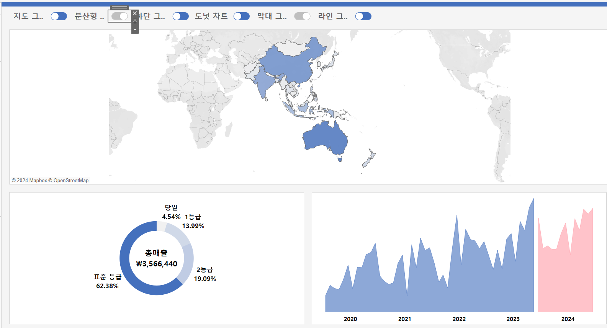

# 7th Study Week

## Study Schedule
<br>

| 회차 | 강의 범위   | 강의 이수 여부 | 링크                                                                                                     |
|------|-------------|----------------|--------------------------------------------------------------------------------------------------------|
| 1    | 1~7강       | ✅              | [링크](https://www.youtube.com/watch?v=AXkaUrJs-Ko&list=PL87tgIIryGsa5vdz6MsaOEF8PK-YqK3fz&index=84)    |
| 2    | 8~17강      | ✅              | [링크](https://www.youtube.com/watch?v=AXkaUrJs-Ko&list=PL87tgIIryGsa5vdz6MsaOEF8PK-YqK3fz&index=75)    |
| 3    | 18~27강     | ✅              | [링크](https://www.youtube.com/watch?v=AXkaUrJs-Ko&list=PL87tgIIryGsa5vdz6MsaOEF8PK-YqK3fz&index=65)    |
| 4    | 28~37강     | ✅              | [링크](https://www.youtube.com/watch?v=e6J0Ljd6h44&list=PL87tgIIryGsa5vdz6MsaOEF8PK-YqK3fz&index=55)    |
| 5    | 38~47강     | ✅              | [링크](https://www.youtube.com/watch?v=AXkaUrJs-Ko&list=PL87tgIIryGsa5vdz6MsaOEF8PK-YqK3fz&index=45)    |
| 6    | 48~57강     | ✅              | [링크](https://www.youtube.com/watch?v=AXkaUrJs-Ko&list=PL87tgIIryGsa5vdz6MsaOEF8PK-YqK3fz&index=35)    |
| 7    | 58~66강     | ✅             | [링크](https://www.youtube.com/watch?v=AXkaUrJs-Ko&list=PL87tgIIryGsa5vdz6MsaOEF8PK-YqK3fz&index=25)    |
| 8    | 67~77강     | 🍽️             | [링크](https://www.youtube.com/watch?v=AXkaUrJs-Ko&list=PL87tgIIryGsa5vdz6MsaOEF8PK-YqK3fz&index=15)    |
| 9    | 78~85강     | 🍽️             | [링크](https://www.youtube.com/watch?v=AXkaUrJs-Ko&list=PL87tgIIryGsa5vdz6MsaOEF8PK-YqK3fz&index=5)     |
---

<br/>

> **🧞‍♀️ 오늘은 강의보다 실습과 대시보드 직접 만들기가 더 중요하니, 기록보다는 사고하며 강의를 들어주세요.**
> **직접 실습파일을 다운로드하는 번거로움이 있어 assignment > 7th_files에 실습파일을 올려두었습니다. 활용해주세요!**


## 58. 집합값 변경

<!-- 집합값 변경 강의에서 알게 된 점을 적어주세요 -->
```
IF [하위 범주 집합] AND [제조 업체 집합] THEN [제품이름]
ELSE '+'
END

-> [하위 범주 집합]과 [제조 업체 집합]이 모두 있을때만
[제품이름]표시, 아니면 +

대시보드에 동작, 집합값 변경?

하위범주를 만드는 제조업체만 띄우는 법?
그래프에서 다른 시트로 이동하기?
```


## 59강. 스토리패널

<!-- 스토리패널 강의에서 알게 된 점을 적어주세요 -->
```
스토리 포인트
    스토리 각각의 개별 시트

새 스토리 포인트
    새 스토리 포인트를 추가하기 위한 옵션
    [빈 페이지]를 추가하여 추가
    혹은 [복제]를 선택하여 현재 스토리 포인트를
    다음 스토리 포인트의 시작점으로 사용가능

스토리 패널은 대시보드, 시트 및 텍스트 설명을 스토리 시트로 가져올 수 있음

스토리 메뉴로 스토리 서식 지정, 스토리 포인트 복사 및 이미지 사용가능

스토리 툴 바는 탐색기 영역을 마우스 오버할 때 나타나며
변경된 내용을 되돌리기, 스토리 포인트에 대하 업데이트 적용, 삭제, 생성 가능

탐색기는 스토리 포인트 편집, 구성 가능
```
## 60. 스토리

<!-- 알게 된 점을 적고, 아래 질문에 답해보세요 :) -->
```
스토리란
    생성한 워크시트와 대시보드에 설명을 덧붙여 데이터를 설명하거나
    정보를 전달하고 의사 결저에 도움을 주고
    설득력 있는 사례를 구성하는 등의 기능을 구현하는 작업이 가능함

툴바 업데이트?
    현재까지의 작업상태 저장

스토리 기능을 이용해서 스토리 포인트 간의 플로우를 잘 구성하고
자신만의 스토리텔링을 완성하여 내용을 분석하고 적절한 인사이트를 얻을 수 있음
```

## 61. 대시보드 탐색

<!-- 대시보드 탐색 강의에서 알게 된 점을 적어주세요 -->
```
탐색을 이용하여 대시보드 간 이동할 수 있음
탐색 개체 -> 편집 단추 -> 이동할 위치
적절한 디자인 변경으로 사용가능  
```

## 62. 태블로 단추

<!-- 태블로 단추 강의에서 알게 된 점을 적어주세요 -->
```
표시/숨기기 단추로 각각의 그래프 숨기기 가능

차트 표시/숨기기 단추 추가
단추 부동 해제
원하는 곳으로 놓기

단추에 이미지 삽입 가능
숨길때와 표시될때 각각 다른 이미지로

큰 컨테이너에 대해서 숨기기 적용하면,
그안에 속한 모든 그래프들 전부 숨겨짐
```

## 63. 막대그래프 드릴다운

<!-- 막대그래프 드릴다운에 대해 알게 된 점을 적어주세요 -->

## 64. 트리맵 드릴다운

<!-- 트리맵 드릴다운에 대해 알게 된 점을 적어주세요 -->

## 65. 파이 차트 드릴다운

<!-- 파일 차트 드릴다운에 대해 알게 된 점을 적어주세요 -->

## 66. 지도 드릴다운

<!-- 지도 드릴다운에 대해 알게 된 점을 적어주세요 -->

---

## 문제

오늘은 별도의 문제가 없습니다.

다만, 학술제 이후 마지막 과제(11/27~)로서 한 주 동안에는 학술제 주제 관련 데이터(없을 경우, 본인 관심 데이터)를 사용해 나만의 대시보드를 제작할 예정입니다. 또한, 학술제에서 시각화 시 태블로를 사용하기를 권장하는 안내가 나갈 예정입니다.
그 때 열심히 배운 내용을 잘 활용해주세요. 감사합니다 :)