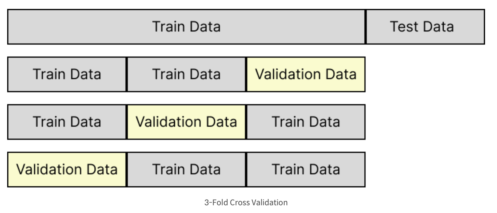

# 트리 알고리즘

## 5-1 결정 트리
<br/>

**메서드**

```
<.info()>
    ㅇ 각 열의 데이터 타입 확인에 용이
    ㅇ 결측치 확인가능

<.describe()> 
    ㅇ 간략한 통계 (최소, 최대, 평균 등등)
    
```

**스케일링**
```
<train, test 분할>

from sklearn.model_selection import train_test_split
train_input, test_input, train_target, test_target = train_test_split(data,target, test_size=0.2, random_state=42)
```
```
<StandardScaler 사용>

from sklearn.preprocessing import StandardScaler
ss= StandardScaler()
ss.fit(train_input)
train_scaled=ss.transform(train_input)
test_scaled=ss.transform(test_input)
```
**결정트리**
```
<DecisionTreeClassifier 사용>

from sklearn.tree import DecisionTreeClassifier
dt= DecisionTreeClassifier(random_state=42)
dt.fit(train_scaled, train_target)
print(dt.score(trained_scaled, train_target))
print(dt.score(test_scaled, test_target))
```
```
<결정트리 시각화>

import matplotlib.pylot as plt
from sklearn.tree import plot_tree
plt.figure(figsize=(10,7))
plot_tree(dt)
plt.show()
```
```
<제한을 둔 결정트리 시각화>

    ㅇ max_depth로 깊이 조절
    ㅇ filled로 노드 색 지정
    ㅇ feature_names로 특성의 이름 전달
    ㅇ 노드엔 테스트 조건, 불순도, 총 샘플 수, 클래스별 샘플 수 적혀있음

plt.figure(figsize=(10,7))
plot_tree(dt, max_depth=1, filled=True, feature_names=['alchhol','sugar','pH'])
plt.show()
```
```
<지니 불순도>

    ㅇ 지니 불순도 = 1-(음성클래스 비율^2 + 양성 클래스 비율^2)
    ㅇ max=0.5, min=0
    ㅇ 부모노드와 자식 노드의 불순도 차이가 가능한 클수록 트리는 성장

<엔트로피>

    ㅇ -음성 클래스 비율 * log2(음성클래스 비율) - 양성 클래스 비율 * log2(양성 클래스 비율)

<부모, 자식노드 불순도 차이>

    ㅇ 부모의 불순도 - (왼쪽 노드 샘플 수 / 부모의 샘플 수) * 왼쪽 노드 불순도
                 - (오른쪽 노드 샘플 수 / 부모의 샘플 수) * 오른쪽 노드 불순도 = 정보이득
```
```
<가지치기>

    ㅇ 과적합 방지용
    ㅇ max_depth 지정하여 사용

dt = DecisionTreeClassifier(max_depth=3, random_state=42) 이런식으로
```


## 5-2 교차 검증과 그리드 서치


**테스트 일반화?**
```
테스트 데이터를 계속해서 사용하다보면 일반화할 수 있는 성능이 아닌,
그 테스트 데이터에 잘 맞는 모델이 만들어 질 수 있음

-> 검증 세트 사용
```
```
<검증 세트>

    ㅇ 트레인 세트와 테스트 세트 사이에 검증 세트(validation set)를 따로 만듦
    ㅇ train_test_split을 두번 사용

*검증세트 분할*
sub_input, val_input, sub_target, var_target = train_test_split(
    train_input, train_target, test_size=0.2, random_state=42)

*훈련세트로 훈련, 검증세트로 검증*
from sklearn.tree import DecisionTreeClassfier
dt= DecisionTreeClassifier(random_state=42)
dt.fit(sub_input, sub_target)
print(dt.score(sub_input, sub_target))
print(dt.score(val_input, var_target))
```
```
<교차 검증>

    ㅇ 검증 세트를 만들기에 훈련 세트의 양이 적어짐
    ㅇ 교차 검증으로 훈련 때 쓰이는 데이터를 크게 할 수 있음
    ㅇ 각각의 점수들을 평균내서 최종점수 산출
```

```
<cross_validate()>

    ㅇ 검증 세트를 떼어 내지 않고 훈련 세트 전체를 cross_validate() 함수에 전달
    ㅇ 5-폴드 교차 검증 수행
    ㅇ 최종 점수는 test_score에 담긴 5개의 점수의 평균
    ㅇ 검증을 수행하면 이 모델에서 얻을 수 있는 최상의 검증 점수를 가늠할 수 있음
    ㅇ 다만 이 함수는 훈련 세트를 섞지 않음 -> 분할기 지정 필요
    ㅇ KFold (회귀), StratifiedKFold (분류)

from sklearn.model_selection import cross_validate
scores = cross_validate(dt, train_input, train_target)
print(socre)

<StratifiedKFold>

splitter = StraitifiedKFold(n_splits=10, sguffle=True, random_state=42)
scores = cross_validate(dt, train_input, train_target, cv=splitter)
print(np.mean(scores['test_score']))
```
**하이퍼파라미터 튜닝**
```
<하이퍼파라미터란>
    ㅇ 모델이 학습할 수 없어서 사용자가 지정해야만하는 파라미터
    ㅇ 매개변수를 바꿔가면서 모델 훈련
    ㅇ 하나의 매개변수의 최적값을 찾고 다음 매개변수를 변경하면 최적값이 달라진다
    -> 사이킷런의 GridSearchCV 클래스 사용
        ㅇ 하이퍼파라미터 탐색과 교차검증을 한번에 수행

from sklearn.model_selection import GridSearchCV
params = {'min_impurity_decrease':[0.0001, 0.0002, 0.0003, 0.0004, 0.0005]}
gs = gridSearchCV(DecisionTreeClassifier(random_state=42),params,n_jobs=-1)

하이퍼파라미터를 찾으면 검증 점수가 가장 높은 모델의 매개변수 조합으로 전체 훈련세트에서 다시 모델을 훈련

dt=gs.best_estimator_
print(dt.score(train_input, train_target))

<최적의 파라미터 확인>
print(gs.best_params_)
```
```
<랜덤 서치>

    ㅇ 매개변수 값의 범위나 간격을 미리 정하기 어려울 수 있다.
    ㅇ 매개 변수 조건이 너무 많아 그리드 서치에 시간이 오래걸릴 수 있다.
    ㅇ 랜덤한 값을 적용

from scipy.stats import uniform, randint
    -> uniform은 실수, randint는 정수
params = {'min_impurity_decrease': uniform(0.0001,0.001),
'max_depth': randint(20,50),
'min_samples_split': randint(2,25),
'min_samples_leaf':randint(1,25),
}

from sklearn.model_selection import RandomizedSearchCV
gs = RandomizedSearchCV(DecisionTreeClassifier(random_state=42), params, n_iter=100, n_jobs=-1, random_state=42)
gs.fit(train_input, train_target)

print(np.max(gs.cv_results_['mean_test_score']))

dt = gs.best_estimator_
print(dt.score(test_input, test_target))
```

## 5-3 트리의 앙상블

**랜덤 포레스트**
```
<앙상블 학습>
    
    ㅇ  여러 개의 개별 모델을 조합하여 최적의 모델로 일반화하는 방법

<랜덤 포레스트>

    ㅇ 결정 트리를 랜덤하게 만들어 숲을 만드는 모델
    ㅇ 과적합에 강함
    ㅇ 안정적인 성능
    ㅇ DecisionTreeClassifier가 제공하는 매개변수를 모두 제공

<부트스트랩 샘플>

    ㅇ 랜덤포레스트에서 훈련을 위해 데이터를 랜덤하게 뽑는 법
    ㅇ 복원추출?
    ㅇ 기본적으로 훈련 데이터와 동일한 크기로 만듬

<RandomForestClassifier>

    ㅇ 전체 특성 개수의 제곱근만큼의 특성을 선택
    ㅇ 전체 4개의 특성이 있으면 노드마다 2개를 랜덤하게 선택

<RandomForestRegressor>

    ㅇ 전체 특성을 모두 사용

from sklearn.model_selection import cross_validate
from sklearn.ensemble import RandomForestClassifier
rf = RandomForesrClassifier(n_jobs = -1, random_state=42)
scores = cross_validate(rf, train_input, train_target,
return_train_score=True, n_jobs=-1)
print(np.mean(scores['train+score']),np.mean(scores['test_score']))

<특성 중요도 추출>

rf.fit(train_input, train_target)
print(rf.feature_importances_)
```
```
<OOB 샘플>

    ㅇ 부트스트랩에 소외된 샘플
    ㅇ 이를 마치 검증 세트처럼 사용가능

rf = RandomForestClassifier(oob_score=True, n_jobs=-1, random_state=42)
rf.fit(train_input, train_target)
print(rf.oob_score_)
```
```
<엑스트라 트리>

    ㅇ 랜덤 포레스트와 비슷
    ㅇ 부트스트랩 대신 전체 훈련세트 사용
    ㅇ 노드 분할 시 무작위로 분할
    ㅇ 과대적합을 막고 검증 세트의 점수를 높이는 효과가 있음

from sklearn.ensemble import ExtraTreesClassifier
et = ExtraTreesClassifier(n_jobs=-1, random_sate=42)
scores = cross_validate(et, train_input, train_target,
        return_train_score=True, n_jobs=-1)
print(np.mean(scores['train_score']),np.mean(scores['test_score']))

et.fit(train_input, train_target)
print(et.feature_importances_)
```
```
<그레이디언트 부스팅>

    ㅇ 깊이가 얕은 결정 트리를 사용하여 이전 트리의 오차를 보완
    ㅇ 과대적합에 강하고 높은 일반화 성능
    ㅇ 경사 하강법 사용

from sklearn.ensemble import GradientBoostingClassifier
gb = GradientBoostingClassifier(n_estimators=100, learning_rate=0.1, random_state=42)
scores = cross_validate(gb, train_input, train_target,
            return_train_score=True, n_jobs=-1)
print(np.mean(scores['train_score']),np.mean(scores['test_score']))
```
```
<히스토그램 기반 그레이디언트 부스팅>

    ㅇ 입력특성을 256개 구간으로 나눔
    ㅇ 누락된 값 전처리할 필요가 없음
    ㅇ 노드를 분할할 때 최적의 분할을 빠르게 찾을 수 있음

<HistGradientBoostingClassifier>

    ㅇ 트리 개수 지정에 max_iter 사용
    ㅇ 코랩에서는 XGBOOST로 사용가능

from sklearn.experimental import enable_hist_gradient_boosting
from sklearn.ensemble import HistGradientBoostingClassifier
hgb = HisGradientBoostingClassifier(random_state=42)
scores = cross_validate(hgb, train_input, train_target, return_train_score=True)
print(np.mean(scores['train_score']),np.mean(scores['test_scores']))


<XGBoost>

from xgboost import XCBClassifier
xgb = XGBClassifier(tree_method='hist', random_state=42)
scores = cross_validate(xgb, train_input, train_target, return_train_score=True)
print(np.mean(scores['train_score']), np.mean(scores['test_score']))


<LightGBM>

from lightgbm import LGBMClassifier
lgb = LGBMClassfier(random_state=42)
scores = cross_validate(lgb, train_input, train_target, return_train_score=True, n_jobs=-1)
```