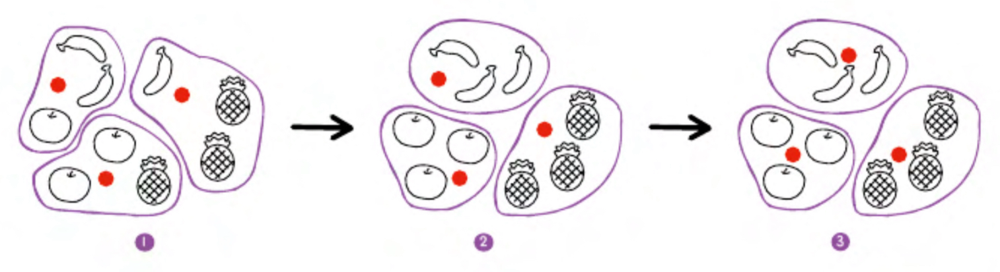
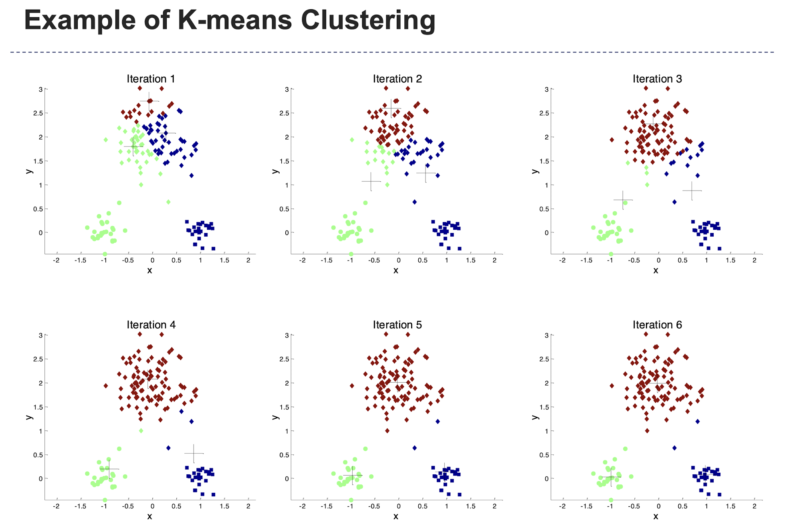
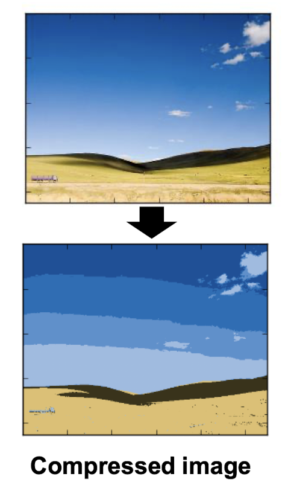
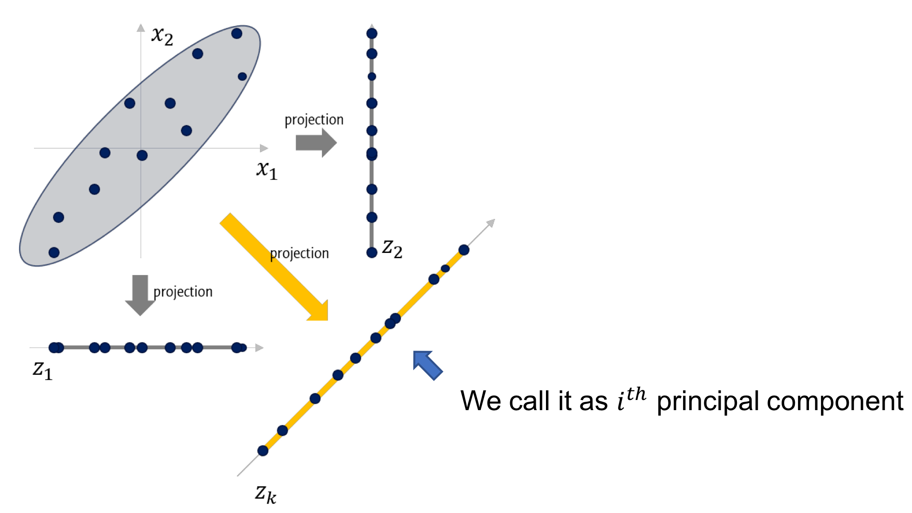

# 비지도 학습

## 6-1 군집 알고리즘
<br/>

**비지도 학습**
```
<비지도 학습>
    ㅇ 타깃이 없을때 사용하는 머신
```
```
<사진 데이터 불러오기 (넘파이 배열)>

!weg https://bit.ly/fruits_300data -o fruits_300.npy
import numbpy as np
import matplotlib.pylot as plt

fruits = np.load('fruits_300.npy)

plt.imshow(fruits[0], cmap='gray')
plt.show()

-> 0에 가까울수록 검고 높은 값일수록 밝음
```
```
<색상 반전>

    ㅇ 배경이 높은 값을 가지게 되기에 컴퓨터가 배경에 집중할 가능성이 있어서

<색상 원래대로>

plt.imshow(fruits[0], cmap='gray_r')
plt.show()
```
```
<그림 나란히>

fig, axs = plt.subplots(1,2)
    axs[0] ...
    axs[1] ...
```
```
<이미지 1차원 배열로>

    ㅇ 100x100의 이미지를 10000개의 1차원 배열로
    ㅇ reshape() 메서드

apple = fruits[0:100].reshape(-1, 100*100)
pineapple = fruits[100:200].reshape(-1, 100*100)
banana = fruits[200:300].reshape(-1, 100*100)
```
```
<각 샘플의 픽셀 평균값>

print(apple.mean(axis=1))
    -> axis가 1인 이유는 1차원 가로배열이기 때문
```
```
<히스토그램 그리기>

    ㅇ 픽셀의 평균이 과일별로 다를 수 있다는 점에서 착안

plt.hist(np.mean(apple, axis=1), alpha=0.8)
plt.hist(np.mean(pineapple, axis=1), alpha=0.8)
plt.hist(np.mean(banana, axis=1), alpha=0.8)

ply.legend(['apple','pineapple','banana'])
plt.show()
```
```
<샘플별이 아닌 픽셀별 평균 구하기>

    ㅇ axis=0으로 평균산출

fig, axs = plt.subplots(1,3, figsize=(20,5))
axs[0].bar(range(10000),np.mean(apple,axis=0))
axs[1].bar(range(10000).np.mean(pineapple,axis=0))
axs[2].bar(range(10000).np.mean(banana, axis=0))
plt.show()
```
```
<픽셀 평균값을 100x100 크기로 바꾸기>

    ㅇ 이미지로 다시 바꿔서 시각화로 비교

apple_mean = np.mean(apple, axis=0).reshape(100,100)
pineapple_mean = np.mean(pineapple, axis=0).reshape(100,100)
banana_mean=np.mean(banana, axis=0).reshape(100,100)
fig, axs = plt.subplots(1,3,figsize=(20,5))
axs[0].imshow(appple_mean, cmap='gray_r')
axs[1].imshow(pineapple_mean, cmap='gray_r')
axs[2].imshow(banana_mean, cmap='gray_r')
plt.show()
```
**평균값과 가까운 사진 고르기**
```
<절대값 오차>
    ㅇ 사과 사진의 평균값과 fruits의 모든 샘플 차이의 절댓값 비교
    ㅇ 각 샘플에 대한 평균 구함 (두 번째, 세 번째 차원 지정)

abs_diff = np.abs(fruits - apple_mean)
abs_mean = np.mean(abs_diff, axis=(1,2))
print(abs_mean.shape)

<오차 작은 샘플 산출>

    ㅇ 오차가 가장 작은 샘플 100개 산출
    ㅇ np.argsort() 사용

apple_index = np.argsort(abs_mean)[:100]
fig, axs = plt.subplots(10,10,figsize=(10,10))
for i in range(10):
    for j in range(10):
        axs[i,j].imshow(fruits[apple_index[i*10+j]], cmap='gray_r')
        axs[i,j].axis('off') -> 좌표축 제거
plt.show()

-> 비슷한 샘플기리 그룹으로 모으는 작업을 군집이라 한다
-> 군집 알고리즘에서 만든 그룹을 클러스터라고 한다
```

## 6-2 k-평균

**타깃값이 없는 경우**
```
<비슷한 샘플끼리 모으기>

    ㅇ 타깃값이 없을 때는 알고리즘을 직접적으로 가르칠 수 없다
    ㅇ 대신 알고림즘은 스스로 데이터가 어떻게 구성되어 있는지 분석

<평균값 구하기>

    ㅇ k-평균 군집 알고리즘 사용
    ㅇ 평균값 = 센트로이드
```


```
from sklearn.cluster import KMeans
km = KMeans(n_clusters=3, random_state=42)
km.fit(fruits_2d)
print(km.labels_)
-> 레이블 순서에는 아무 의미도 없다
print(np.unique(km.labels_, return_counts=True))
```
```
<군집 시각화>

import matplotlib.pyplot as plt
def draw_fruits(arr, ratio=1):
    n=len(arr)

rows = int(np.ceil(n/10))
cols = n if rows < 2 else 10
fig, axs = plt.subplots(rows, cols,
                            figsize=(cols*ratio, rows*ratio), squeeze=False)
for i in range(rows):
    for j in range(cols):
        if i*10 + j < n:
            axs[i,j].imshow(arr[i*10 + j], cmap='gray_r')
        axs[i'j].axis('off')
plt.show()

draw_fruits(fruits[km.labels_==0])
```
**최적의 k 찾기**
```
<엘보우 기법>

    ㅇ 이너셔를 확인하자
    ㅇ 이녀서 = 센트로이드와 샘플 사이의 거리 제곱합
    ㅇ 이 이너셔가 급격하게 줄어드는 지점이 최적

inertia = []
for k in range(2,7):
    km = KMeans(n_clusters=k, random_state=42)
    km.fit(fruits_2d)
    km.fit(fruits_2d)
    inertia.append(km.inertia_)

plt.plot(range(2,7), inertia)
plt.xlabel('k')
plt.ylabel('inertia')
plt.show()
```
## 6-3 주성분 분석

**차원과 차원축소**

```
<차원 축소>

    ㅇ 차원을 줄이면 저장공간을 줄일 수 있다
    ㅇ 특성이 많으면 과적합의 문제가 있음
    ㅇ 데이터를 잘 나타내는 일부 특성만 선택하면 성능을 향상할 수 있다
```
```
<주성분 분석, PCA>

    ㅇ 데이터에 있는 분산이 큰 방향을 찾는 것
    ㅇ 분산이 큰 방향이 주성분 벡터
```

```
<PCA 클래스>

from sklearn.decomposition import PCA
pca = PCA(n_components=50)
pca.fit(fruits_2d)

fruits_pca = pca.transform(fruits_2d)
print(fruits_pca.shape)
-> 10000개의 픽셀을 50으로 줄인 효과
```
```
<재구성>

    ㅇ inverse_transform() 메서드로 다시 복구 가능

fruits_inverse = pca.inverse_transform(fruits_pca)
print(fruits_inverse.shape)

<100*100으로>

fruits_reconstruct = fruits_inverse.reshape(-1,100,100)
for start in [0,100,200]:
    draw_fruits(fruits_reconstruct[start:start+100])
    print("/n")
```
```
<설명된 분산>

    ㅇ 주성분이 원본 데이터의 분산을 얼마나 잘 나타내는지 기록한 값
    ㅇ explained_variance_ratio_에 기록

print(np.sum(pca.explained_variance_ratio_))

<그래프 시각화>

plt.plot(pca.explained_variance_ratio_)
plt.show()
```
**다른 알고리즘과 함께 사용**
```
코드
from sklearn.linear_model import LogisticRegression
lr = LogisticRegression()

target = np.array([0]*100 + [1]*100 + [2]*100)
```
```
<10000개의 특성>

    ㅇ 정확도 99, 훈련시간 0.94초
<50개의 특성>

    ㅇ 정확도 100, 훈련시간 0.03초

<2개의 특성>

    ㅇ 정확도 99, 훈련시간 0.04초
```
```
<분산의 비율로 주성분 갯수 찾기>

pca = PCA(n_components=0.5)
pca.fit(fruits_2d)

    ㅇ 단 2개의 특성만으로 분산의 50% 설명가능
```
```
<차원 축소의 장점>

    ㅇ 시각화 용이
        ㅇ 3차원 이하로 줄이면 화면에 출력 용이
```